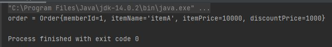

# 스프링 핵심 원리 - 기본편
인프렁 강좌 '스프링 핵심 원리-기본편'(김영한)을 수강하며 정리한 내용들입니다.<br>
https://www.inflearn.com/course/%EC%8A%A4%ED%94%84%EB%A7%81-%ED%95%B5%EC%8B%AC-%EC%9B%90%EB%A6%AC-%EA%B8%B0%EB%B3%B8%ED%8E%B8

---
---

## 객체 지향 설계와 스프링

---

### 이야기 - 자바 진영의 추운 겨울과 스프링의 탄생
<BR>

스프링 역사
- 2002년 로드 존슨 책 출간
- EJB의 문제점 지적
- BeanFactory, ApllicationContext, POJO, 제어의 역전, 의존관계 주입

---

### 스프링이란?

- 필수
  - 스프링 프레임워크
  - 스프링 부트

- 선택
  - 스프링 데이터 : 기본적인 CRUD는 어떤 데이터베이스든 비슷한데, 이런걸 편리하게 사용할 수 있도록 도와주는 것이 '스프링 데이터'라는 기술이다. 그 중 많이 사용하는 것이 '스프링 데이터 JPA'를 많이 사용함.
  - 스프링 세션 : 세션 기능을 편리하게 사용할 수 있도록 도와줌.
  - 스프링 시큐리티 : 보안과 관련
  - 스프링 Rest Docs : API문서랑 test를 편리하게 엮어서 API문서화를 편리하게 해줌.
  - 스프링 배치 : 배치처리(1000만건 업데이트를 한번에 하는게 아닌 나누어서 업데이트하는 느낌)에 특화된 기술
  - 스프링 클라우드 : 클라우드에 특화된 기술

- 스프링 프레임워크
  - 핵심 기술 : 스프링 DI 컨테이너, AOP, 이벤트, 기타
  - 웹 기술 : 스프링 MVC, 스프링 WebFlux
  - 데이터 접근 기술 : 트랜잭션, JDBC, ORM 지원, XML 지원
  - 기술 통합 : 캐시, 이메일, 원격접근, 스케쥴링
  - 테스트 : 스프링 기반 테스트 지원
  - 언어 : 코틀린, 자바
  - 최근에는 스프링 부트를 통해서 스프링 프레임워크의 기술들을 편리하게 사용.

- 스프링 부트
  - <strong>스프링을 편리하게 사용할 수 있도록 지원, 최근에는 기본으로 사용</strong>
  - 단독으로 실행할 수 있는 스프링 애플리케이션을 쉽게 생셩
  - Tomcat 같은 웹 서버를 내장해서 별도의 웹 서버를 설치하지 않아도 됨.
  - 손쉬운 빌드 구성을 위한 starter 종속성 제공
  - 스프링과 3rd parth(외부) 라이브러리 자동 구성
    - 과거에는 버전 통일이 힘들었었다. 지금은 외부 라이브러리 버전에 대해서는 고민X
  - 메트릭, 상태 확인, 외부 구성 같은 프로덕션 준비 기능 제공
    - 운영환경에서 모니터링은 중요. 이런 부분을 스프링부트가 기본적으로 제공해줌.
  - 관례에 의한 간결한 설정
    - 예전에는 스프링 프레임워크 설정이 힘들었지만, 스프링부트가 이를 편리하게 해줌.

- 스프링 단어?
  - 스프링이라는 단어는 문맥에 따라 다르게 사용된다.
    - 스프링 DI 컨테이너 기술
    - 스프링 프레임워크
    - 스프링 부트, 스프링 프레임워크 등을 모두 포함한 스프링 생태계

- 스프링의 핵심 개념, 컨셉
  - 스프링은 자바 언어 기반의 프레임워크
  - 자바 언어의 가장 큰 특징 - <strong>객체 지향 언어</strong>
  - 스프링은 객체 지향 언어가 가진 강력한 특징을 살려내는 프레임워크
  - 스프링은 <strong>좋은 객체 지향</strong> 애플리케이션을 개발할 수 있게 도와주는 프레임워크

---

### 좋은 객체 지향 프로그래밍?

- 객체 지향 특징
  - 추상화
  - 캡슐화
  - 상속
  - <strong>다형성</strong>

- 객체 지향 프로그래밍
  - 객체 지향 프로그래밍은 프로그램을 명령어의 목록으로 보는 시각에서 벗어나 여러 개의 독립된 단위, 즉 <strong>"객체"</strong>들의 <strong>모임</strong>으로 파악하고자 하는 것이다. 각각의 <strong>객체</strong>는 메시지를 주고받고, 데이터를 처리할 수 있다.<strong>(협력)</strong>
  - 객체 지향 프로그래밍은 프로그램을 <strong>유연</strong>하고 <strong>변경</strong>이 용이하게 만들기 때문에 대규모 소프트웨어 개발에 많이 사용된다.

- 유연하고, 변경이 용이?
  - 레고 블럭 조립하듯이
  - 키보드, 마우스 갈아 끼우듯이
  - 컴퓨터 부품 갈아 끼우듯이
  - 컴포넌트를 쉽게 유연하게 변경하면서 개발할 수 있는 방법
  > 다형성(Polymorphism)

- 다형성의 실세계 비유
  - 실세계와 객체 지향을 1:1로 매칭은 잘 안됨.
  - 그래도 비유하면 이해하기 좋음
  - <strong>역할</strong>과 <strong>구현</strong>으로 세상을 구분
    - 역할 : 인터페이스
    - 구현 : 인터페이스를 구현한 객체

- 운전자 - 자동차 예시
  - 
  - 자동차 역할을 3개의 다른 자동차로 구현
  - 만약 운전자가 K3를 타다가 다른 자동차인 아반떼로 차를 바꿔도 당연히 운전을 할 수 있음.
    - 왜냐하면 자동차 역할에 대한 구현만 바뀌었을 뿐이기 때문이다.
  - <strong>그래서 자동차가 바뀌어도 운전자한테 영향을 주지 않는다.</strong>
    > 유연하고 변경이 용이하다.
  - 운전자는 자동차 역할에 대해서는 의존하고 있다.
  - 이렇게 자동차 역할를 만들고 자동차 구현을 분리한 이유는 '운전자'(client)를 위해서 이렇게 함.
    - client는 자동차의 내부 구조를 몰라도 됨.
    - 자동차 구현이 바뀌어도 client에게는 영향이 없음.
  - client에 영향을 주지않고 새로운 기능을 제공할 수 있다.
  - 즉, 새로운 자동차가 나와도 client는 새로운 것을 안배워도 됨.

- 공연 무대 예시
  - 
  - 배우는 대체가 가능하다.
  - 역할과 구현으로 나눔 = 변경가능한 대체 가능성이 생김
    - 유연하고 변경이 용이하다라는 뜻

- 다형성의 실세계 비유 예시
  - 운전자 - 자동차
  - 공연 무대
  - 키보드, 마우스, 세상의 표준 인터페이스들
  - 정렬 알고리즘(정렬만 되면 더 좋은 기능의 알고리즘으로 교체)
  - 할인 정책 로직

- <strong>역할과 구현을 분리</strong>
  - <strong>역할</strong>과 구현으로 구분하면 세상이 <strong>단순</strong>해지고, <strong>유연</strong>해지며 <strong>변경</strong>도 편리
  - 장점
    - <strong>클라이언트</strong>는 대상의 역할(인터페이스)만 알면 된다.
    - <strong>클라이언트는</strong> 구현 대상의 <strong>내부 구조를 몰라도</strong> 된다.
      - ex> 운전자 - 자동차
    - <strong>클라이언트</strong>는 구현 대상의 <strong>내부 구조가 변경</strong>되어도 영향을 받지 않는다.
      - 기름차에서 전기차로 바뀌어도 운전자는 운전 가능
    - <strong>클라이언트</strong>는 구현 <strong>대상 자체를 변경</strong>해도 영향을 받지 않는다.
      - K3에서 테슬라로 바꿔도 운전자는 영향을 받지 않음.

- 역할과 구현을 분리_자바 언어
  - 자바 언어의 다형성을 활용
    - 역할 = 인터페이스
    - 구현 = 인터페이스를 구현한 클래스, 구현 객체
  - 객체를 설계할 때 <strong>역할</strong>과 <strong>구현</strong>을 명확히 분리
  - 객체 설계시 역할(인터페이스)을 먼저 부여하고, 그 역할을 수행하는 구현 객체 만들기

- 객체의 협력이라는 관계부터 생각
  - 혼자 있는 객체는 없다
  - 클라이언트 : <strong>요청</strong>, 서버 : <strong>응답</strong>
  - 수 많은 객체 클라이언트와 객체 서버는 서로 협력 관계를 가진다.
  - 

- 자바 언어의 다형성
  - 
    - MemberService가 save()를 호출하면, interface의 MemberRepository의 save()를 호출하면, 실제로는 밑의 구현체들의 save()가 호출이된다.(예를 들면 현재 MemoryMemberRepository가 들어가있으면 해당 save()가 호출)
  - <strong>오버라이딩</strong>을 떠올려보자
  - 오버라이딩은 자바 기본 문법
  - 오버라이딩 된 메서드가 실행
  - 다형성으로 인터페이스를 구현한 객체를 실행 시점에 유연하게 변경할 수 있다.
  - 물론 클래스 상속 관계도 다형성, 오버라이딩 적용가능
  - 
    - client(MemberService)는 MemberRepository에 의존한다.
      - 의존한다 == 내가 쟤를 알고 있다.
  - 
    - MemberRepository에 구현체(MemoryMemberRepository, JdbcMemberRepository)들을 할당할 수 있다.
      - 

    - 코드 예시
        <details>
        <summary>MemoryMemberRepository</summary>

            ```java
            public class MemberService{
                private MemberRepository memberRepository = new MemoryMemberRepository();
            }
            ```

        </details> 

        <details>
        <summary>JdbcMemberRepository</summary>

            ```java
            public class MemberService{
                //private MemberRepository memberRepository = new MemoryMemberRepository();
                private MemberRepository memberRepository = new JdbcMemberRepository();
            }
            ```

        </details> 

    - 어떤 구현체를 넣냐에 따라 다름
      - 


- <strong>다형성의 본질</strong>
  - 인터페이스를 구현한 객체 인스턴스를 <strong>실행 시점</strong>에 유연하게 <strong>변경</strong>할 수 있다.
  - 다형성의 본질을 이해하려면 <strong>협력</strong>이라는 객체사이의 관계에서 시작해야함.
  - <strong>클라이언트를 변경하지 않고, 서버의 구현 기능을 유연하게 변경할 수 있다.</strong>

- 역할과 구현을 분리_정리
  - 실세계의 역할과 구현이라는 편리한 컨셉을 다형성을 통해 객체 세상으로 가져올 수 있음
  - 유연하고, 변경이 용이
  - 확장 가능한 설계
  - 클라이언트에 영향을 주지 않는 변경이 가능
  - 인터페이스를 안정적으로 잘 설계하는 것이 중요

- 역할과 구현을 분리_한계
  - 역할(인터페이스) 자체가 변하면, 클라이언트, 서버 모두에 큰 변경이 발생한다.
    - 자동차를 비행기로 변경해야 한다면?
    - 대본 자체가 변경된다면?
    - USB 인터페이스가 변경된다면?
  - 인터페이스를 안정적으로 잘 설계하는 것이 중요


- 스프링과 객체 지향
  - 다형성이 가장 중요!
  - 스프링은 다형성을 극대화해서 이용할 수 있게 도와준다.
  - 스프링에서 이야기하는 제어의 역전(IoC), 의존관계 주입(DI)은 다형성을 활용해서 역할과 구현을 편리하게 다룰 수 있도록 지원한다.
  - 스프링을 사용하면 마치 레고 블럭 조립하듯이! 공연 무대의 배우를 선택하듯이! 구현을 편리하게 변경할 수 있다.

---

### 좋은 객체 지형 설계의 5가지 원칙(SOLID)

- SOLID
    > 클린코드로 유명한 로버트 마틴이 좋은 객체 지향 설계의 5가지 원칙을 정리
  - SRP : 단일 책임 원칙(Single Responsibility Principle)
  - OCP : 개방-폐쇄 원칙(Open/Closed Principle)
  - LSP : 리스코프 치환 원칙(Liskov Substitution Principle)
  - ISP : 인터페이스 분리 원칙(Interface Segregation Principle)
  - DIP : 의존관계 역전 원칙(Dependency Inversion Principle)

- SRP 단일 책임 원칙
  - 한 클래스는 하나의 책임만 가져야 한다.
  - 하나의 책임이라는 것은 모호하다.
    - 클 수 있고, 작을 수 있다.
    - 문맥과 상황에 따라 다르다.
  - <strong>중요한 기준은 변경</strong>이다. 변경이 있을 때 파급 효과가 적으면 단일 책임 원칙을 잘 따른 것
  - EX> UI 변경, 객체의 생성과 사용을 분리

- OCP 개방-폐쇄 원칙(중요)
  - 소프트웨어 요소는 <strong>확장에는 열려</strong> 있으나 <strong>변경에는 닫혀</strong> 있어야 한다.
    - 코드의 변경없이 기능을 추가할 수 있다??
- <strong>다형성</strong>을 활용해보자
- 인터페이스를 구현한 새로운 클래스를 하나 만들어서 새로운 기능을 구현
- 지금까지 배운 역할과 구현의 분리를 생각해보자.
    - 코드 예시
        <details>
        <summary>MemoryMemberRepository</summary>

            ```java
            public class MemberService{
                private MemberRepository memberRepository = new MemoryMemberRepository();
            }
            ```

        </details> 

        <details>
        <summary>JdbcMemberRepository</summary>

            ```java
            public class MemberService{
                //private MemberRepository memberRepository = new MemoryMemberRepository();
                private MemberRepository memberRepository = new JdbcMemberRepository();
            }
            ```

        </details> 

    - MemberService를 보면,
      - 1번코드) field에 MemberRepository 인터페이스를 알고 있고 new 해서 MemoryMemberRepository를 넣음.
      - 2번코드) field에 MemberRepository 인터페이스를 알고 있고 new 해서 JdbcMemberRepository를 넣음.
    - 위 코드를 보면 JDBC로 바꿀려면 결국 코드를 변경해야한다.

- OCP 개방-폐쇄 원칙_문제점
  - MemberService 클라이언트가 구현 클래스를 직접 선택
    - 
    ```java
    MemberRepository m = new MemoryMemberRepository();//기존코드
    ```
    - 
    ```java
    MemberRepository m = new JdbcMemberRepository();//변경 코드
    ```
  - <strong>구현 객체를 변경하려면 클라이언트 코드를 변경해야 한다.</strong>
  - <strong>분명 다형성을 사용했지만 OCP 원칙을 지킬 수 없다.</strong>
  - 이 문제를 어떻게 해결해야 하나?
  - 객체를 생성하고, 연관관계를 맺어주는 별도의 조립, 설정자가 필요하다.
    - 스프링 컨테이너가 해줌.

- LSP 리스코프 치환 원칙
  - 프로그램의 객체는 프로그램의 정확성을 깨뜨리지 않으면서 하위 타입의 인스턴스로 바꿀 수 있어야 한다.
    - EX> 자동차 인터페이스의 엑셀은 앞으로 가라는 기능이다. 그러나, 뒤로 가게 구현하면 LSP 위반, 느리더라도 앞으로 가야함.(그래도 컴파일 오류가 나지 않고 성공을 하지만 안됨. 기능적으로 보장을 해줘야함.)
  - 다형성에서 하위 클래스는 인터페이스 규약을 다 지켜야 한다는 것, 다형성을 지원하기 위한 원칙, 인터페이스를 구현한 구현체는 믿고 사용하려면, 이 원칙이 필요하다.
  - 단순히 컴파일에 성공하는 것을 넘어서는 이야기
  
- ISP 인터페이스 분리 원칙
  - 특정 클라이언트를 위한 인터페이스 여러 개가 범용 인터페이스 하나보다 낫다.
  - 자동차 인터페이스 -> 운전 인터페이스, 정비 인터페이스로 분리.(자동차 인터페이스가 너무 크니까 분리, 이는 사용자 클라이언트를 운전자 클라이언트와 정비사 클라이언트로 분리할 수 있다.)
  - 사용자 클라이언트 -> 운전자 클라이언트, 정비사 클라이언트로 분리.
  - 분리하면 정비 인터페이스 자체가 변해도 운전자 클라이언트에 영향을 주지 않음.
  - 인터페이스가 명확해지고, 대체 가능성이 높아진다.


- <strong>DIP 의존관계 역전 원칙(중요)</strong>
  - 프로그래머는 "추상화에 의존해야지, 구체화에 의존하면 안된다." 의존성 주입은 이 원칙을 따르는 방법 중 하나다.
  - 쉽게 이야기해서 구현 클래스에 의존하지 말고, 인터페이스에 의존하라는 뜻.(즉, 클라이언트 코드가 구현 클래스를 바라보지 말고 인터페이스만 바라보게 하기, MemberService가 MemberRepository interface만 바라보게하고, MemoryMemberRepository나 JdbcMemberRepository에 대해서는 몰라야한다.)
  - 앞에서 이야기한 <strong>역할(Role)에 의존하게 해야 한다는 것과 같다.</strong> 객체 세상도 클라이언트가 인터페이스에 의존해야 유연하게 구현체를 변경할 수 있다! 구현체에 의존하게 되면 변경이 아주 어려워진다.
  - 그런데 OCP에서 설명한 MemberService는 인터페이스에 의존하지만, 구현 클래스도 동시에 의존한다.
  - MemberService 클라이언트가 구현 클래스를 직접 선택
    ```java
    MemberRepository m = new MemoryMemberRepository();
    ```
  - <strong>DIP 위반</strong>

- 정리
  - 객체 지향의 핵심은 다형성
  - 다형성 만으로는 쉽게 부품을 갈아 끼우듯이 개발할 수 없다.
  - 다형성 만으로는 구현 객체를 변경할 땓 클라이언트 코드도 함께 변경된다.
  - <strong>다형성 만으로는 OCP, DIP를 지킬 수 없다.</strong>
  - 뭔가 더 필요함.


---

### 객체 지향 설계와 Spring

- 스프링 이야기에 왜 객체 지향 이야기가 나오는가?
  - <strong>스프링은 다음 기술로 다형성 + OCP, DIP를 가능하게 지원</strong>
    - DI(Dependency Injection): 의존관계, 의존성 주입
    - DI 컨테이너 제공
      - 자바 객체들을 어떤 컨테이너안에 넣어두고 이 안에서 서로 의존관계를 연결해주고 주입해주는 기능들을 제공해줌.
  - <strong>클라이언트 코드의 변경 없이 기능 확장</strong>
  - 쉽게 부품을 교체하듯이 개발.

- 스프링이 없던 시절
  - 옛날 어떤 개발자가 좋은 객체 지향 개발을 하려고 OCP, DIP 원칙을 지키면서 개발을 해보니, 너무 할일이 많았다. 배보다 배꼽이 크다. 그래서 프레임워크로 만들어버림.
  - 순수하게 자바로 OCP, DIP 원칙들을 지키면서 개발을 해보면, 결국 스프링 프레임워크를 만들게 된다,(더 정확히는 DI 컨테이너)
  - DI 개념은 말로 설명해도 이해가 잘 안됨 -> 코드로 짜봐야 필요성을 알게된다!

- 정리
  - 모든 설계에 <strong>역할</strong>과 <strong>구현</strong>을 분리하자.
  - 자동차, 공연의 예를 떠올려보자.
  - 애플리케이션 설계도 공연을 설계 하듯이 배역만 만들어주고, 배우는 언제든지 <strong>유연</strong>하게 <strong>변경</strong>할 수 있도록 만드는 것이 좋은 객체 지향 설계다.
  - 이상적으로는 모든 설계에 인터페이스를 부여하자.

- 정리_실무 고민
  - 하지만 인터페이스를 도입하면 추상화라는 비용이 발생한다.
    - 단순하게는, 인터페이스 클래스와 구현 클래스를 만들어야 함.
    - 추상화가 되버리면 개발자가 코드를 한번 더 열어봐야함.(인터페이스도 보고, 구현체도 보고)
  - 기능을 확장할 가능성이 없다면, 구현체 클래스를 직접 사용하고, 향후 꼭 필요할 때 리팩터링해서 인터페이스를 도입하는 것도 방법이다.

- 책추천
  - 객체지향 책 추천 : 객체지향의 사실과 오해
  - 스프링 책 추천 : 토비의 스프링(필수)
  - JPA 책 추천 : 자바 ORM 표준 JPA 프로그래밍

---
---

## 스프링 핵심 원리 이해1 - 예제 만들기

이 단원에서는 순수한 Java로만 작성해볼거임.(프로젝트 환경설정을 편리하게 하려고 스프링 부트를 사용하긴 함. 그외에는 순수한 자바로만 개발)

---
---

### 프로젝트 생성

- 환경
  - Java11
  - IntelliJ
- start.spring.io에서 아래와 같이 프로젝트 생성
  - Gradle Project
  - Java
  - 2.4.2
  - Project Metadata
    - Group : hello
    - Artifact(빌드명) : core
    - Packaging : Jar
    - Java : 11
  - Dependencies : 아무것도 선택안할거임(only 자바로 작성할거라서)

- 위 설정 후 다운 받기 -> 압축 풀기 -> IntelliJ에서 open -> 압축 푼 경로로가서 build.gradle 열기 -> Open as Project

- build.gradle
  ```java
  dependencies {
    implementation 'org.springframework.boot:spring-boot-starter'
    testImplementation 'org.springframework.boot:spring-boot-starter-test'
  }
  ``` 
  - 의존관계가 spring-boot-starter와 test관련된 라이브러리 이렇게 두가지만 들어가있다.

- 실행방법
  - src/main/java/hello.core/CoreApplication을 실행하면 됨.
    - 실행하면 바로 끝나야함(왜냐 spring web project를 넣은게 아니기때문에)

- Preferences -> gradle 입력 -> Build and run using : IntelliJ IDEA, Run tests using : IntelliJ IDEA로 수정
  - 이렇게하면 IntelliJ 에서 Java를 바로 실행하기때문에 체감상 더 빠르다.

---

### 비즈니스 요구사항과 설계

- 회원
  - 회원 가입, 회원 조회
  - 회원에는 일반과 VIP 등급이 있다.
  - 회원 데이터는 자체 DB를 구축할 수도 있고, 외부 시스템과 연동할 수 있다.(미확정)
- 주문과 할인 정책
  - 회원은 상품 주문 가능
  - 회원 등급에따라 할인 정책 적용
  - 할인 정책
    - 모든 VIP는 1,000원 할인해주는 고정 금액 할인 적용(나중에 변경될 수도 있음)
  - 할인 정책은 변경 가능성이 높다.
    - 회사의 기본 항린 정책을 아직 정하지 못함, 오픈 직전까지 고민을 미루고 싶다. 최악의 경우 할인을 적용하지 않을 수 있다(미확정)

- 미확정인 부분때문에 개발을 무기한 기다릴 수는 없다.
- <strong>인터페이스를 만들고 구현체를 언제든지 갈아끼울 수 있도록 설계하면 된다.</strong>
  
---

### 회원 도메인 설계

- 회원 도메인 협력 관계
  - 기획자들도 볼 수 있는 그림
  - 
  - 클라이언트(역할)가 회원 서비스 호출
  - 회원 서비스(역할)는 두가지 기능을 제공함,
    - 회원가입
    - 회원조회
  - 회원 저장소(역할)라는 인터페이스를 별도로 생성
    - 왜냐하면 회원 db를 자체 구축할 수도 있고, 외부 시스템과 연동할 수 있기 때문.
    - 회원 데이터에 접근하는 계층을 따로 만듦.
  - 회원 저장소의 구현
    - 메모리 회원 저장소(구현)
    - DB 회원 저장소(구현)
    - 외부 시스템 연동 회원 저장소(구현)
    - 위 셋 중하나를 회원 저장소 인터페이스에 꼽으면 된다.
    - 일단은, 메모리 회원 저장소(간단함)를 만들어서 개발을 진행하기로 함.(단, 메모리이기때문에 서버가 재부팅되면 데이터가 날라가니까 개발할때만 사용)

- 회원 클래스 다이어그램
  - 도메인 협력 관계를 바탕으로 개발자들이 구체화하여 클래스 다이어그램을 생성
  - interface랑 구현체들이 보임
  - 실제 구현 level
  - 서버를 실행하지 않고 클래스들만 분석해서 볼 수 있는 그림
  - 
  - MemberService(역할)(interface)
    - 회원 서비스
    - MemberServiceImpl(구현체)
  - MemberRepository(역할)(interface)
    - 회원 저장소
    - MemoryMemberRepository(구현체)
    - DbMemberRepository(구현체)

- 회원 객체 다이어그램
  - 구현체들은 서버가 뜰때 동적으로 결정이 됨. 이를 표현하고자 함.
  - 실제 서버에 올라오면 객체간의(메모리 간의) 참조들이 어떻게 되는지 그린거임.
  - 
  - 클라이언트는 회원 서비스를 바라 봄.
  - 회원 서비스(정확히는 회원 서비스 구현체)는 메모리 회원 저장소를 바라봄.

- 설계 순서
  - 도메인 -> 클래스 다이어그램 -> 객체 다이어그램

---

### 회원 도메인 개발

- 위에서 작성한 회원 클래스 다이어그램을 바탕으로 개발하기.
- member package 생성
  - Grade(enum)
    - 회원 등급을 나타낸다
    - BASIC, VIP
  - Member(Class, Entity)
    - 3가지 속성을 가짐
      - id, name, grade
      ```java
      private Long id;
      private String name;
      private Grade grade;
      ``` 
    - 생성자 만들기
      ```java
      public Member(Long id, String name, Grade grade) {
        this.id = id;
        this.name = name;
        this.grade = grade;
      }
      ``` 
    - Getter & Setter 생성
      - 데이터를 가져오고 꼽아주는 역할
      - Getter 와 Setter를 통해 private의 값들을 설정해줄 수 있다.  
  - MemberRepository(interface)
    ```java
    public interface MemberRepository {

      void save(Member member);

      Member findById(Long memberId);
    }
    ```
    - save()
      - 회원 저장
    - findById()
      - 회원의 id로 회원을 찾는 기능
  - MemoryMemberRepository(구현체)
    - 보통은 따로 package만들어서 구현체끼리 묶어두나 간편한 예제니까 같은 member package에 넣어둠
    - 구현체니까 아래와 같이 해야함
      ```java
      public class MemoryMemberRepository implements MemberRepository
      ```
    - 저장소니까 Map같은 저장소가 있어야함
      ```java
      private static Map<Long, Member> store = new HashMap<>();
      ```
      - HashMap<>()은 동시성 이슈가 있을 수 있어서 사실은 ConcurrentHashMap을 써야한다.
    - save(Member member)
    - findById(Long memberId)
      - store에서 get()해서 넘어온 memberId를 가지고 찾는기능.
    - 이렇게 간단하게 메모리로 사용하는 db를 만들었고 개발을 진행할 수 있다. 물론 메모리로만 진행하기 때문에 test용도로만 써야한다.

  - MemberService(interface)
    - 2가지 기능이 있음.
    - join()
      - 회원 가입
    - findMember()
      - 회원 조회
  - MemberServiceImpl(구현체)
    - 가입을하고 조회를 할려면 필요한 것이 MemberRepository이다. 그러나, MemberRepository는 interface이므로 구현 객체를 선택해서 넣어줘야함.
      ```java
      private final MemberRepository memberRepository = new MemoryMemberRepository();
      ``` 
    - 회원 가입
      ```java
      @Override
      public void join(Member member) {
        memberRepository.save(member);
      }
      ``` 
      - join()에서 save()를 호출하면 다형성에 의해서 MemoryMemberRepository에 있는 save()가 호출이 된다.
    - 회원 조회
      ```java
      @Override
      public Member findMember(Long memberId) {
        return memberRepository.findById(memberId);
      }
      ``` 

---

### 회원 도메인 실행과 테스트

- 회원 객체 다이어그램의 그림을 만들거임.
- 런타임에 동작 -> 클라이언트는 MemberServiceImpl을 사용하게 됨 -> 회원 서비스는 메모리 회원 저장소를 참조함.
- src/main/java/hello.core에 MemberApp 생성
  - 여기서 잘되는지 test할 예정
  - MemberService를 만들어서 구현체로 new MemberServiceImpl()해서 선택해줌.
  - join() test
    - member를 생성자를 통해 객체 생성
    - join(member)
    - memberService.findMember()를 통해 가입한 멤버랑 찾은 멤버가 똑같으면 원하는데로 test가 된거임
  - 위 방식대로 test한 것은 순수한 자바코드로 진행한거임(spring 관련X)
  - 그런데, 애플리케이션 로직으로 main method를 test하는것은 한계가 있음.(좋은 방법이 아님)
  - <strong>그래서, Junit이라는 test framework를 사용한다.</strong>

- test(junit)
  - src/test/java/hello.core/ 에 member package 생성
  - src/test/java/hello.core/member/ 에 MemberServiceTest class 생성
    -join() Test
      ```java
      MemberService memberService = new MemberServiceImpl();

      @Test
      void join(){
        //given
        Member member = new Member(1L,"memberA",Grade.VIP);

        //when
        memberService.join(member);
        Member findMember = memberService.findMember(1L);

        //then
        Assertions.assertThat(member).isEqualTo(findMember);
      }
      ``` 
    - given
      - ~~한것들이 주어졌을때
    - when
      - 이렇게 햇을때
    - then
      - 요렇게 된다.
    - 검증
      - Assertions(org.assertj.core.api)를 통해 검증하면 됨
  - join test를 실행하면 성공한 모습을 볼 수 있다.
  - 위에서 순수 자바코드로 검증하면 눈으로 직접(출력된 결과를 보면서) 검증했었지만, junit으로 검증하면 출력된 결과를 직접 보면서 검증하는 것이 아니라 성공, 실패의 유무를 바로 확인 가능하다.
  - test code 작성은 필수적이다.

- 회원 도메인 설계의 문제점
  - 다른 저장소로 변경할 때 OCP 원칙을 준수하지 못함.
  - DIP 원칙을 준수하지 못함.
  - 즉, <strong>의존관계가 인터페이스 뿐만 아니라 구현까지 모두 의존하는 문제점이 있음</strong>
    - 코드에서는 아래 부분이 구현체를 의존하는 부분이다.
    ```java
    public class MemberServiceImpl implements MemberService{
      private final MemberRepository memberRepository = new MemoryMemberRepository();
      ...
      ...
      ...
    ``` 
      - 앞의 MemberRepository라는 interface에 의존을 하지만, 뒤에 실제 할당하는 부분인 new MemoryMemberRepository()부분에서 구현체를 의존한다.
      - 그래서 MemberServiceImpl은 MemberRepository(추상화) 뿐만 아니라 MemoryMemberRepository(구체화)도 의존한다.

---

### 주문과 할인 도메인 설계

- 주문과 할인 정책(only 역할에 대한 그림)
  - [비즈니스 요구사항과 설계](#비즈니스-요구사항과-설계) 에서 주문과 할인 정책 확인하고 오기.
- 주문 도메인 협력, 역할, 책임
  - 
  - `클라이언트`는 주문 생성을 할 수 있음.
    - 클라이언트는 Spring MVC에서 Controller가 될 듯.
  - `주문 서비스 역할`는 주문 생성의 역할을 함.
    - 회원 등급이 필요하기 때문에 `회원 저장소 역할`에서 회원 조회해서,
    - 그 회원의 등급을 가지고 `할인 정책 역할`에다가 물어보고, 할인의 결과를 주문 서비스 역할에다가 전달해주고,
  - `주문 서비스 역할`은 최종적으로 할인이 적용된 결과를 `클라이언트`에게 반환한다.
  - 참고: 실제로는 주문 데이터를 DB에 저장하겠지만, 예제가 너무 복잡해 질 수 있어서 생략하고, 단순히 주문 결과를 반환.

- 주문 도메인 전체(역할 + 구현에 대한 그림)
  - 
  - 위 그림을 잘 보면 `역할` 먼저 만들고, `구현`을 그 다음에 만듦.
    - `역할`과 `구현`을 분리했기 때문에, 자유롭게 `구현 객체`를 조립할 수 있게 설계가 된거다.(유연하게 변경 가능)

- 주문 도메인 클래스 다이어그램
  - 위에서 만든 그림을 가지고 아래와 같은 클래서 다이어그램 만듦.
  - 

- 주문 도메인 객체 다이어그램1
  - 클래스 다이어그램과 다르게 실제 내가 애플리케이션을 끼워서 동적으로 객체들의 연관관계가 맺어지는 그림
  - 
  - `클라이언트`가 `주문 서비스 구현체`를 호출하면, `메모리 회원 저장소`를 호출 + `정액 할인 정책`을 호출한다.
  - 즉, 회원을 메모리에서 조회하고, 정액 할인 정책(고정 금액)을 지원해도 주문 서비스를 변경하지 않아도 된다. 역할들의 협력 관계를 그대로 재사용 할 수 있다.

- 주문 도메인 객체 다이어그램2
  - 
  - 나중에 바뀌면 구현체를 위와같이 바꿔서 끼우면 됨.
  - 회원을 메모리가 아닌 실제 DB에서 조회하고, 정률 할인 정책(쭈문 금액에 따라 % 할인)을 지원해도 주문 서비스를 변경하지 않아도 된다.
  - 따라서, <strong>협력 관계를 그대로 재사용 할 수 있다.</strong>

---

### 주문과 할인 도메인 개발

- discount 관련 개발
  - src/main/java/hello.core/discount package 생성
  - DiscountPolicy interface 생성
    - 할인 대상 금액을 반환해줌
  - FixDiscountPolicy Class 생성(정액할인정책 구현체)
    ```java
    private int discountFixAmount = 1000; // 1000원 할인

    @Override
    public int discount(Member member, int price) {
      if (member.getGrade() == Grade.VIP){
          return discountFixAmount;
      }else{
          return 0;
      }
    }
    ``` 
    - VIP면 1000원 할인, 그 외는 0원 할인
- order 관련 개발
  - src/main/java/hello.core/order package 생성
  - Order class 생성
    - 주문에서 할인이 다 끝나고 만들어지는 객체
    - field에 memberId, itemName, itemPrice,discountPrice(할인 금액)
    - 그 후, 생성자 생성
    - 그리고, getter, setter 생성
    - calculatePrice()(계산 로직)
      ```java
      public int calculatePrice(){
        return itemPrice - discountPrice;
      }
      ``` 
    - toString()
      - Generate->toString()해서 생성
      - 편하게 객체의 데이터를 보기 위해서 생성
      - 객체를 출력하면 toString()의 결과가 나옴

  - OrderService interface 생성
    - createOrder()
      - OrderService에는 주문을 생성할때 회원 id, 상품명, 상품 가격을 파라미터로 넘겨야함. 그러면, return으로 주문 결과를 반환한다.

  - OrderServiceImpl class 생성
    - OrderService는 MemberRepository에서 회원을 찾아야하고, DiscountPolicy가 필요함.
      ```java
      private final MemberRepository memberRepository = new MemoryMemberRepository();
      private final DiscountPolicy discountPolicy = new FixDiscountPolicy();
      ```
       
    - createOrder구현
      ```java
      @Override
      public Order createOrder(Long memberId, String itemName, int itemPrice) {
        Member member = memberRepository.findById(memberId);
        int discountPrice = discountPolicy.discount(member, itemPrice);

        return new Order(memberId, itemName, itemPrice, discountPrice);
      }
      ```
      - OrderService 입장에서는 할인에 대해서는 잘 모르지만 할인에 대한 부분은 discountPolicy가 알아서 해주고 그에 대한 결과만 얻어옴.
        - 단일 체계 원칙을 잘 지킴
        - 만약, 할인에 대한 변경이 필요하면 할인 부분만 고치면 됨.(주문까지는 안건들여도 됨.)

---

### 주문과 할인 도메인 실행과 테스트

주문이 원하는대로 동작하는지 main method 생성해봄.(물론 좋은 방법이 아님.)
- src/main/java/hello.core/order/OrderApp class 생성
  - 임의의 VIP member를 생성하고 이를 메모리DB에 넣어줌(그래야 주문에서 찾아 쓸 수 있으니까)
    ```java
    Long memberId = 1L;
    Member member = new Member(memberId, "memberA", Grade.VIP);
    memberService.join(member);
    ``` 
  - createOrder를 통해 10000원짜리 itemA를 memberId가 order를 생성함.
    ```java
    Order order = orderService.createOrder(memberId,"itemA",10000);
    ```
  - order를 출력하면 Order Class의 toString으로 인해 아래와 같은 출력물이 나온다.
    - 
    <br/>


junit을 통해 test하기
- 위와 같이 비슷하게 만들면 됨.
  ```java
  @Test
  void createOrder(){
    Long memberId = 1L;
    Member member = new Member(memberId, "memberA", Grade.VIP);
    memberService.join(member);

    Order order = orderService.createOrder(memberId, "itemA", 10000);
    Assertions.assertThat(order.getDiscountPrice()).isEqualTo(1000);
  }
  ``` 
  - @Test 해줘야함.
  - sysout 대신 Assertions으로 확인.

- 단위 test를 잘 만드는 것이 중요함.
  - 단위 test란 spring이나 컨테이너의 도움 없이 순수하게 자바코드로 test를 하는 것.


---
---

## 스프링 핵심 원리 이해2 - 객체 지향 원리 적용

---
---

### 새로운 할인 정책 개발

>할인 정책을 고정할인금액(VIP는 1000원 할인)보다는 주문 금액당 정률% 할인으로 바꾸고자 한다.

- 애자일 고프트웨어 개발 선언
  >공정과 도구보다 `개인과 상호작용`을<br> 
  포괄적인 문서보다 `작동하는 소프트웨어`를<br> 
  게약 협상보다 `고객과의 협력`을<br> 
  계획을 따르기보다 `변화에 대응하기`를<br> 
  가치 있게 여긴다.

- RateDiscountPolicy 개발
  - 
  - 아래와 같이 일단 작성
  ```java
  private int discountPercent = 10;

  @Override
  public int discount(Member member, int price) {
    if(member.getGrade() == Grade.VIP){
      return price * discountPercent / 100;
    }else{
      return 0;
    }
  }
  ```

- RateDiscountPolicyTest 생성
  - 아래와 같이 코드 작성(성공 test)
  ```java
  @Test
  @DisplayName("VIP는 10% 할인이 적용되어야 한다")
  void vip_o(){
    //given
    Member member = new Member(1L, "memberVIP", Grade.VIP);
    //when
    int discount = discountPolicy.discount(member, 10000);
    //then
    Assertions.assertThat(discount).isEqualTo(1000);
  }
  ``` 
  - @DisplayName() : junit5에서 부터 지원하면 test 실행 결과를 vip_o 대신 괄호안에 적힌 문자로 나옴.
  - test를 할때에는 `성공 test`도 중요하나 `실패 test`도 중요하다.
  - 아래와 같이 코드 작성(실패 test)
  ```java
  @Test
  @DisplayName("VIP가 아니면 할인이 적용되지 않아야 한다")
  void vip_x(){
    //given
    Member member = new Member(2L, "memberBASIC", Grade.BASIC);
    //when
    int discount = discountPolicy.discount(member, 10000);
    //then
    Assertions.assertThat(discount).isEqualTo(1000);
  }
  ``` 

---

### 새로운 할인 정책 적용과 문제점

- 위에서 만든 새로운 할인 정책을 적용을 할려면 OrderServiceImpl로 들어가 아래와 같이 코드를 고쳐야한다.
  ```java
  //private final DiscountPolicy discountPolicy = new FixDiscountPolicy();
  private final DiscountPolicy discountPolicy = new RateDiscountPolicy();
  ...
  ...
  ```
  - 할인 정책을 변경할려면 클라이언트인 `OrderServiceImpl` 코드를 고쳐야 한다.

- 위에서 `문제점`을 발견함!!
  - 역할과 구현 분리 O
  - 다형성 활용, 인터페이스와 구현 객체 분리 O
  - OCP, DIP와 같은 객체지향 설계 원칙 준수? X
    - 그렇게 보이지만 아님!
  - DIP: 주문서비스 클라이언트 `OrderServiceImpl`는 인터페이스(추상)뿐만 아니라 `구현체 클래스에도 의존`하고 있다.
    - interface 의존 : `DiscountPolicy`
    - 구현체 의존 : `FixDiscountPolicy`, `RateDiscountPolicy`
    - 실제 의존 관계
      
  - OCP : 변경하지 않고 확장해야함
    - 지금 코드는 `기능을 확장해서 변경`하면, `클라이언트 코드에 영향을 줌`.
    - 정책 변경
      

<br/>
<strong> 위와 같은 문제를 어떻게 해결할 수 있을까?</strong><br/>

- `인터페이스에만 의존하도록 설계를 변경하자`
  - 
  - 아래와 같이 코드 변경
  ```java
  //private final DiscountPolicy discountPolicy = new FixDiscountPolicy();
  //private final DiscountPolicy discountPolicy = new RateDiscountPolicy();
  private DiscountPolicy discountPolicy;
  ``` 
  - DiscountPolicy는 interface이다. 즉, OrderServiceImpl은 추상화인 DiscountPolicy에만 의존한다.

- 위와 같이 코드를 수정한 뒤, OrderServiceTest를 돌리면 `NullPointerException`이 발생
  - 구현체 없이 인터페이스만 가지고 돌렸기 때문.

<strong>해결 방안</strong>

- 누군가 클라이언트인 `OrderServiceImpl`에 `DiscountPolicy`의 구현 객체를 대신 생성하고 주입해주어야 한다.

---

### 관심사의 분리

>중요

- 애플리케이션을 하나의 공연이라고 생각해보자
  - 각각의 `인터페이스` == `배역(배우 역할)`
  - 이 배역에 맞는 `배우를 선택`하는 것은 `누가`하는가?
  - 배역을 정하는 것은 배우들이 정하는게 아닌 `공연 기획자`가 정하는 거다.
  - 이전 코드는 마치 `로미오 역할(인터페이스)`을 하는 `레오나르도 디카프리오(구현체,배우)`가 `줄리엣 역할(인터페이스)`을 하는 `여자 주인공(구현체, 배우)`을 직접 초빙하는 것과 같다.

  - `OrderServiceImpl`은 `OrderService와 관련된 로직만 `해야하는데, discountPolicy를 자기가 직접 선택까지 함.(관심사 분리 X)

`관심사를 분리하자`(공연 기획자를 만들고, 배우와 공연 기획자의 책임을 확실히 분리하자.)

<strong>AppConfig 등장</strong>

- 애플리케이션의 전체 동작 방식을 구성(or 설정)(config)하기 위해, <strong>구현 객체를 생성</strong>하고, <strong>연결</strong>하는 책임을 가지는 별도의 설정 클래스를 만들자.
  - src/main/java/hello.core/AppConfig class 생성

- MemberServiceImpl class로 가서 코드를 아래와 같이 수정
  ```java
  //private final MemberRepository memberRepository = new MemoryMemberRepository();
  private final MemberRepository memberRepository;

  public MemberServiceImpl(MemberRepository memberRepository) {
    this.memberRepository = memberRepository;
  }
  ``` 
  - 생성자를 통해서 이 MemberRepositoryImpl에 뭐가 들어갈지를 선택함.
- AppConfig class에서 아래와 같이 코드 작성.
  ```java
  public MemberService memberService(){
    return new MemberServiceImpl(new MemoryMemberRepository());
  }
  ``` 
  - 어디선가 `AppConfig`를 통해서 `memberService`를 불러다 사용한다.
  - 그러면, `MemberService` 구현체 객체가 생성이 되는데, 그 때 `MemoryMemberRepository`가 들어간다.
- 위와 같이 코드를 수정할 경우, `MemberServiceImpl`에 `MemoryMemberRepository`(즉 구현체)에 대한 코드는 없어진다!
  - 즉, `추상화에만 의존한다`

-  위와 같은 과정을 `생성자 주입`이라고 한다.
   -  생성자를 통해서 객체가 들어간다

- 마찬가지로 OrderService도 바꿔준다.
  - `OrderServiceImpl`은 사용하는 field가 2개이다.
    - `MemberRepository`,`DiscountPolicy`
  - `OrderServiceImpl` 코드 수정
    ```java
    //private final MemberRepository memberRepository = new MemoryMemberRepository();
    //private final DiscountPolicy discountPolicy = new FixDiscountPolicy();
    //private final DiscountPolicy discountPolicy = new RateDiscountPolicy();
    private final MemberRepository memberRepository;
    private final DiscountPolicy discountPolicy;

    public OrderServiceImpl(MemberRepository memberRepository, DiscountPolicy discountPolicy) {
      this.memberRepository = memberRepository;
      this.discountPolicy = discountPolicy;
    }
    ```
  - `AppConfig` 코드 추가
    ```java
    public OrderService orderService(){
      return new OrderServiceImpl(new MemoryMemberRepository(), new FixDiscountPolicy());
    }
    ``` 
  - `AppConfig`를 통해서 누군가가 OrderService를 조회하면 `OrderServiceImpl`이 반환이 되는데 거기에 `MemoryMemberRepository`랑 `FixDiscountPolicy`가 들어간다.
  - 그러면, `OrderServiceImpl`은 인터페이스에만 의존하게 된다.

- `AppConfig`는 애플리케이션의 실제 동작에 필요한 <strong>구현 객체를 생성</strong>한다.
  - `MemberServiceImpl`
  - `MemoryMemberRepository`
  - `OrderServiceImpl`
  - `FixDiscountPolicy`
- `AppConfig`는 생성한 객체 인스턴스의 참조를 <strong>생성자를 통해서 주입(연결)</strong> 해준다.
  - `MemberServiceImpl` -> `MemoryMemberRepository`
  - `OrderServiceImpl` -> `MemoryMemberRepository`, `FixDiscountPolicy`

정리
- 설계 변경으로 `MemberServiceImpl`은 `MemoryMemberRepository`를 의존하지 않는다!
- 단지 `MemberRepository` interface에만 의존.
- `MemberServiceImpl` 입장에서 `생성자`를 통해 어떤 구현 객체가 들어올지(주입될지)는 알 수 없다.
- `MemberServiceImpl의 생성자`를 통해서 어떤 구현 객체를 주입할지는 오직 외부 `AppConfig`에서 결정.
- `MemberServiceImpl`은 이제부터 <strong>의존관계에 대한 고민은 외부</strong>에 맡기고 <strong>실행에만 집중</strong>하면 된다.

클래스 다이어그램

- `MemberService`는 interface이다. 
- 이 interface를 구현하는 것이 `MemberServiceImpl`이다.
- 이 `MemberServiceImpl`은 `MemberRepository`라는 interface에 의존한다.
- `AppConfig`가 `MemberServiceImpl`와 `MemoryMemberRepository`를 생성한다.
- 그렇게하여, 객체의 생성과 연결은 `AppConfig`가 담당한다.
- <strong>DIP 완성</strong>
  - `MemberServiceImpl`은 `MemberRepository`인 추상에만 의존하면 된다. 이제 구현체 클래스를 몰라도 됨.
- <strong>관심사 분리</strong>
  - 객체를 생성하고 연결하는 역할(Config)과 실행하는 역할(Impl)이 명확히 분리.

회원 객체 인스턴스 다이어그램

- `AppConfig`가 `MemoryMemberRepository` 객체를 생성.
- 그 다음, `MemberServiceImpl`을 생성할 때, `MemoryMemberRepository`의 참조 값을 같이 생성자에 넘겨줌.
- 그리하여, `MemberServiceImpl`은 생성한 `MemoryMemberRepository`에 대한 값을 주입을 받게 됨.

- <strong>DI(Dependency Injection)</strong>
  - 클라이언트인 `MemberServiceImpl`의 입장에서 보면 의존관계를 마치 외부에서 주입해주는 것 같다고하여 `의존관계 주입` 또는 `의존성 주입`이라고 한다.

`AppConfig` 실행

- `MemberApp` 코드 수정
  ```java
  public static void main(String[] args) {
    AppConfig appConfig = new AppConfig();
    MemberService memberService = appConfig.memberService();
    //MemberService memberService = new MemberServiceImpl();
    ...
    ...
  }
  ``` 
  - 그러면 `AppConfig`로 들어가 `MemberServiceImpl`을 만들고 내가 만든 `MemberServiceImpl`은 `MemoryMemberRepository` 를 사용한다는 의미로 주입해줌.
    ```java
    public class AppConfig {

    public MemberService memberService(){
      return new MemberServiceImpl(new MemoryMemberRepository());
    }
    ```

- `OrderApp` 코드 수정
  ```java
  AppConfig appConfig = new AppConfig();
  MemberService memberService = appConfig.memberService();
  OrderService orderService = appConfig.orderService();
  ``` 
- MemberApp과 OrderApp test를 실행해보면 각각 성공하는 모습을 볼 수 있다.

Test 코드 수정
- `MemberServiceTest`를 아래와 같이 수정
  ```java
  //MemberService memberService = new MemberServiceImpl();
  MemberService memberService;

  @BeforeEach
  public void beforeEach(){
    AppConfig appConfig = new AppConfig();
    memberService = appConfig.memberService();
  }
  ``` 
  - 실행을 하기 전에 `AppConfig`를 만들고, `memberService`를 할당해준다. 그 후, test가 돌아간다. 
- 마찬가지로 `OrderServiceTest`도 수정
  ```java
  //MemberService memberService = new MemberServiceImpl();
  //OrderService orderService = new OrderServiceImpl();
  MemberService memberService;
  OrderService orderService;

  @BeforeEach
  public void beforeEach(){
    AppConfig appConfig = new AppConfig();
    memberService = appConfig.memberService();
    orderService = appConfig.orderService();
  }
  ``` 

#### 정리
- `AppConfig`를 통해서 관심사를 분리.
- 배역, 배우를 생각해보기.
- `AppConfig`는 공연 기획자
- `AppConfig`는 구현체 클래스를 선택.(배약에 맞는 담당 배우 선택). 애플리케이션이 어떻게 동작해야 할지 전체 구성을 책임짐.
- 이제 각 구현체들은(각 배우들은) 담당 기능들을 실행하는 책임만 지면 됨.
- `OrderServiceImpl`은 기능을 실행하는 책임만 지면 됨.

---

### AppConfig 리팩터링

현재 `AppConfig`를 보면 <strong>중복</strong>이 있고, <strong>역할</strong>에 따른 <strong>구현</strong>이 잘 안보인다.(나름 설정 정보니까...)(역할들을 드러나게 하는게 중요함.)

- `AppConfig`를 아래와 같이 수정.
  ```java
  public MemberService memberService(){
    return new MemberServiceImpl(memberRepository());
  }

  private MemberRepository memberRepository() {
    return new MemoryMemberRepository();
  }

  public OrderService orderService(){
    return new OrderServiceImpl(memberRepository(), discountPolicy());
  }

  public DiscountPolicy discountPolicy(){
    return new FixDiscountPolicy();
  }
  ``` 
- `AppConfig`에서 method 이름을 통해서 역할들이 전부 드러남.
  - `MemberService`,`MemberRepository`,`OrderService`,`DiscountPolicy`
- `memberService`는 `MemberServiceImpl`을 사용할거다.
- `memberRepository`에 대한것은 `MemoryMemberRepository`를 사용할거다.
- 'orderService'에 대한 구체적인 것은 현재 내 application에서 `memberRepository`쓰는 것을 가져오고, 현재 내 application에서 `discountPolicy`쓰는 것을 가져온다.
- `discountPolicy`에 대한 것은 `FixDiscountPolicy`를 사용할거다.

- 
  - 그리하여 설계에 대한 그림이 Config에 그대로 드러나게 된다.(역할 + 구현이 한 눈에 들어옴)

- `new MemoryMemberRepository()` 이 부분이 중복 제거되었다. 이제 `MemoryMemberRepository`를 다른 구현체로 변경할 때 한 부분만 변경하면 된다.
- `AppConfig`를 보면 역할과 구현 클래스가 한눈에 들어온다. 애플리케이션 전체 구성이 어떻게 되어있는지 빠르게 파악할 수 있다.

---

### 새로운 구조와 할인 정책 적용

정액 할인 정책(FixDiscountPolicy) -> 정률 할인 정책(RateDiscountPolicy)로 변경

- `AppConfig`의 등장으로, 애플리케이션은 크게 `사용 영역`과 `객체를 생성하고 구성(Configuration) 영역`으로 분리.
- 이제는 `AppConfig`만 변경하면 됨.
- 사용, 구성의 분리 
  - 
- 할인 정책 변경
  - 

- `Appconfig`에서 아래와 같이 코드 수정
  ```java
  public DiscountPolicy discountPolicy(){
    //return new FixDiscountPolicy();
    return new RateDiscountPolicy();
  }
  ``` 
- 이제는 할인 정책을 변경해도, 애플리케이션의 구성 역할을 담당하는 `Appconfig`만 변경하면 됨. 클라이언트 코드인 `OrderServiceImpl`을 포함해서 `사용 영역`의 어떤 코드도 변경할 필요가 없다.

- `구성 영역(AppConfig)`은 당연히 변경이 됨.

---

### 좋은 객체 지향 설계의 5가지 원칙의 적용

여기서는 SRP, DIP, OCP 적용

SRP 단일 책임 원칙
>한 클래스는 하나의 책임만 가져야 한다.
- SRP를 따르면서 관심사를 분리.
- 구현 객체를 생성하고 연결하는 책임은 `Appconfig`가 담당.
- `클라이언트 객체`는 실행하는 책임만 담당.

DIP 의존관계 역전 원칙
>프로그래머는 "추상화에 의존해야지, 구체화에 의존하면 안된다." 의존성 주입(DI)은 이 원칙을 따르는 방법 중 하나다.
- `클라이언트 코드`가 `DiscountPolicy` 추상화 인터페이스에만 의존하도록 코드를 구성해야함.
- 하지만, 클라이언트 코드는 인터페이스만으로는 아무것도 실행할 수 없다.(NullPointerException)
- `Appconfig`가 `FixDiscountPolicy` 객체 인스턴스를 `클라이언트 코드` 대신 생성해서 `클라이언트 코드`에 의존관계를 주입했다.
- 이렇게해서 DIP 원칙을 따르면서 문제 해결.

OCP
>소프트웨어 요소는 확장에는 열려 있으나 변경에는 닫혀 있어야 한다.
- 다형성 사용 + `클라이언트`가 DIP를 지킴 ==> OCP가 적용 될 가능성이 열림.
- `애플리케이션` = `사용 영역` + `구성 영역`
- `Appconfig`가 의존관계를 변경해서 `클라이언트 코드`에 주입하므로 `클라이언트 코드`는 변경하지 않아도 됨.
- **소프트웨어 요소를 새롭게 확장해도 사용 영역의 변경은 닫혀 있다**

---

### IoC, DI, 그리고 컨테이너

**제어의 역전 IoC(Inversion of Control)**
- 내가 호출하는 것이 아닌, 프레임워크 같은 것들이 내 코드를 대신 호출해주는 것.(마치 제어권이 뒤바뀐것 같아, 제어의 역전이라고 함)
- `AppConfig`가 등장한 이후, 구현 객체는 자신의 로직을 실행하는 역할만 담당하고, 프로그램의 제어 흐름은 이제 `AppConfig`가 가져간다.
  - ex> `OrderServiceImpl`은 필요한 인터페이스들을 호출하지만 어떤 구현 객체들이 실행될지 모른다.
- 프로그램에 대한 제어 흐름에 대한 권한은 모두 `AppConfig`가 가지고 있다. 심지어 `OrderServiceImpl`도 `AppConfig`가 생성한다. 그리고 `AppConfig`는 `OrderServiceImpl`이 아닌 `Orderservice` 인터페이스의 다른 구현 객체를 생성하고 실행할 수 도 있다. 그런 사실도 모른체 `OrderServiceImpl`은 묵묵히 자신의 로직을 실행할 뿐 이다.
- 이렇듯 프로그램의 제어 흐름을 직접 제어하는 것이 아니라 외부에서 관리하는 것을 `제어의 역전(IoC)`이라 한다.

**프레임워크 vs 라이브러리**
- **프레임워크**가 **내가 작성한 코드를 제어**하고, **대신 실행**하면 그것은 프레임워크가 맞다.
  - ex> JUnit
- 반면에 **내가 작성한 코드**가 **직접 제어의 흐름을 담당**한다면 그것은 프레임워크가 아니라 **라이브러리**다.
  - ex> 자바 객체를 Json or xml 바꿀때, 그 라이브러리를 불러다가 직접 호출하는 것

**의존관계 주입 DI(Dependency Injection)**
- `OrderServiceImpl`은 `DiscountPolicy` 인터페이스에 의존한다. 실제 어떤 구현 객체가 사용될지는 모른다.
- 의존관계는 **정적인 클래스 의존 관계**와 **실행 시점에 결정되는 동적인 객체(인스턴스) 의존 관계** 둘을 분리해서 생각해야 한다.

  **정적인 클래스 의존관계**
  
  - 클래스가 사용하는 import 코드만 보고 의존관계를 쉽게 판단할 수 있다.
  - 정적인 의존관계는 애플리케이션을 실행하지 않아도 분석 가능.
  - IntelliJ에서는 `hello.core` 우클릭 -> Diagrams -> show Diagram... -> Java Classes -> 바탕 우클릭 -> Show Dependencies 클릭 하면 의존관계에 대한 diagrams이 보임(정적)
    
  - 클래스 다이어그램
    - 
  - 그러나, 이러한 클래스 의존관계 만으로는 실제 어떤 객체가 `OrderServiceImpl`에 주입 될지 알 수 없다.(실제 실행시켜봐야 알 수 있다.)

  **동적인 객체 인스턴스 의존 관계**

  - 애플리케이션 실행 시점에 실제 생성된 객체 인스턴스의 참조가 연결된 의존 관계.
  - 객체 다이어그램
    - 
  - 애플리케이션 **실행 시점(런타임)** 에 외부에서 실제 구현 객체를 생성하고 클라이언트에 전달해서 클라이언트와 서버의 실제 의존관계가 연결 되는 것을 **의존관계 주입**이라고 한다.
  - 객체 인스턴스를 생성하고, 그 참조값을 전달해서 연결.
  - 의존관계 주입을 사용하면 
    - 클라이언트 코드를 변경하지 않고, 클라이언트가 호출하는 대상의 타입 인스턴스를 변경할 수 있다.
    - 정적인 클래스 의존관계를 변경하지 않고, 동적인 인스턴스 의존관계를 쉽게 변경할 수 있다.
  
**IoC 컨테이너, DI 컨테이너**
- `AppConfig`처럼 객체를 생성하고 관리하면서 의존관계를 연결해 주는 것을 IoC 컨테이너 또는 **DI 컨테이너** 라고 함.
- 또는, 어셈블러(application 전체에 대한 구성을 한다고 하여), 오브젝트 팩토리(object를 만들어 낸다고 하여) 등으로 불리기도 한다.


---

### 스프링으로 전환하기

지금까지 순수한 자바 코드만으로 DI를 적용함.

`Appconfig` 코드 변경
- 이전 코드
  ```java
  public class AppConfig {

    public MemberService memberService(){
      return new MemberServiceImpl(memberRepository());
    }

    public MemberRepository memberRepository() {
      return new MemoryMemberRepository();
    }

    public OrderService orderService(){
      return new OrderServiceImpl(memberRepository(), discountPolicy());
    }

    public DiscountPolicy discountPolicy(){

      //return new FixDiscountPolicy();
      return new RateDiscountPolicy();
    }
  }
  ``` 
- 바꾼 코드
  ```java
  @Configuration
  public class AppConfig {

    @Bean
    public MemberService memberService(){
      return new MemberServiceImpl(memberRepository());
    }
    @Bean
    public MemberRepository memberRepository() {
      return new MemoryMemberRepository();
    }

    @Bean
    public OrderService orderService(){
      return new OrderServiceImpl(memberRepository(), discountPolicy());
    }

    @Bean
    public DiscountPolicy discountPolicy(){
      //return new FixDiscountPolicy();
      return new RateDiscountPolicy();
    }
  }
  ``` 

`MemberApp` 코드 변경
- 이전 코드
  ```java
  public static void main(String[] args) {

    AppConfig appConfig = new AppConfig();
    MemberService memberService = appConfig.memberService();
    //MemberService memberService = new MemberServiceImpl();
    Member member = new Member(1L, "memberA", Grade.VIP);
    memberService.join(member);

    Member findMember = memberService.findMember(1L);
    System.out.println("new member = " + member.getName());
    System.out.println("find Member = " + findMember.getName());
  }
  ``` 
- 바꾼 코드
  ```java
  public static void main(String[] args) {

    ApplicationContext applicationContext = new AnnotationConfigApplicationContext(AppConfig.class);
    MemberService memberService = applicationContext.getBean("memberService", MemberService.class);

    Member member = new Member(1L, "memberA", Grade.VIP);
    memberService.join(member);

    Member findMember = memberService.findMember(1L);
    System.out.println("new member = " + member.getName());
    System.out.println("find Member = " + findMember.getName());

  }
  ``` 

`OrderApp`도 위와 같이 동일하게 바꾸면 됨

**스프링 컨테이너**
- `ApplicationContext`를 `스프링 컨테이너라고 한다.
- 기존에는 개발자가 `AppConfig`를 사용해서 직접 객체를 생성하고 DI를 했지만, 이제부터는 스프링 컨테이너를 통해서 사용한다.
- 스프링 컨테이너는 `@Configuration`이 붙은 `AppConfig`를 설정(구성) 정보로 사용.
- 여기서 `@Bean`이라 적힌 메서드를 모두 호출해섭 반환된 객체를 스프링 컨테이너에 등록.
  - 이렇게 스프링 컨테이너에 등록된 객체를 스프링 빈이라 한다.
- 스프링 빈은 `@Bean`이 붙은 method의 name을 스프링 빈의 이름으로 사용(`memberService`,`orderService`)
- 이전에는 개발자가 필요한 객체를 `AppConfig`를 사용해서 직접 조회했지만, 이제부터는 스프링 컨테이너를 통해서 필요한 스프링 빈(객체)를 찾아야 한다. 스프링 빈은 `applicationContext.getBean()` method를 사용해서 찾을 수 있다.
- 기존에는 개발자가 직접 자바 코드로 모든 것을 했다면, 이제부터는 스프링 컨테이너에 객체를 스프링 빈으로 등록하고, 스프링 컨테이너에서 스프링 빈을 찾아서 사용하도록 변경함.

---
---

## 스프링 컨테이너와 스프링 빈

---
---

### 스프링 컨테이너 생성

스프링 컨테이너 생성 과정

```java
//스프링 컨테이너 생성
ApplicationContext applicationContext = new AnnotationConfigApplicationContext(AppConfig.class);
```

- `ApplicationContext` = 스프링 컨테이너라 한다.
- `ApplicationContext` = 인터페이스.
- 스프링 컨테이너는 XML 기반으로 만들 수도 있고, 애노테이션(@) 기반의 자바 설정 클래스로 만들 수 있다.
- 직전에 `AppConfig`를 사용했던 방식이 애노테이션 기반의 자바 설정 클래스로 스프링 컨테이너를 만든 것.
- 자바 설정 클래스를 기반으로 스프링 컨테이너(`ApplicationContext`)를 만들어보자.
  - `new AnnotationsConfigApplicationContext(AppConfig.class);`
  - 이 클래스는 `ApplicationContext` 인터페이스의 구현체이다.

1. 스프링 컨테이너 생성


   - `new AnnotationConfigApplicationContext(AppConfig.class)`
   - 스프링 컨테이너를 생서할 때는 구성 정보를 지정해줘야하며 여기서는 `AppConfig.class`를 구성 정보로 지정.

2. 스프링 빈 등록


  - 스프링 컨테이너는 파라미터로 넘오언 설정 클래스 정보를 사용해서 스프링 빈을 등록.
  
  **빈 이름**
  - 빈 이름은 method 이름을 사용.
  - 빈 이름을 직접 부여할 수도 있다.
    - `@Bean(name="memberService2") `
  >**주의: 빈 이름은 항상 다른 이름을 부여**해야 한다. 같은 이름을 부여하면, 다른 빈이 무시되거나, 기존 빈을 덮어버리거나 설정에 따라 오류가 발생.

3. 스프링 빈 의존관계 설정 - 준비

- 위에서 객체를 생성한 후, 그 다음 의존 관계를 설정해줘야함.

4. 스프링 빈 의존관계 설정 - 완료

- `memberService`의 의존관계로 `memberRepository`를 넣어줬고, 그러면 `MemoryMemberRepository`가 세팅이 됨.
- 그 다음, `orderService`는 `memberRepository`와 `discountPolicy`를 의존한다. 그래서 `MemoryMemberRepository`와 `RateDiscountPolicy`가 세팅이 된다.
- 스프링 컨테이너는 설정 정보를 참고해서 의존관계를 주입(DI)한다.
- 단순히 자바 코드를 호출하는 것 같지만, 차이가 있다.(싱글톤 컨테이너에서 설명함).

**참고**

  스프링 = 빈 생성 + 의존관계 주입, 하는 단계로 나누어져 있다.

  그런데 자바 코드로 스프링 빈을 등록하면 생성자를 호출하면서 의존관계 주입도 한번에 처리된다.
  
  여기서는 이해를 돕기 위해 개념적으로 나누어 설명했고, 자세한 내용은 의존관계 자동 주입에서 다시 설명.

**정리**

  스프링 컨테이너를 생성하고, 설정(구성) 정보를 참고해서 스프링 빈도 등록하고, 의존관계도 설정했다.

  다음은 스프링 컨테이너에서 데이터를 조회해본다.


---

### 컨테이너에 등록된 모든 빈 조회

모든 빈 출력하기
- 실행하면 스프링에 등록된 모든 빈 정보를 출력할 수 있다.
- `ac.getBeanDefinitionNames()` : 스프링에 등록된 모든 빈 이름 조회.
- `ac.getBean()` : 빈 이름으로 빈 객체(인스턴스)를 조회.

애프리케이션 빈 출력하기
- 스프링 내부에서 사용하는 빈은 `getRole()`로 구분할 수 있다.
  - `ROLE_APPLICATION` : 일반적으로 사용자가 정의한 빈
  - `ROLE_INFRASTRUCTURE` : 스프링이 내부에서 사용하는 빈
```java
@Test
@DisplayName("애플리케이션 빈 출력하기")
void findApplicationBean(){
    String[] beanDefinitionNames = ac.getBeanDefinitionNames();
    for (String beanDefinitionName : beanDefinitionNames) {
        BeanDefinition beanDefinition = ac.getBeanDefinition(beanDefinitionName);//bean 하나하나에 대한 metadata 정보
        // 스프링이 내부에서 뭔가 하기 위해서 등록한 빈이 아니라 내가 애플리케이션을 주로 개발하기위해서
        // 등록한 빈(아니면 외부 라이브러리..)
        if (beanDefinition.getRole() == BeanDefinition.ROLE_APPLICATION){
            Object bean = ac.getBean(beanDefinitionName);
            System.out.println("name = " + beanDefinitionName + " object = " + bean);
        }
    }
}
```

---

### 스프링 빈 조회 - 기본

`ac.getBean(빈이름, 타입)`

`ac.getBean(타입)`

조회 대상 스프링 빈이 없으면 예외 발생
  
  - `NoSuchBeanDefinitionException: No bean named 'xxxxx' available'`

모든 빈 출력하기

```java
AnnotationConfigApplicationContext ac = new AnnotationConfigApplicationContext(AppConfig.class);

@Test
@DisplayName("모든 빈 출력하기")
void findAllBean(){
    String[] beanDefinitionNames = ac.getBeanDefinitionNames();
    for (String beanDefinitionName : beanDefinitionNames) {
        Object bean = ac.getBean(beanDefinitionName);
        System.out.println("name = " + beanDefinitionName + " object = " + bean);
    }
}
```

애플리케이션 빈 출력하기

```java
@Test
@DisplayName("애플리케이션 빈 출력하기")
void findApplicationBean(){
    String[] beanDefinitionNames = ac.getBeanDefinitionNames();
    for (String beanDefinitionName : beanDefinitionNames) {
        BeanDefinition beanDefinition = ac.getBeanDefinition(beanDefinitionName);//bean 하나하나에 대한 metadata 정보
        // 스프링이 내부에서 뭔가 하기 위해서 등록한 빈이 아니라 내가 애플리케이션을 주로 개발하기위해서
        // 등록한 빈(아니면 외부 라이브러리..)
        if (beanDefinition.getRole() == BeanDefinition.ROLE_APPLICATION){
            Object bean = ac.getBean(beanDefinitionName);
            System.out.println("name = " + beanDefinitionName + " object = " + bean);
        }
    }
}
```

빈 이름으로 조회

```java
@Test
@DisplayName("빈 이름으로 조회")
void findBeanByName(){
    MemberService memberService = ac.getBean("memberService",MemberService.class);
//        System.out.println("memberService = " + memberService);
//        System.out.println("memberService.getClass() = " + memberService.getClass());
    assertThat(memberService).isInstanceOf(MemberServiceImpl.class);
}

```

이름 없이 타입으로만 조회

```java
@Test
@DisplayName("이름 없이 타입으로만 조회")
void findBeanByType(){
    MemberService memberService = ac.getBean(MemberService.class);
    assertThat(memberService).isInstanceOf(MemberServiceImpl.class);
}
```

구체 타입으로 조회

```java
@Test
@DisplayName("구체 타입으로 조회")
void findBeanByName2(){
    MemberService memberService = ac.getBean("memberService",MemberServiceImpl.class);
    assertThat(memberService).isInstanceOf(MemberServiceImpl.class);
}
```
  - 유연성이 떨어짐


빈 이름으로 조회

```java
@Test
@DisplayName("빈 이름으로 조회X")
void findByBeanNameX(){
//        ac.getBean("xxxxx", MemberService.class);
    //MemberService xxxxx = ac.getBean("xxxxx", MemberService.class);
    assertThrows(NoSuchBeanDefinitionException.class,
            () -> ac.getBean("xxxxx", MemberService.class));
}
```
  - assertThrows는 org.junit.jupiter.api.Assertions 거임.
  ```java
  assertThrows(NoSuchBeanDefinitionException.class,
            () -> ac.getBean("xxxxx", MemberService.class)); 
  ``` 
    - 람다 : () -> ~~~ : 이 로직을 실행을 하면 `NoSuchBeanDefinitionException`이 터져야함(터지면 성공, 안터지면 실패)


---

### 스프링 빈 조회 - 동일한 타입이 둘 이상

타입으로 조회시 같은 타입의 스프링 빈이 둘 이상이면 오류가 발생한다. 이때는 빈 이름을 지정하자.

`ac.getBeanOfType()` 을 사용하면 해당 타입의 모든 빈을 조회할 수 있다.

타입으로 조회시 같은 타입이 둘 이상 있으면, 중복 오류가 발생한다

```java
AnnotationConfigApplicationContext ac = new AnnotationConfigApplicationContext(SameBeanConfig.class);

//NoUniqueBeanDefinitionException이 터짐
@Test
@DisplayName("타입으로 조회시 같은 타입이 둘 이상 있으면, 중복 오류가 발생한다")
void findBeanByTypeDuplicate(){
    assertThrows(NoUniqueBeanDefinitionException.class,
            () -> ac.getBean(MemberRepository.class));
}
```

타입으로 조회시 같은 타입이 둘 이상 있으면, 빈 이름을 지정하면 된다

```java
@Test
@DisplayName("타입으로 조회시 같은 타입이 둘 이상 있으면, 빈 이름을 지정하면 된다")
void findBeanByName(){
    MemberRepository memberRepository = ac.getBean("memberRepository1",MemberRepository.class);
    assertThat(memberRepository).isInstanceOf(MemberRepository.class);
}
```

특정 타입을 모두 조회하기
```java
@Test
@DisplayName("특정 타입을 모두 조회하기")
void findAllBeanByType(){
    //key : String, value : MemberRepository
    Map<String, MemberRepository> beansOfType = ac.getBeansOfType(MemberRepository.class);
    for (String key : beansOfType.keySet()) {
        System.out.println("key = " + key + " value = " + beansOfType.get(key));
    }
    System.out.println("beansOfType = " + beansOfType);
    assertThat(beansOfType.size()).isEqualTo(2);

}
```

Test에서 따로 Config 생성
```java
// 중복을 검사해야하는데 Appconfig를 건들기 싫어서 새로 만듦
//static인 이유 : scope을 이 안에서만 사용하겠다는 의미
@Configuration
static class SameBeanConfig {

    @Bean
    public MemberRepository memberRepository1() {
        return new MemoryMemberRepository();
    }

    @Bean
    public MemberRepository memberRepository2() {
        return new MemoryMemberRepository();
    }
}
```

---

### 스프링 빈 조회 - 상속 관계

- 부모 타입으로 조회하면, 자식 타입도 함께 조회한다.
- 그래서 모든 자바 객체의 최고 부모인 `Object` 타입으로 조회하면, 모든 스프링 빈을 조회할 수 있다.

TestConfig 생성

```java
@Configuration
static class TestConfig{
    @Bean
    public DiscountPolicy rateDiscountPolicy(){
        return new RateDiscountPolicy();
    }

    @Bean
    public DiscountPolicy fixDiscountPolicy(){
        return new FixDiscountPolicy();
    }
}
```

부모 타입으로 조회 시, 자식이 둘 이상 있으면 중복 오류가 발생한다

```java
@Test
  @DisplayName("부모 타입으로 조회 시, 자식이 둘 이상 있으면 중복 오류가 발생한다")
  void findBeanByParentTypeDuplicate(){
      DiscountPolicy bean = ac.getBean(DiscountPolicy.class);
      Assertions.assertThrows(NoUniqueBeanDefinitionException.class,
              () -> ac.getBean(DiscountPolicy.class));
  }
```

부모 타입으로 조회 시, 자식이 둘 이상 있으면, 빈 이름을 지정하면 된다

```java
@Test
@DisplayName("부모 타입으로 조회 시, 자식이 둘 이상 있으면, 빈 이름을 지정하면 된다")
void findBeanByParentTypeBeanName(){
    DiscountPolicy rateDiscountPolicy = ac.getBean("rateDiscountPolicy",DiscountPolicy.class);
    org.assertj.core.api.Assertions.assertThat(rateDiscountPolicy).isInstanceOf(RateDiscountPolicy.class);
}
```

특정 하위 타입으로 조회

```java
//not good
@Test
@DisplayName("특정 하위 타입으로 조회")
void findBeanBySubTypes(){
    RateDiscountPolicy bean = ac.getBean(RateDiscountPolicy.class);
    org.assertj.core.api.Assertions.assertThat(bean).isInstanceOf(RateDiscountPolicy.class);
}
```

부모 타입으로 모두 조회하기

```java
@Test
@DisplayName("부모 타입으로 모두 조회하기")
void findAllBeanByParentType(){
    Map<String, DiscountPolicy> beansOfType = ac.getBeansOfType(DiscountPolicy.class);
    org.assertj.core.api.Assertions.assertThat(beansOfType.size()).isEqualTo(2);
    for (String key : beansOfType.keySet()) {
        System.out.println("key = " + key + " value = " + beansOfType.get(key));
    }
}
```

부모 타입으로 모두 조회하기 - Object

```java
//java 객체는 모든것이 object type이기 때문이다
//그래서 spring bin에 등록된 모든 객체가 다 튀어나온다.
@Test
@DisplayName("부모 타입으로 모두 조회하기 - Object")
void findAllBeanByObjectType(){
    Map<String, Object> beansOfType = ac.getBeansOfType(Object.class);
    for (String key : beansOfType.keySet()) {
        System.out.println("key = " + key + " value = " + beansOfType.get(key));
    }
}
```
---

### BeanFactory와 ApplicationContext
 


  - 그림을 보면 ApplicationContext는 BeanFactory에다가 부가기능을 더한거라고 이해된다.

**BeanFactory**
- 스프링 컨테이너의 최상위 인터페이스.
- 스프링 빈을 관리, 조회하는 역할 담당
- `getBean()`을 제공
- 지금까지 사용한 대부분 기능은 BeanFactory가 제공하는 기능.

**ApplicationContext**
- BeanFactory의 기능을 모두 상속받아서 제공.
- 빈을 관리하고 검색하는 기능을 BeanFactory가 제공해주는데, 차이점은?
  - 애플리케이션을 개발할 때는 빈은 관리하고 조회하는 기능은 물론이고, 수 많은 **부가기능**이 필요하다.

**ApplicationContext가 제공하는 부가기능**

   
  - **메시지소스를 활용한 국제화 기능**
    - ex> 한국에서 들어오면 한국어로, 영어권에서 들어오면 영어로 출력
  - **환경변수**
    - 로컬,개발,운영등을 구분해서 처리
    - 개발할때는 크게 3가지 환경이 있음
      - 로컬(내 PC), TEST 서버(개발 환경), 운영 환경(실제 서버) + 알파(스테이지 환경)(운영과 가장 밀접한 환경)
  - **애플리케이션 이벤트**
    - 이벤트를 발행하고 구독하는 모델을 편리하게 지원
  - **편리한 리소스 조회**
    - 파일, 클래스패스, 외부 등에서 리소스를 편리하게 조회.

정리
- ApplicationContext는 BeanFactory의 기능을 상속받는다.
- ApplicationContext는 빈 관리기능 + 편리한 부가 기능을 제공.
- BeanFactory를 직접 사용할 일은 거의 없다. 부가기능이 포함된 ApplicationContext를 사용한다.
- BeanFactory나 ApplicationContext를 스프링 컨테이너라 한다.

---

### 다양한 설정 형식 지원 - 자바 코드 ,XML

- 스프링 컨테이너는 다양한 형식의 설정 정보를 받아드릴 수 있게 유연하게 설계되어 있다.
  - 자바 코드, XML, Groovy 등...


애노테이션 기반 자바 코드 설저 사용
- 지금까지 했던 것들
- `new AnnotationConfigApplicationContext(AppConfig.class)`
- `AnnotationConfigApplicationContext` 클래스를 사용하면서 자바 코드로된 설정 정보를 넘기면 된다.


XML 설정 사용
- 최근에는 스프링 부트를 많이 사용하면서 XML 기반 설정은 잘 사용X.
- `GenericXmlApplicationContext`를 사용하면서 `xml` 설정 파일을 넘기면 된다.

- xml 기반의 `appConfig.xml` 스프링 설정 정보와 자바 코드로 된 `AppConfig.java` 설정 정보를 비교해보면 거의 비슷하다는 것을 알 수 있다.
- xml 기반으로 설정하는 것은 최근에 잘 사용X
  - 필요할 경우 공식 레퍼런스 문서에서 확인.
  - https://spring.io/projects/spring-framework

---

### 스프링 빈 설정 메타 정보 - BeanDefinition

- xml, 자바 코드 등 스프링이 이런 다양한 설정 형식을 지원하는 것의 중심에는 `BeanDefinition` 이라는 추상화가 있다.
- 즉, **역할과 구현을 개념적으로 나눈 것**이다.
  - XML을 읽어서 BeanDefinition을 만들면 된다.
  - 자바 코드를 읽어서 BeanDefinition을 만들면 된다.
  - 스프링 컨테이너는 자바 코드인지, XML인지 몰라도 된다. 오직 BeanDefintion만 알면 된다.
- `BeanDefinition`을 빈 설정 메타정보라 한다.
  - `@Bean`, `<bean>`당 각각 하나씩 메타 정보가 생성된다.
- 스프링 컨테이너는 이 메타정보를 기반으로 스프링 빈을 생성한다.
  

  - 그림 상 `스프링 컨테이너` 자체는 `BeanDefinition`에만 의존한다. class로 설정된건지, xml로 설정된건지, 임의로 된건지 상관없이
  - 설계자체를 추상화(`BeanDefinition`)에만 의존하도록 설계한거임.

  코드 레벨로 조금 더 깊이 있게 들어가보면,
  

  - `AnnotationConfigApplicationContext`는 `AnnotatedBeanDefinitionReader`를 사용해서 `AppConfig.class`를 읽고 `BeanDefinition`을 생성.
  - `GenericXmlApplicationContext`는 `XmlBeanDefinitionReader`를 사용해서 `appConfig.xml` 설정 정보를 읽고 `BeanDefinition`을 생성.
  - 새로운 형식의 설정 정보가 추가되면, XxxBeanDefinitionReader를 만들어서 `BeanDefinition`을 생성하면 된다.


BeanDefinition 살펴보기

```java
AnnotationConfigApplicationContext ac = new AnnotationConfigApplicationContext(AppConfig.class);

@Test
@DisplayName("빈 설정 메타정보 확인")
void findApplicationBean(){
    String[] beanDefinitionNames = ac.getBeanDefinitionNames();
    for (String beanDefinitionName : beanDefinitionNames) {
        BeanDefinition beanDefinition = ac.getBeanDefinition(beanDefinitionName);

        if (beanDefinition.getRole() == BeanDefinition.ROLE_APPLICATION){
            System.out.println("beanDefinitionName = " + beanDefinitionName +
            " beanDefinition = " + beanDefinition);
        }
    }
}
```
  
  - **BeanDefinition 정보**
    - BeanClassName : 생성할 빈의 클래스 명(자바 설정 처럼 팩토리 역할의 빈을 사용하면 없음)
    - factoryBeanName : 팩토리 역할의 빈을 사용할 경우 이름
      - ex> appConfig
    - factoryMethodName : 빈을 생성할 팩토리 메서드 지정
      - ex> memberService
    - Scope : 싱글톤(기본값)
    - lazyInit : 스프링 컨테이너를 생성할 때 빈을 생성하는 것이 아니라, 실제 빈을 사용할 때 까지 최대한 생성을 지연처리 하는지 여부
    - InitMethodName : 빈을 생성하고, 의존관계를 적용한 뒤 호출되는 초기화 메서드 명
    - DestroyMethodName : 빈의 생명주기가 끝나서 제거하기 직전에 호출되는 메서드 명
    - Constructor arguments, Properties : 의존관계 주입에서 사용한다.(자바 설저 처럼 팩토리 역할의 빈을 사용하면 없음)

  아래와 같이 테스트를 돌리면 나옴.
    


**정리**
- BeanDefinition을 직접 생성해서 스프링 컨테이너에 등록할 수도 있다. 그러나, 실무에서 BeanDefinition을 직접 정의하거나 사용할 일은 거의 없다.
- BeanDefinition에 대해서는 스프링이 다양한 형태의 설정 정보를 BeanDefinition으로 추상화해서 사용하는 것 정도만 이해하기
- 가끔 스프링 코드나 스프링 관련 오픈 소스의 코드를 볼 때, BeanDefinitino이라는 것이 보일 때가 있는데, 이때 이러한 메커니즘을 떠올리면 된다.

Spring에 bean을 등록하는 법(크게 2가지)
1. 직접 spring bean 등록(xml,...)
2. 우회해서하기(factorymethod사용,자바 코드를 가지고 @Bean 등록하는 방법)

---
---

## 싱글톤 컨테이너

---
---

### 웹 애플리케이션과 싱글톤

- 싱글톤 패턴 : 객체가 현재 JVM안에 하나만 있어야하는 그러한 패턴
- 스프링은 태생이 기업용 온라인 서비스 기술을 지원하기 위해 탄생.
- 대부분의 스프링 애플리케이션은 웹 애플리케이션이다. 물론 웹이 아닌 애플리케이션 개발(batch, demon...)도 얼마든지 개발할 수 있다.
- 웹 애플리케이션은 보통 여러 고객이 동시에 요청을 한다.


  - 클라이언트 A,B,C가 spring한테 동시에 요청을 함.
  - 우리가 직접 만든 DI 컨테이너(AppConfig)에서 객체를 반환함.
  - 즉, 고객이 3번 요청하면 객체가 3개 생성이 됨.
  - 계속 요청이 올때마다 객체를 만들어야하는데, 이러한 점이 문제점이다.

```java
@Test
@DisplayName("스프링 없는 순수한 DI 컨테이너")
void pureContainer(){
    AppConfig appConfig = new AppConfig();
    //1. 조회: 호출할 때 마다 객체를 생성
    MemberService memberService1 = appConfig.memberService();

    //2. 조회: 호출할 때 마다 객체를 생성
    MemberService memberService2 = appConfig.memberService();

    //참조값이 다른 것을 확인
    System.out.println("memberService1 = " + memberService1);
    System.out.println("memberService2 = " + memberService2);

    //memberService1 != memberService2
    assertThat(memberService1).isNotSameAs(memberService2);
}
```
  - 실행결과
    
  - 객체가 서로 다르다.
  - 즉, JVM 메모리에 계속 객체를 생성해서 올라가게 된다.
  - 웹 애플리케이션의 특징은 고객 요청이 엄청 많은데 이런식으로 계속 객체를 생성하는 것은 효율적이지 않다.
  - 우리가 과거에 만들었던 스프링 없는 순수한 DI 컨테이너인 AppConfig는 요청을 할 때 마다 객체를 서로 생성한다.
  - 고객 트래픽이 초당 100이 나오면 초당 100개 객체가 생성되고 소멸된다 == **메모리 낭비가 심하다**
  - 해결방안은 해당 객체가 딱 **1개만 생성**되고, **공유**하도록 설계하면 된다 -> **싱글톤 패턴**


---

### 싱글톤 패턴

- 클래스의 인스턴스가 딱 1개만 생성되는 것을 보장하는 디자인 패턴이다.
  - 한 JVM, 한 java 서버 안에서는 객체의 인스턴스가 딱 1개만 생성되도록 하는 디자인 패턴.
- 그래서 객체 인스턴스를 2개 이상 생성하지 못하도록 막아야 한다.
  - private 생성자를 사용해서 외부에서 임의로 new 키워드를 사용하지 못하도록 막아야 한다.

```java
public class SingletonService {

    private static final SingletonService instace = new SingletonService();
    
  
    ....
}
```
  - 자기 자신을 내부에 private static으로 가지고 있다.
    - 이렇게 하면, class level에 올라가기때문에 딱 1개만 존재하게 된다.
  - JVM, 자바가 뜰 때, SingletonService에 static이라고 되어있고 그 오른쪽에 new라고 되어있는걸 보고 new SingletonService()를 내부적으로 실행시켜 이 객체(자기자신)을 생성해서 `instance`에 참조를 넣어둠. 그러면, 자기 자신의 객체 인스턴스를 생성해서 저기 안에만 들어가있는거임.

```java
public static SingletonService getInstace(){
    return instace;
}
```
  - 조회할때는, getInstance()를 사용하면 됨.

```java
private SingletonService(){
        
}
```
  - 다른 곳에서 new를 통해 객체를 생성하는 것을 방지하기 위해 private으로 만듦.

```java
public void logic(){
    System.out.println("싱글톤 객체 로직 호출");
}
```
  - 그냥 로직임

위의 코드들을 통해 `싱글톤`이 됨.
1. static 영역에 객체 instance를 미리 하나 생성해서 올려둔다.
2. 이 객체 인스턴스가 필요하면 오직 `getInstance()` 메서드를 통해서만 조회할 수 있다. 이 메서드를 호출하면 항상 같은 인스턴스를 반환한다.
3. 딱 1개의 객체 인스턴스만 존재해야 하므로, 생성자를 private으로 막아서 혹시라도 외부에서 new 키워드로 객체 인스턴스가 생성되는 것을 막는다.


singleton test
```java
@Test
@DisplayName("싱글톤 패턴을 적용한 객체 사용")
void singletonServiceTest(){
    SingletonService singletonService1 = SingletonService.getInstace();
    SingletonService singletonService2 = SingletonService.getInstace();

    System.out.println("singletonService1 = " + singletonService1);
    System.out.println("singletonService2 = " + singletonService2);
    
}
```
   - 실행을하면, 같은 객체인것을 확인할 수 있다.

- 그렇다면, AppConfig를 모두 다 싱글톤 패턴으로 바꿔야하나?
  - 그럴필요는 없다.
  - spring container를 사용하면 spring container가 기본적으로 객체를 싱글톤은로 만들어서 관리 해줌.
- 싱글톤 패턴이 적용이되면, 이제 고객 요청이 초당 100개가 와서 처리해야되어도 객체를 만들지않고 있는 객체를 그대로 재활용함 == 성능이 좋아짐.


- 싱글톤 패턴을 구현하는 방법은 여러가지가 있다.
  - 위의 방법은, 객체를 미리 생성해두는 가장 단순하고 안전한 방법.
  - 기타등등

**싱글톤 패턴 문제점**
- 싱글톤 패턴을 구현하는 코드 자체가 많이 들어간다.
- 의존관계상 클라이언트가 구체 클래스에 의존한다 -> DIP를 위반.
- 클라이언트가 구체 클래스에 의존해서 OCP 원칙 위반할 가능성이 높다.
- 테스트하기 어렵다.
- 내부 속성을 변경하거나 초기화 하기 어렵다.
- private 생성자로 자식 클래스를 만들기 어렵다.
- 결론적으로 유연성이 떨어진다.
- 안티패턴으로 불리기도 한다.

---

### 싱글톤 컨테이너

스프링 컨테이너는 싱글톤 패턴의 문제점을 해결하면서, 객체 인스턴스를 싱글톤(1개만 생성)으로 관리한다. 지금까지 학습한 스프링 빈이 바로 싱글톤으로 관리되는 빈이다.

**싱글톤 컨테이너**
- 스프링 컨테이너는 싱글턴 패턴을 적용하지 않아도, 객체 인스턴스를 싱글톤으로 관리.
  - 컨테이너는 객체를 하나만 생성해서 관리.
- 스프링 컨테이너는 싱글톤 컨테이너 역할을 한다. 이렇게 싱글톤 객체를 생성하고 관리하는 기능을 싱글톤 레지스트리라 한다.
- 스프링 컨테이너의 이런 기능 덕분에 싱글턴 패턴의 모든 단점을 해결하면서 객체를 싱글톤으로 유지.
  - 싱글톤 패턴을 위한 지저분한 코드가 들어가지 않아도 됨.
  - DIP, OCP, 테스트, private 생성자로 부터 자유롭게 싱글톤을 사용할 수 있다.

**싱글톤 컨테이너 적용 후**
```java
@Test
@DisplayName("스프링 컨테이너와 싱글톤")
void springContainer(){

    ApplicationContext ac = new AnnotationConfigApplicationContext(AppConfig.class);

    MemberService memberService1 = ac.getBean("memberService",MemberService.class);
    MemberService memberService2 = ac.getBean("memberService",MemberService.class);


    //참조값이 다른 것을 확인
    System.out.println("memberService1 = " + memberService1);
    System.out.println("memberService2 = " + memberService2);

    //memberService1 != memberService2
    assertThat(memberService1).isSameAs(memberService2);
}
```

  
  - 스프링 컨테이너 덕분에 고객의 요청이 올 때 마다 객체를 생성하는 것이 아니라, 이미 만들어진 객체를 공유해서 효율적으로 재사용할 수 있다.

참고 : 스프링의 기본 빈 등록 방식은 싱글톤이지만, 싱글톤 방식만 지원하는 것은 아니다. 요청할 때 마다 새로운 객체를 생성해서 반환하는 기능도 제공함.

---

### 싱글톤 방식의 주의점

- 싱글톤 패턴이든, 스프링 같은 싱글톤 컨테이너를 사용하든, 객체 인스턴스를 하나만 생성해서 공유하는 싱글톤 방식은 여러 클라이언트가 하나의 같은 객체 인스턴스를 공유하기 때문에 **싱글톤 객체는 상태를 유지(stateful)하게 설계하면 안된다.**
- **무상태(stateless)로 설계**해야 한다.
  - 특정 클라이언트에 의존적인 필드가 있으면 안된다.
  - 특정 클라이언트가 값을 변경할 수 있는 필드가 있으면 안됨.
  - 가급적 읽기만 가능.(가급적이면 값을 수정하면 안됨.)
  - 필드 대신에 자바에서 공유되지 않는, 지역변수, 파라미터, ThreadLocal 등을 사용해야 한다.
- 스프링 빈의 필드에 공유 값을 설정하면 정말 큰 장애가 발생할 수 있다. 

```java
@Test
void statefulServiceSingleton(){
    ApplicationContext ac = new AnnotationConfigApplicationContext(TestConfig.class);
    StatefulService statefulService1 = ac.getBean(StatefulService.class);
    StatefulService statefulService2 = ac.getBean(StatefulService.class);

    //ThreadA : A 사용자가 10000원 주문
    statefulService1.order("userA",10000);
    //ThreadB : B 사용자가 20000원 주문
    statefulService2.order("userB",20000);

    //ThreadA : 사용자 A가 주문 금액을 조회
    int price = statefulService1.getPrice();
    System.out.println("price = " + price);
}
```
  - 우리가 기대한 값은 10000원이다.(왜냐하면 statefulService1이 값을 조회했기 때문에)
  - 하지만 실행하면 20000원이 나온다.(왜냐, 같은 객체를 공유하는데 중간에 사용자 B가 price를 바꿔버렸기 때문)

  - 최대한 단순히 설명하기 위해, 실제 쓰레드는 사용하지 않았다.
  - ThreadA가 사용자A 코드를 호출하고, ThreadB가 사용자B 코드를 호출한다고 가정.
  - `StatefulService`의 `price` 필드는 공유되는 필드인데, 특정 클라이언트가 값을 변경.
  - 사용자A의 주문금액은 10000원이 되어야 하는데, 20000원이라는 결과가 나옴.
  - 실무에서 이런 경우를 종종 보는데, 이로인해 정말 해결하기 어려운 큰 문제들이 터진다.
  - 공유필드는 조심!. 스프링 빈은 항상 무상태(stateless)로 설계해야함.

---

### @Configuration과 싱글톤

- @Bean memberService 호출하면 결과적으로 new MemoryMemberRepository()를 한번 호출함.

- @Bean orderService 호출하면 결과적으로 new MemoryMemberRepository()를 호출

- 위에서 MemoryMemberRepository()가 두 번 호출이 됨 ==> 싱글톤이 깨지는 것인가??

위를 직접 테스트 해보기
```java
@Test
void configurationTest(){
    ApplicationContext ac = new AnnotationConfigApplicationContext(AppConfig.class);

    MemberServiceImpl memberService = ac.getBean("memberService", MemberServiceImpl.class);
    OrderServiceImpl orderService = ac.getBean("orderService", OrderServiceImpl.class);
    MemberRepository memberRepository = ac.getBean("memberRepository", MemberRepository.class);

    MemberRepository memberRepository1 = memberService.getMemberRepository();
    MemberRepository memberRepository2 = orderService.getMemberRepository();


    System.out.println("memberService -> memberRepository1 = " + memberRepository1);
    System.out.println("orderService -> memberRepository2 = " + memberRepository2);
    System.out.println("memberRepository = " + memberRepository);

    assertThat(memberService.getMemberRepository()).isSameAs(memberRepository);
    assertThat(orderService.getMemberRepository()).isSameAs(memberRepository);
}
```
- 확인해보면 memberRepository 인스턴스는 모두 같은 인스턴스가 공유되어 사용된다.
- AppConfig의 자바 코드를 보면 분명히 각각 2번 `new MemoryMemberRepository` 호출해서 다른 인스턴스가 생성되어야 할거 같은데 `Appconfig`에서 객체 생성 부분에 soutm 해서 확인해보면 한번씩만 호출되는 사실을 알 수 있다.


---

### @Configuration과 바이트코드 조작의 마법

스프링 컨테이너는 싱글톤 레지스트리다.
  - 따라서 스프링 빈이 싱글톤이 되도록 보장해주어야 한다.
  - 그런데 스프링이 자바 코드까지 어떻게 하기는 어렵다.
  - 위에서 저 자바 코드를 보면 분명 3번 호출되어야 한다.

그래서 스프링은 클래스의 바이트코드를 조작하는 라이브러리를 사용한다

```java
@Test
void configurationDeep(){
    ApplicationContext ac = new AnnotationConfigApplicationContext(AppConfig.class);
    AppConfig bean = ac.getBean(AppConfig.class);
    System.out.println("bean.getClass() = " + bean.getClass());
}
```
  - 만약 순수한 클래스였다면 다음과 같이 출력되어야 한다. `class hello.core.AppConfig`
  - 그러나 `bean.getClass() = class hello.core.AppConfig$$EnhancerBySpringCGLIB$$da84958b` 이렇게 출력 결과가 나온다.
  - 이것은 내가 만든 클래스가 아니라 스프링ㅇ CGLIB라는 바이트코드 조작 라이브러리를 사용해서 `AppConfig` 클래스를 상속받은 임의의 다른 클래스를 만들고, 그 다른 클래스를 스프링 빈으로 등록한 것이다.
  - 
  - AppConfig가 있는데 CGLIB라는 바이트코드 조작 라이브러리를 가지고 AppConfig를 상속받아서 다른 클래스(`AppConfig@CGLIB`)를 만든다. 그리고 `AppConfig@CGLIB`를 스프링 빈으로 등록해버려, 스프링 컨테이너에는 이름은 appConfig이나 instance 객체가 AppConfig@CGLIB가 들어가있다.

그 임의의 다른 클래스가 바로 싱글톤이 보장되도록 해준다. 

- @Bean이 붙은 메서드마다 이미 스프링 빈이 존재하면 존재하는 빈을 반환하고, 스프링 빈이 없으면 생성해서 스프링 빈으로 등록하고 반환하는 코드가 동적으로 만들어진다.
- 덕분에 싱글톤이 보장되는 것이다.

@Configuration을 제외하고 @Bean만 있을 경우 위 코드들을 실행하면 MemberRepository가 3번 호출 되는 것을 알 수 있다.
  - 1번은 @Bean에 의해 스프링 컨테이너에 등록하기 위해서, 2번은 각각 `memberRepository()`를 호출하면서 발생한 코드.

**정리**
- @Bean만 사용해도 스프링 빈으로 등록되지만, 싱글톤을 보장하지 않는다.
  - `memberRepository()` 처럼 의존관계 주입이 필요해서 메서드를 직접 호출할 때 싱글톤을 보장하지 않는다.

- 크게 고민할 것이 없다. 스프링 설정 정보는 항상 `@Configuration`을 사용하자.

---
---

## 컴포넌트 스캔

---
---

### 컴포넌트 스캔과 의존관계 자동 주입 시작하기

- 지금까지 스프링 빈을 등록할 때는 자바 코드의 @Bean이나 XML의 `<bean>`등을 통해서 설정 정보에 직접 등록할 스프링 빈을 나열했다.
- 예제에서는 몇개가 안되었지만, 스프링 빈이 수십 수백가되면 일일이 등록하기 귀찮고, 설정 정보가 커지고, 반복하고, 누락하는 문제가 발생.
- 그래서 **스프링은 설정 정보가 없어도 자동으로 스프링 빈을 등록하는 컴포넌트 스캔이라는 기능**을 제공.
- 또 **의존관계도 자동으로 주입하는 `@Autowired`라는 기능도 제공**

```java
@ComponentScan(
    excludeFilters = @ComponentScan.Filter(type= FilterType.ANNOTATION)
)
```
- @Component가 붙은 클래스를 찾아서 자동으로 스프링 빈으로 등록해줌
- 그중에서 자동으로 뺄 것들도 있다.(Configuration 애노테이션이 붙은 아이들)

```java
@Configuration
@ComponentScan(
    excludeFilters = @ComponentScan.Filter(type= FilterType.ANNOTATION, classes = Configuration.class)
)
public class AutoAppConfig {
}
```
- 컴포넌트 스캔을 사용하려면 먼저 `@ComponetScan`을 설정 정보에 붙여주면 된다.
- 기존의 `AppConfig`와는 다르게 `@Bean`으로 등록한 클래스가 하나도 없다.

>참고 : 컴포넌트 스캔을 사용하면 `@Configuration` 이 붙은 설정 정보도 자동으로 등록되기 때문에, AppConfig, TestConfig 등 앞서 만들어두었던 설정 정보도 함께 등록되고 실행되어 버린다. 그래서 `excludeFilters`를 이용해서 설정정보는 컴포넌트 스캔 대상에서 제외했다. 보통 설정 정보를 컴포넌트 스캔 대상에서 제외하지는 않지만, 기존 예제 코드를 최대한 남기고 유지하고 싶어 이 방법을 선택했다.

컴포넌트 스캔은 이름 그대로 `@Component` 애노테이션이 붙은 클래스를 스캔해서 스프링 빈으로 등록한다. `@Component`를 붙여주자.(+@Autowired)

- 이전에 AppConfig에서는 `@Bean`으로 직접 설정 정보를 작성했고, 의존관계도 직접 명시했다. 이제는 이런 설정 정보 자체가 없기 때문에, 의존관계 주입도 이 클래스 안에서 해결해야 한다.
- `@Autowired`는 의존관계를 자동으로 주입해준다. 자세한 룰은 조금 뒤에 설명하겠다.


1. **ComponentScan**
  - 
   - `@ComponentScan`은 `@Component`가 붙은 모든 클래스를 스프링 빈으로 등록한다.
   - 이때 스프링 빈의 기본 이름은 `클래스명`을 사용하되 맨 앞글자만 소문자를 사용한다
   - **빈 이름 기본 전략** : MemberServiceImpl 클래스 -> memberServiceImpl
   - **빈 이름 직접 지정** : 만약 스프링 빈의 이름을 직접 지정하고 싶으면 `@Component("memberServiceImpl")` 이런식으로 이름을 부여하면 된다.
  
2. **@Autowired 의존관계 자동 주입**
  - 
  - 생성자에 `@Autowired`를 지정하면, 스프링 컨테이너가 자동으로 해당 스프링 빈을 찾아서 주입한다.
  - 이때 기본 조회 전략은 탕비이 같은 빈을 찾아서 주입한다.
    - `getBean(MemberRepository.clasS)` 와 동일하다고 이해하면 된다.
    - 더 자세한 내용은 뒤에서 설명.
  - 생성자에 파라미터가 많아도 다 찾아서 자동으로 주입한다.

혼자 정리
- AutoAppConfig에 `@ComponentScan`
- 자동으로 class path를 뒤져가면서 다 spring bin에 등록
  - 전부 등록하는 것은 아니고 `@Component`가 붙은 class만 스프링 빈에 등록.
- 그런데, `@Component`가 붙은 class를 스프링 빈으로 등록하면 의존관계를 주입할 수 있는 방법이 없다.
  - 이전에 수동으로 할 때에는 설정정보에서 다 적어줌.
  - 하지만 AutoAppConfig는 설정정보를 안사용하기 때문에 그래서 `@Autowired`를 통해 의존관계 자동 주입을 사용한다.
- `@Autowired`는 기본적으로 `타입`을 가지고 등록을 해준다.

---

### 탐색 위치와 기본 스캔 대상

탐색할 패키지의 시작 위치 지정
- 모든 자바 클래스를 다 컴포넌트 스캔하면 시간이 오래 걸린다. 그래서 꼭 필요한 위치부터 탐색하도록 시작 위치를 지정할 수 있다.
- 
  ```java
  @ComponentScan(
    basePackages = "hello.core",
  )
  ```
- `basePackages` : 탐색할 패키지의 시작 위치를 지정. 이 패키지를 포함해서 하위 패키지를 모두 탐색.
  - `basePackages = {"hello.core","hello.service"}` 이렇게 여러 시작 위치를 지정할 수도 있다.
- `basePackageClasses` : 지정한 클래스의 패키지를 탐색 시작 위로 지정한다.
- 만약 지정하지 않으면, `@ComponentScan`이 붙은 설정 정보 클래스의 패키지가 시작 위치가 된다.

  > 권장하는 방법 : 패키지 위치를 지정하지 않고, 설정 정보 클래스의 위치를 프로젝트 최상단에 두는 것이다. 최근 스프링 부트도 이 방법을 기본으로 제공한다.

  예를 들어 프로젝트가 다음과 가티 구조가 되어 있으면
  - `com.hello`
  - `com.hello.service`
  - `com.hello.repository`

  `com.hello`가 프로젝트 시작 루트, 여기에 AppConfig 같은 메인 설정 정보를 두고, `@ComponentScan` 애노테이션을 붙이고, `basePackages` 지정은 생략한다. 

  이렇게 하면 `com.hello`를 포함한 하위는 모두 자동으로 컴포넌트 스캔의 대상이 된다. 그리고 프로젝트 메인 설정 정보는 프로젝트를 대표하는 정보이기 때문에 프로젝트 시작 루트 위치에 두는 것이 좋다 생각한다.
  
  참고로 스프링 부트를 사용하면 스프링 부트의 대표 시작 정보인 `@SpringBootApplication`를 이 프로젝트 시작 루트 위치에 두는 것이 관례이다. (그리고 이 설정안에 바로 `@ComponentScan`이 들어있다!)

컴포넌트 스캔 기본 대상
- 컴포터는 스캔은 `@Component`뿐만 아니라 다음과 같은 내용도 추가로 대상에 포함한다.
  - `@Component` : 컴포넌트 스캔에서 사용
  - `@Controller` : 스프링 MVC 컨트롤러에서 사용
  - `@Service` : 스프링 비즈니스 로직에서 사용
  - `@Repository` : 스프링 데이터 접근 계층에서 사용
  - `@Configuration` : 스프링 설정 정보에서 사용

  > 참고 : 사실 애노테이션에느 상속관계라는 것이 없다. 그래서 이렇게 애노테이션이 특정 애노테이션을 들고 있는 것을 인식할 수 있는 것은 자바 언어가 지원하는 기능은 아니고, 스프링이 지원하는 기능이다.  

- 컴포넌트 스캔의 용도 뿐만 아니라 다음 애노테이션이 있으면 스프링은 부가 기능을 수행한다.
  - `@Controller` : 스프링 MVC 컨트롤러로 인식
  - `@Repository` : 스프링 데이터 접근 계층으로 인식하고, 데이터 계층의 예외를 스프링 예외로 변환해준다.
  - `@Configuration` : 앞서 보았듯이 스프링 설정 정보로 인식하고, 스프링 빈이 싱글톤을 유지하도록 추가 처리를 한다.
  - `@Service` : 사실 `@Service`는 특별한 처리를 하지 않는다. 대신 개발자들이 핵심 비즈니스 로직이 여기에 있겠구나 라고 비즈니스 계층을 인식하는데 도움이 된다.

  > 참고 : `useDefaultFilters` 옵션은 기본으로 켜져있는데, 이 옵션을 끄면 기본 스캔 대상들이 제외된다. 

---

### 필터

- `includeFilters` : 컴포넌트 스캔 대상을 추가로 지정.
- `excludeFilters` : 컴포넌트 스캔에서 제외할 대상을 지정.

```java
@Configuration
@ComponentScan(
    includeFilters = @Filter(type = FilterType.ANNOTATION, classes = MyIncludeComponent.class),
    excludeFilters = @Filter(type = FilterType.ANNOTATION, classes = MyExcludeComponent.class)
)
```
- `includeFilters`에 `MyIncludeComponent` 애노테이션을 추가해서 BeanA가 스프링 빈에 등록된다.
- `excludeFilters`에 `MyExcludeComponent` 애노테이션을 추가해서 BeanB는 스프링 빈에 등록되지 않는다.

FilterType 옵션은 5가지 옵션이 있다.
- ANNOTATION : 기본값, 애노테이션을 인식해서 동작한다.
  - ex> `org.example.SomeAnnotation`
- ASSIGNABLE_TYPE : 지정한 타입과 자식 타입을 인식해서 동작한다.
  - ex> `org.example.SomeClass`
- ASPECTJ: AspectJ 패턴 사용
  - ex> `org.example..*Service+`
- REGEX : 정규 표현식
  - ex> `org\.example\.Default.*`
- CUSTOM : `TypeFilter`이라는 인터페이스를 구현해서 처리
  - ex> `org.example.MyTypeFilter`


예를들어서 `BeanA`도 빼고 싶으면 아래와 같이 코드 작성.
```java
@ComponentScan(
  includeFilters = {
    @Filter(type = FilterType.ANNOTATION, classes = MyIncludeComponent.class),
  },
  excludeFilters = {
    @Filter(type = FilterType.ANNOTATION, classes = MyExcludeComponent.class),
    @Filter(type = FilterType.ASSIGNABLE_TYPE, classes = BeanA.class)
  }
)
```
>참고 : `@Component` 면 충분하기 때문에, `includeFilters`를 사용할 일은 거의 없다. `excludeFilters`는 여러가지 이유로 간혹 사용할 때가 있지만 많지는 않다.<br>
특히 최근 스프링 부트는 컴포넌트 스캔을 기본으로 제공하는데, 개인적으로는 옵션을 변경하면서 사용하기 보다는 스프링의 기본 설정에 최대한 맞추어 사용하는 것을 권장하고, 선호하는 편이다.

---

### 중복 등록과 충돌

컴포넌트 스캔에서 같은 빈 이름을 등록하면 다음과 같은 두가지 상황이 있다.

1. 자동 빈 등록 vs 자동 빈 등록
2. 수동 빈 등록 vs 자동 빈 등록


자동 빈 등록 vs 자동 빈 등록
- 컴포넌트 스캔에 의해 자동으로 스프링 빈이 등록되는데, 그 이름이 같은 경우 스프링은 오류를 발생시킨다.
  - `ConflictingBeanDefinitionException` 예외 발생

수동 빈 등록 vs 자동 빈 등록


```java
@Component
public class MemoryMemberRepository implements MemberRepository{
```

```java
@Configuration
@ComponentScan(
        basePackages = "hello.core.member",
        excludeFilters = @ComponentScan.Filter(type= FilterType.ANNOTATION, classes = Configuration.class)
)
public class AutoAppConfig {

    @Bean(name = "memoryMemberRepository")
    MemberRepository memberRepository(){
        return new MemoryMemberRepository();
    }
}
```

이 경우 수동 빈 등록이 우선권을 가진다.(수동 빈이 자동 빈을 오버라이딩 해버린다.)

**수동 빈 등록시 남는 로그**
```text
Overriding bean definition for bean 'memoryMemberRepository' with a different definition: replacing ....
```
개발자가 의도했다면 이해하지만, 현실은 개발자가 의도적으로 설정해서 이런 결과가 만들어지기 보다는 여러 설정들이 꼬여서 이런 결과가 만들어지는 경우가 대부분이다.<br>
**그러면 정말 잡기 어려운 버그가 만들어진다. 항상 잡기 어려운 버그는 애매한 버그다**<br>
그래서 최근 스프링 부트에서는 수동 빈 등록과 자동 빈 등록이 충돌나면 오류가 발생하도록 기본 값을 바꾸었다.

---
---

## 의존관계 자동 주입

---
---

### 다양한 의존관계 주입 방법

의존관계 주입은 크게 4가지 방법이 있다.
- 생성자 주입
- 수정자 주입(setter 주입)
- 필드 주입
- 일반 메서드 주입

생성자 주입
- 이름 그대로 생성자를 통해서 의존 관계를 주입 받는 방법.
- 지금까지 우리가 진행했던 방법이 바로 생성자 주입.
- 특징
  - 생성자 호출시점에 딱 1번만 호출되는 것이 보장.
  - **불변, 필수** 의존관계에 사용
  - 
  ```java
  @Component
  public class OrderServiceImpl implements OrderService{
    private final MemberRepository memberRepository;
    private final DiscountPolicy discountPolicy;

    @Autowired
    public OrderServiceImpl(MemberRepository memberRepository, DiscountPolicy discountPolicy) {
        this.memberRepository = memberRepository;
        this.discountPolicy = discountPolicy;
    }
  }
  ```
    - 생성자 : 값이 한번 할당되거는 바뀌면 안됨.
    - private final : 필수적으로 값이 들어가야해
    
  **중요! 생성자가 딱 1개만 있으면 @Autowired를 생략해도 자동 주입 된다.** 물론 스프링 빈에만 해당한다.

수정자 주입(setter 주입)
- setter라 불리는 필드의 값을 변경하는 수정자 메서드를 통해서 의존관계를 주입하는 방법.
- 특징
  - **선택, 변경** 가능성이 있는 의존관계에 사용
  - 자바빈 프로퍼티 규약의 수정자 메서드 방식을 사용하는 방법이다.
  - 
  ```java
  @Component
  public class OrderServiceImpl implements OrderService{
      private MemberRepository memberRepository;
      private DiscountPolicy discountPolicy;

      @Autowired
      public void setMemberRepository(MemberRepository memberRepository) {
          this.memberRepository = memberRepository;
      }

      @Autowired
      public void setDiscountPolicy(DiscountPolicy discountPolicy) {
          this.discountPolicy = discountPolicy;
      }
  }
  ```
    - 만약에 MemberRepository가 스프링 빈에 등록이 안되어있을경우에도 사용할 수 있다.
  > 참고 : `@Autowired`의 기본 동작은 주입할 대상이 없으면 오류가 발생한다. 주입할 대상이 없어도 동작하게 하려면 `@Autowired(required = false)` 로 지정하면 된다.  

  > 참고 : 자바빈 프로퍼티, 자바에서는 과거부터 필드의 값을 직접 변경하지 않고, setXxx, getXxx라는 메서드를 통해서 값을 읽거나 수정하는 규칙을 만들었는데, 그것이 자바빈 프로퍼티 규약이다.

    - ex >
      ```java
      Class Data{
        private int age;
        public void setAge(int age){
          this.age = age;
        }

        public int getAge(){
          return age;
        }
      }
      ```

필드 주입
- 이름 그대로 필드에 바로 주입하는 방법.
- 특징
  - 코드가 간결해지지만 외부에서 변경이 불가능해서 테스트 하기 힘들다.
  - DI 프레임워크가 없으면 아무것도 할 수 없다.
  - 사용하지 말자!!
  - 사용해도 되는 곳
    - 애플리케이션의 실제 코드와 관계 없는 테스트 코드
    - 스프링 설정을 목적으로 하는 `@Configuration` 같은 곳에서만 특별한 용도로 사용
  ```java
  @Componet
  public class OrderServiceImpl implements OrderService{
    @Autowired
    private MemberRepository memberRepository;
    @Autowired
    private DiscountPolicy discountPolicy;
  }
  ``` 

일반 메서드 주입
- 일반 메서드를 통해서 주입 받을 수 있다.
- 특징
  - 한번에 여러 필드를 주입 받을 수 있다.
  - 일반적으로 잘 사용하지 않는다.
  - 
    ```java
    @Component
    public class OrderServiceImpl implements OrderService{
      private MemberRepository memberRepository;
      private DiscountPolicy discountPolicy;

      @Autowired
      public void init(MemberRepository memberRepository, DiscountPolicy discountPolicy){
        this.memberRepository = memberRepository;
        this.discountPolicy = discountPolicy;
      }
    }
    ```
  > 참고 : 의존관계 자동 주입은 스프링 컨테이너가 관리하는 스프링 빈이어야 동작한다. 스프링 빈이 아닌 `Member`와 같은 클래스에서 `@Autowired` 코드를 적용해도 아무 기능도 동작하지 않는다.

---

### 옵션 처리

주입할 스프링 빈이 없어도 동작해야 할 때가 있다.
그런데 `@Autowired`만 사용하면 `required`옵션의 기본값이 `true`로 되어 있어서 자동 주입 대상이 없으면 오류가 발생한다.

자동 주입 대상을 옵션으로 처리하는 방법은 다음과 같다.
- `@Autowired(required=false)` : 자동 주입할 대상이 없으면 수정자 메서드 자체가 호출 안됨.
- `org.springframework.lang.@Nullable` : 자동 주입할 대상이 없으면 null이 입력된다.
- `Optional<>` : 자동 주입할 대상이 없으면 `Optional.empty`가 입력된다.

```java
static class TestBean{

    @Autowired(required = false)
    public void setNoBean1(Member noBean1){
        System.out.println("noBean1 = " + noBean1);
    }

    @Autowired
    public void setNoBean2(@Nullable Member noBean2){
        System.out.println("noBean2 = " + noBean2);
    }

    @Autowired
    public void setNoBean3(Optional<Member> noBean3){
        System.out.println("noBean3 = " + noBean3);
    }
}
```
- **Member는 스프링 빈이 아니다**
- `setNoBean1()`은 `@Autowired(required=false)` 이므로 호출 자체가 안된다.

출력결과
>setNoBean2 = null<br>
setNoBean3 = Optional.empty

>참고 : @Nullable, Optional은 스프링 전반에 걸쳐서 지원된다. 예를 들어서 생성자 자동 주입에서 특정 필드에만 사용해도 된다.

---

### 생성자 주입을 선택해라!

과거에는 수정자 주입과 필드 주입을 많이 사용했지만, 최근에는 스프링을 포함한 DI 프레임워크 대부분이 **생성자 주입을 권장**한다. 그 이유는 다음과 같다.

**불변**
- 대부분의 의존관계 주입은 한번 일어나면 애플리케이션 종료시점까지 의존관계를 변경할 일이 없다. 오히려 대부분의 의존관계는 애플리케이션 종료 전까지 변하면 안된다.(불변해야 한다)
- 수정자 주입을 사용하면, setXxx 메서드를 public으로 열어두어야 한다.
- 누군가 실수로 변경할 수 도 있고, 변경하면 안되는 메서드를 열어두는 것은 좋은 설계 방법이 아니다.
- 생성자 주입은 객체를 생성할 때 딱 1번만 호출되므로 이후에 호출되는 일이 없다. 따라서 불변하게 설계할 수 있다.

**누락 막기**
프레임워크 없이 순수한 자바 코드를 단위 테스트 하는 경우에 다음과 같이 수정자 의존관계인 경우
```java
public class OrderServiceImpl implements OrderService{
  private MemberRepository memberRepository;
  private DiscountPolicy discountpolicy;

  @Autowired
  public void setMemberRepository(MemberRepository memberRepository){
    this.memberRepository = memberRepository;
  }
  @Autowired
  public void setDiscountPolicy(DiscountPolicy discountPolicy){
    this.discountPolicy = discountPolicy;
  }
} 
```
- `Autowired`가 프레임워크 안에서 동작할 때는 의존관계가 없으면 오류가 발생하지만, 지금은 프레임워크 없이 순수한 자바 코드로만 단위 테스트를 수행하고 있다.

이렇게 테스트를 수행하면 실행은 된다.
```java
@Test
void createOrder(){
  OrderServiceImpl orderService = new OrderServiceImpl();
  orderService.createOrder(1L,"itemA",10000);
}
```
그런데 막상 실행 결과는 NPE(Null Pointer Exception)이 발생하는데, memberRepository, discountPolicy 모두 의존관계 주입이 누락되었기 때문이다.

생성자 주입을 사용하면 다음처럼 주입 데이터를 누락 했을 때 **컴파일 오류**가 발생한다.<br>
그리고 IDE에서 바로 어떤 값을 필수로 주입해야 하는지 알 수 있다.

```java
@Test
void create(){
  OrderServiceImpl orderService = new OrderServiceImpl();
  orderService.createOrder(1L,"itemA",10000);
}
```
 
**final 키워드**
생성자 주입을 사용하면 필드에 `final` 키워드를 사용할 수 있다. 그래서 생성자에서 혹시라도 값이 설정되지 않는 오류를 컴파일 시점에 막아준다. 다음 코드를 보자.
```java
@Component
public class OrderServiceImpl implements OrderService{
  private final MemberRepository memberRepository;
  private final DiscountPolicy discountPolicy;

  @Autowired
  public OrderServiceImpl(MemberRepository memberRepository, DiscountPolicy discountPolicy){
    this.memberRepository = memberRepository;
  }
}
```
- 잘 보면 필수 필드인 `discountPolicy`에 값을 설정해야 하는데, 이 부분이 누락되었다. 자바는 컴파일 시점에 다음 오류를 발생시킨다.
- `java: variable discountPolicy might not have been initialized`
- **컴파일 오류는 세상에서 가장 빠르고, 좋은 오류다!**

> 참고 : 수정자 주입을 포함한 나머지 주입 방식은 모두 생성자 이후에 호출되므로, 필드에 `final` 키워드를 사용할 수 없다. 오직 생성자 주입 방식만 `final` 키워드를 사용할 수 있다.


**정리**
- 생성자 주입 방식을 선택하는 이유는 여러가지가 있지만, 프레임워크에 의존하지 않고, 순수한 자바 언어의 특징을 잘 살리는 방법이기도 하다.
- 기본으로 생성자 주입을 사용하고, 필수 값이 아닌 경우에는 수정자 주입 방식을 옵션으로 부여하면 된다. 생성자 주입과 수정자 주입을 동시에 사용할 수 없다.
- 항상 생성자 주입을 선택해라! 그리고 가끔 옵션이 필요하면 수정자 주입을 선택해라. 필드 주입은 사용하지 않는게 좋다.

---

### 롬복과 최신 트랜드

막상 개발으 해보면, 대부분이 다 불변이고, 그래서 다음과 같이 생성자에 final 키워드를 사용하게 된다. <br>
그런데 생성자도 만들어야 하고, 주입 받은 값을 대입하는 코드도 만들어야 하고... <br>
필드 주입처럼 좀 편리하게 사용하는 방법은 없을까? 

1. `build.gradle`에 라이브러리 및 환경 추가
2. File->Settings -> plugin -> lombok 검색 설치 실행
3. File->Settings -> Annotation Processors 검색 -> Enable annotation processing 체크
4. 임의의 테스트 클래스를 만들고 @Getter, @Setter 확인

`@RequiredArgsConstructor`
- `final`이 붙은 필드를 모아서 생성자를 자동으로 만들어준다.
- 코드가 정말 간결해진다.
- 롬복이 자바의 애노테이션 프로세서라는 기능을 이용해서 컴파일 시점에 생성자 코드를 자동으로 생성해준다. 실제 `class`를 열어보면 다음 코드가 추가되어 있는 것을 확인할 수 있다.

**정리**
최근에는 생성자를 딱 1개 두고, `@Autowired`를 생략하는 방법을 주로 사용한다. 여기에 Lombok 라이브러리의 `@RequiredArgsConstructor` 함께 사용하면 기능은 다 제공하면서, 코드는 깔끔하게 사용할 수 있다.

---

### 조회 빈이 2개 이상 - 문제

`@Autowired`는  타입(Type)으로 조회한다.
```java
@Autowired
private DiscountPolicy discountPolicy
```
타입으로 조회하기 때문에, 마치 다음 코드와 유사하게 동작.
`ac.getBean(DiscountPolicy.class)`

스프링 빈 조회해서 학습했듯이 타입으로 조회하면 선택된 빈이 2개 이상일 때 문제가 발생한다.<br>
`DiscountPolicy`의 하위 타입인 `FixDiscountPolicy`, `RateDiscountPolicy` 둘다 스프링 빈으로 선언해보자.

```java
@Component
public class FixDiscountPolicy implements DiscountPolicy()
```
```java
@Component
public class RateDiscountPolicy implements DiscountPolicy()
```

`NoUniqueBeanDefinitionException` 오류 발생.

오류메시지에서는 `fixDiscountPolicy`,`rateDiscountPolicy` 2개가 발견되었다고 말한다.

이때 하위 타입으로 지정할 수도 있지만, 하위 타입으로 지정하는 것은 DIP를 위배하고 유연성이 떨어진다. 그리고 이름만 다르고, 완전히 똑같은 타입의 스프링 빈이 2개 있을 때 해결이 안된다.

스프링 빈을 수동 등록해서 문제를 해결해도 되지만, 의존 관계 자동 주입에서 해결하는 여러 방법이 있다.

---

### @Autowired 필드 명, @Qualifier, @Primary

조회 대상 빈이 2개 이상일 때 해결 방법
- @Autowired 필드 명 매칭
- @Quilifer -> @Quilifier낄 ㅣ매칭 -> 빈 이름 매칭
- @Primary 사용

@Autowired 필드 명 매칭

- `@Autowired`는 타입 매칭을 시도하고, 이때 여러 빈이 있으면 필드 이름, 파라미터 이름으로 빈 이름을 추가 매칭한다.

- 기존코드
```java
@Autowired
private DiscountPolicy discountPolicy
```

- 필드 명을 빈 이름으로 변경
```java
Autowired
private DiscountPolicy rateDiscountPolicy
```

필드 명이 `rateDiscountPolicy`이므로 정상 주입된다.<br>
**필드 명 매칭은 먼저 타입 매칭을 시도 하고 그 결과에 여러 빈이 있을 때 추가로 동작하는 기능이다.**

**Autowired 매칭 정리**
1. 타입 매칭
2. 타입 매칭의 결과가 2개 이상일 때 필드 명, 파라미터 명으로 빈 이름 매칭

@Quilifier 사용
`Quilifier`는 추가 구분자를 붙여주는 방법이다. 주입시 추가적인 방법을 제공하는 것이지 빈 이름을 변경하는 것은 아니다.

**빈 등록시 @Qualifier를 붙여 준다**
```java
@Component
@Qualifier("mainDiscountPolicy")
public class RateDiscountPolicy implements DiscountPolicy{}
```
```java
@Component
@Qualifier("fixDiscountPolicy")
public class FixDiscountPolicy implements DiscountPolicy{}
```

**주입시에 @Qualifier를 붙여주고 등록한 이름을 적어준다.**

**생성자 자동 주입 예시**
```java
@Autowired
public OrderServiceImpl(MemberRepository memberRepository, @Qualifier("mainDiscountPolicy") DiscountPolicy discountPolicy){
  this.memberRepository = memberRepository;
  this.discountPolicy = discountPolicy;
}
```

**수정자 자동 주입 예시**
```java
@Autowired
public DiscountPolicy setDiscountPolicy(@Qualifier("mainDiscountPolicy") DicounstPolicy discountPolicy){
  return discountPolicy;
}
```

`@Qualifier`로 주입할 때 `@Qulifier("mainDiscountPolicy")`를 못찾으면 어떻게 될까? 그러면 mainDiscountPolicy라는 이름의 스프링 빈을 추가로 찾는다. 하지만 경험상 `@Qualifier`는 `@Qulifier`를 찾는 용도로만 사용하는게 명확하고 좋다.

다음과 같이 직접 빈 등록시에도 @Qualifier를 동일하게 사용할 수 있다.
```java
@Bean
@Qualifier("mainDiscountPolicy")
public DiscountPolicy discountPolicy(){
  return new...
}
```

**@Qualifier 정리**
1. @Qualifier끼리 매칭
2. 빈 이름 매칭
3. `NosuchBeanDefinitionException` 예외 발생

**@Primary 사용**
`@Primary`는 우선순위를 정하는 방법이다. @Autowired 시에 여러 빈 매칭되면 `@Primary`가 우선권을 가진다.

main DB(90%)와 보조 DB(10%)가 있다고 가정하고, main DB를 가져오는 커넥션을 할때에도 Qualifier를 해주고, 보조 DB를 가져올때도 Qualifier하기에는 귀찮다. 그래서 main DB 가져오는 코드에는 `@Primary`를 걸어준다. 

`@Qualifier`의 단점은 주입 받을 때 모든 코드에 `@Qualifier`를 붙여주어야 한다는 점이다.

반면에 `@Primary`는 `@Qualifer`를 붙일 필요가 없다.

**@Primary, @Qualifier 활용**
코드에서 자주 사용하는 메이 db의 커넥션을 획득하는 스프링 빈이 있고, 코드에서 특별한 기능으로 가끔 사용하는 서브 db의 커넥션을 획득하는 스프링 빈이 있다고 생각해보자. 메인 db의 커넥션을 획득하는 스프링 빈은 `@Primary`를 적용해서 조회하는 곳에서 `@Qualifier` 지정 없이 편리하게 조회하고, 서브 db 커넥션 빈을 획득 할 때는 `@Qualifer`를 지정해서 명시적으로 획득 하는 방식으로 사용하면 코드를 깔끔하게 유지할 수 있다. 물론 이때 메인 db의 스프링 빈을 등록할 때, `Qualifier`를 지정해주는 것은 상관없다.

**우선순위**
`@Primary`는 기본값 처럼 동작하는 것이고, `@Qualifier`는 매우 상세하게 동작한다. 이런 경우 어떤 것이 우선권을 가져갈까? 스프링은 자동보다는 수동이, 넓은 범위의 선택권 보다는 좁은 범위의 선택권이 우선 순위가 높다. 따라서 여기서도 `@Qualifier`가 우선권이 높다.

---

### 애노테이션 직접 만들기

`@Qualifier("mainDiscountPolicy")` 이렇게 문자를 적으면 컴파일시 타입 체크가 안된다. 다음과 같은 애노테이션을 만들어서 문제를 해결할 수 있다.
```java
@Compoent
@MainDiscountPolicy
public class RateDiscountPolicy implements DiscountPolicy{}
```

애노테이션에는 상속이라는 개념이 없다. 이렇게 여러 애노테이션을 모아서 사용하는 기능은 스프링이 지원해주는 기능이다. @Qulifier 뿐만 아니라 다른 애노테이션들도 함께 조합해서 사용할 수 있다. 단적으로 @Autowired도 재정의 할 수 있다. 물론 스프링이 제공하는 기능은 뚜렷한 목적 없이 무분별하게 재정의 하는 것은 유지보수에 더 혼란만 가증할 수 있다.


---
---

## IntelliJ 단축키 모음집 & 참고
- 기본적으로 `Preferences -> keymap` 으로 들어간 뒤 본인이 사용하고자하는 단축키 이름일 입력하면 환경에 맞게(window,mac..) 단축키가 나옴
- Preferences(or Settings) 바로가기 : `ctrl+alt+s`
- Generate(생성자,Getter,Setter 등...) : `alt+insert` (나같은 경우 alt+function+delete)
- `Compact middle Package`
- 자동완성(세미콜론까지 포함해서) : `ctrl+shift+enter`
- public static void main(String[] args) 생성 : `psvm + enter`
- 값 추출해서 변수에 넣기 : `ctrl+alt+v`
- Print a value to System.out : `soutv+enter`
- main에서의 함수에서 test 바로 생성하기: `ctrl+shift+t`
- test를 할때 Assertions는 static import하는게 좋음 : `Assertions 커서 두고 +alt+enter+(on demand static~~)`
- 과거 history 보기 : `ctrl+e`
- Extract Method : `ctrl+alt+m`
- 리스트나 배열이 있으면 for 자동 생성,iterator() : `iter+tab`
- 검색 : `ctrl+n`


---
---

## 목차(바로가기)

- [스프링 핵심 원리 - 기본편](#스프링-핵심-원리---기본편)
  - [객체 지향 설계와 스프링](#객체-지향-설계와-스프링)
    - [이야기 - 자바 진영의 추운 겨울과 스프링의 탄생](#이야기---자바-진영의-추운-겨울과-스프링의-탄생)
    - [스프링이란?](#스프링이란)
    - [좋은 객체 지향 프로그래밍?](#좋은-객체-지향-프로그래밍)
    - [좋은 객체 지형 설계의 5가지 원칙(SOLID)](#좋은-객체-지형-설계의-5가지-원칙solid)
    - [객체 지향 설계와 Spring](#객체-지향-설계와-spring)
  - [스프링 핵심 원리 이해1 - 예제 만들기](#스프링-핵심-원리-이해1---예제-만들기)
    - [프로젝트 생성](#프로젝트-생성)
    - [비즈니스 요구사항과 설계](#비즈니스-요구사항과-설계)
    - [회원 도메인 설계](#회원-도메인-설계)
    - [회원 도메인 개발](#회원-도메인-개발)
    - [회원 도메인 실행과 테스트](#회원-도메인-실행과-테스트)
    - [주문과 할인 도메인 설계](#주문과-할인-도메인-설계)
    - [주문과 할인 도메인 개발](#주문과-할인-도메인-개발)
    - [주문과 할인 도메인 실행과 테스트](#주문과-할인-도메인-실행과-테스트)
  - [스프링 핵심 원리 이해2 - 객체 지향 원리 적용](#스프링-핵심-원리-이해2---객체-지향-원리-적용)
    - [새로운 할인 정책 개발](#새로운-할인-정책-개발)
    - [새로운 할인 정책 적용과 문제점](#새로운-할인-정책-적용과-문제점)
    - [관심사의 분리](#관심사의-분리)
      - [정리](#정리)
    - [AppConfig 리팩터링](#appconfig-리팩터링)
    - [새로운 구조와 할인 정책 적용](#새로운-구조와-할인-정책-적용)
    - [좋은 객체 지향 설계의 5가지 원칙의 적용](#좋은-객체-지향-설계의-5가지-원칙의-적용)
    - [IoC, DI, 그리고 컨테이너](#ioc-di-그리고-컨테이너)
    - [스프링으로 전환하기](#스프링으로-전환하기)
  - [스프링 컨테이너와 스프링 빈](#스프링-컨테이너와-스프링-빈)
    - [스프링 컨테이너 생성](#스프링-컨테이너-생성)
    - [컨테이너에 등록된 모든 빈 조회](#컨테이너에-등록된-모든-빈-조회)
    - [스프링 빈 조회 - 기본](#스프링-빈-조회---기본)
    - [스프링 빈 조회 - 동일한 타입이 둘 이상](#스프링-빈-조회---동일한-타입이-둘-이상)
    - [스프링 빈 조회 - 상속 관계](#스프링-빈-조회---상속-관계)
    - [BeanFactory와 ApplicationContext](#beanfactory와-applicationcontext)
    - [다양한 설정 형식 지원 - 자바 코드 ,XML](#다양한-설정-형식-지원---자바-코드-xml)
    - [스프링 빈 설정 메타 정보 - BeanDefinition](#스프링-빈-설정-메타-정보---beandefinition)
  - [싱글톤 컨테이너](#싱글톤-컨테이너)
    - [웹 애플리케이션과 싱글톤](#웹-애플리케이션과-싱글톤)
    - [싱글톤 패턴](#싱글톤-패턴)
    - [싱글톤 컨테이너](#싱글톤-컨테이너-1)
    - [싱글톤 방식의 주의점](#싱글톤-방식의-주의점)
    - [@Configuration과 싱글톤](#configuration과-싱글톤)
    - [@Configuration과 바이트코드 조작의 마법](#configuration과-바이트코드-조작의-마법)
  - [컴포넌트 스캔](#컴포넌트-스캔)
    - [컴포넌트 스캔과 의존관계 자동 주입 시작하기](#컴포넌트-스캔과-의존관계-자동-주입-시작하기)
    - [탐색 위치와 기본 스캔 대상](#탐색-위치와-기본-스캔-대상)
    - [필터](#필터)
    - [중복 등록과 충돌](#중복-등록과-충돌)
  - [의존관계 자동 주입](#의존관계-자동-주입)
    - [다양한 의존관계 주입 방법](#다양한-의존관계-주입-방법)
    - [옵션 처리](#옵션-처리)
    - [생성자 주입을 선택해라!](#생성자-주입을-선택해라)
    - [롬복과 최신 트랜드](#롬복과-최신-트랜드)
    - [조회 빈이 2개 이상 - 문제](#조회-빈이-2개-이상---문제)
    - [@Autowired 필드 명, @Qualifier, @Primary](#autowired-필드-명-qualifier-primary)
    - [애노테이션 직접 만들기](#애노테이션-직접-만들기)
  - [IntelliJ 단축키 모음집 & 참고](#intellij-단축키-모음집--참고)
  - [목차(바로가기)](#목차바로가기)

- [스프링 핵심 원리 - 기본편](#스프링-핵심-원리---기본편)
  - [객체 지향 설계와 스프링](#객체-지향-설계와-스프링)
    - [이야기 - 자바 진영의 추운 겨울과 스프링의 탄생](#이야기---자바-진영의-추운-겨울과-스프링의-탄생)
    - [스프링이란?](#스프링이란)
    - [좋은 객체 지향 프로그래밍?](#좋은-객체-지향-프로그래밍)
    - [좋은 객체 지형 설계의 5가지 원칙(SOLID)](#좋은-객체-지형-설계의-5가지-원칙solid)
    - [객체 지향 설계와 Spring](#객체-지향-설계와-spring)
  - [스프링 핵심 원리 이해1 - 예제 만들기](#스프링-핵심-원리-이해1---예제-만들기)
    - [프로젝트 생성](#프로젝트-생성)
    - [비즈니스 요구사항과 설계](#비즈니스-요구사항과-설계)
    - [회원 도메인 설계](#회원-도메인-설계)
    - [회원 도메인 개발](#회원-도메인-개발)
    - [회원 도메인 실행과 테스트](#회원-도메인-실행과-테스트)
    - [주문과 할인 도메인 설계](#주문과-할인-도메인-설계)
    - [주문과 할인 도메인 개발](#주문과-할인-도메인-개발)
    - [주문과 할인 도메인 실행과 테스트](#주문과-할인-도메인-실행과-테스트)
  - [스프링 핵심 원리 이해2 - 객체 지향 원리 적용](#스프링-핵심-원리-이해2---객체-지향-원리-적용)
    - [새로운 할인 정책 개발](#새로운-할인-정책-개발)
    - [새로운 할인 정책 적용과 문제점](#새로운-할인-정책-적용과-문제점)
    - [관심사의 분리](#관심사의-분리)
      - [정리](#정리)
    - [AppConfig 리팩터링](#appconfig-리팩터링)
    - [새로운 구조와 할인 정책 적용](#새로운-구조와-할인-정책-적용)
    - [좋은 객체 지향 설계의 5가지 원칙의 적용](#좋은-객체-지향-설계의-5가지-원칙의-적용)
    - [IoC, DI, 그리고 컨테이너](#ioc-di-그리고-컨테이너)
    - [스프링으로 전환하기](#스프링으로-전환하기)
  - [스프링 컨테이너와 스프링 빈](#스프링-컨테이너와-스프링-빈)
    - [스프링 컨테이너 생성](#스프링-컨테이너-생성)
    - [컨테이너에 등록된 모든 빈 조회](#컨테이너에-등록된-모든-빈-조회)
    - [스프링 빈 조회 - 기본](#스프링-빈-조회---기본)
    - [스프링 빈 조회 - 동일한 타입이 둘 이상](#스프링-빈-조회---동일한-타입이-둘-이상)
    - [스프링 빈 조회 - 상속 관계](#스프링-빈-조회---상속-관계)
    - [BeanFactory와 ApplicationContext](#beanfactory와-applicationcontext)
    - [다양한 설정 형식 지원 - 자바 코드 ,XML](#다양한-설정-형식-지원---자바-코드-xml)
    - [스프링 빈 설정 메타 정보 - BeanDefinition](#스프링-빈-설정-메타-정보---beandefinition)
  - [싱글톤 컨테이너](#싱글톤-컨테이너)
    - [웹 애플리케이션과 싱글톤](#웹-애플리케이션과-싱글톤)
    - [싱글톤 패턴](#싱글톤-패턴)
    - [싱글톤 컨테이너](#싱글톤-컨테이너-1)
    - [싱글톤 방식의 주의점](#싱글톤-방식의-주의점)
    - [@Configuration과 싱글톤](#configuration과-싱글톤)
    - [@Configuration과 바이트코드 조작의 마법](#configuration과-바이트코드-조작의-마법)
  - [컴포넌트 스캔](#컴포넌트-스캔)
    - [컴포넌트 스캔과 의존관계 자동 주입 시작하기](#컴포넌트-스캔과-의존관계-자동-주입-시작하기)
    - [탐색 위치와 기본 스캔 대상](#탐색-위치와-기본-스캔-대상)
    - [필터](#필터)
    - [중복 등록과 충돌](#중복-등록과-충돌)
  - [의존관계 자동 주입](#의존관계-자동-주입)
    - [다양한 의존관계 주입 방법](#다양한-의존관계-주입-방법)
    - [옵션 처리](#옵션-처리)
    - [생성자 주입을 선택해라!](#생성자-주입을-선택해라)
    - [롬복과 최신 트랜드](#롬복과-최신-트랜드)
    - [조회 빈이 2개 이상 - 문제](#조회-빈이-2개-이상---문제)
    - [@Autowired 필드 명, @Qualifier, @Primary](#autowired-필드-명-qualifier-primary)
    - [애노테이션 직접 만들기](#애노테이션-직접-만들기)
  - [IntelliJ 단축키 모음집 & 참고](#intellij-단축키-모음집--참고)
  - [목차(바로가기)](#목차바로가기)