# 스프링 MVC 1편 - 백엔드 웹 개발 핵심 기술

---
---

## 목차

- [스프링 MVC 1편 - 백엔드 웹 개발 핵심 기술](#스프링-mvc-1편---백엔드-웹-개발-핵심-기술)
  - [목차](#목차)
  - [웹 애플리케이션 이해](#웹-애플리케이션-이해)
    - [웹 서버, 웹 어플리케이션 서버](#웹-서버-웹-어플리케이션-서버)
    - [서블릿](#서블릿)
    - [동시 요청 - 멀티 쓰레드](#동시-요청---멀티-쓰레드)
    - [HTML, HTTP API, CSR, SSR](#html-http-api-csr-ssr)
    - [자바 백엔드 웹 기술 역사](#자바-백엔드-웹-기술-역사)
  - [서블릿](#서블릿-1)
    - [프로젝트 생성](#프로젝트-생성)
    - [Hello 서블릿](#hello-서블릿)
    - [HttpServletRequest - 개요](#httpservletrequest---개요)
    - [HTttpServletRequest - 기본 사용법](#htttpservletrequest---기본-사용법)
    - [HTTP 요청 데이터 - 개요](#http-요청-데이터---개요)
    - [HTTP 요청 데이터 - GET 쿼리 파라미터](#http-요청-데이터---get-쿼리-파라미터)
    - [HTTP 요청 데이터 - POST HTML Form](#http-요청-데이터---post-html-form)
    - [HTTP 요청 데이터 - API 메시지 바디 - 단순 텍스트](#http-요청-데이터---api-메시지-바디---단순-텍스트)
    - [HTTP 요청 데이터 - API 메시지 바디 - JSON](#http-요청-데이터---api-메시지-바디---json)
    - [HttpServletResponse - 기본 사용법](#httpservletresponse---기본-사용법)
    - [HTTP 응답 데이터 - 단순 텍스트, HTML](#http-응답-데이터---단순-텍스트-html)
    - [HTTP 응답 데이터 - API JSON](#http-응답-데이터---api-json)
  - [서블릿, JSP, MVC 패턴](#서블릿-jsp-mvc-패턴)
    - [회원 관리 웹 애플리케이션 요구사항](#회원-관리-웹-애플리케이션-요구사항)
    - [서블릿으로 회원 관리 웹 애플리케이션 만들기](#서블릿으로-회원-관리-웹-애플리케이션-만들기)
    - [JSP로 회원 관리 웹 애플리케이션 만들기](#jsp로-회원-관리-웹-애플리케이션-만들기)
    - [MVC 패턴 - 개요](#mvc-패턴---개요)
    - [MVC 패턴 - 적용](#mvc-패턴---적용)


---
---

## 웹 애플리케이션 이해

---
---

### 웹 서버, 웹 어플리케이션 서버

웹 - HTTP 기반 통신이다.

- 웹 브라우저에서 URL을 치면 인터넷을 통해서 server에 접근하고 server에서는 HTML을 만들어서 client에 내려주고 웹 브라우저가 받은 HTML을 가지고 우리에게 보여준다.

- client에서 server로 데이터를 전송할때, server에서 client로 데이터를 응답할 때, 이때 HTTP protocol 기반으로 동작함.

모든 것이 웹에서는 HTTP기반으로 데이터를 주고 받음
- HTML,TXT
- IMAGE,음성,영상,파일
- JSON,XML(API)
- 거의 모든 형태의 데이터 전송 가능
- server간 데이터를 주고 받을 때도 대부분 HTTP 사용

웹 서버(Web Server)

- HTTP 기반 동작 서버
- 정적 리소스 제공, 기타 부가기능 제공
- 정적(파일) HTML, CSS, JS, 이미지, 영상
- ex> NGINX, APACHE

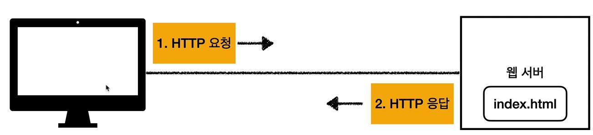

웹 애플리케이션 서버(WAS - Web Application Server)

- HTTP 기반 동작
- 웹 서버 기능 + (정적 리소스 제공 가능)
- **프로그램 코드를 실행해서 애플리케이션 로직 수행**
  - 동적 HTML, HTTP API(JSON)
  - 서블릿, JSP, 스프링 MVC
- ex> 톰캣(Tomcat) Jetty, Undertow

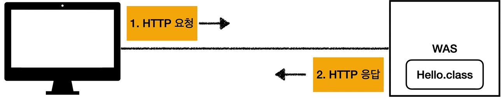

웹 서버, 웹 애플리케이션 서버(WAS) 차이

- 웹 서버는 정적 리소스(파일), WAS는 애플리케이션 로직
- 사실 둘의 용어도 경계도 모호
  - 웹 서버도 프로그램을 실행하는 기능을 포함하기도 함
  - 웹 애플리케이션 서버도 웹 서버의 기능을 제공함
- 자바는 서블릿 컨테이너 기능을 제공하면 was
  - 서블릿 없이 자바코드를 실행하는 서버 프레임워크도 있음
- **WAS는 애플리케이션 코드를 실행하는데 더 특화**

웹 시스템 구성 - WAS, DB
- WAS, DB 만으로 시스템 구성 가능
- WAS는 정적 리소스, 애플리케이션 로직 모두 제공 가능

- 

- WAS가 너무 많은 역할을 담당, 서버 과부하 우려
- 가장 비싼 애플리케이션 로직이 정적 리소스 때문에 수행이 어려울 수 있음
- WAS 장애시 오류 화면도 노출 불가능

웹 시스템 구성 - WEB, WAS, DB
- 정적 리소스는 웹 서버가 처리
- 웹 서버는 애플리케이션 로직같은 동적인 처리가 필요하면 WAS에 요청을 위임
- WAS는 중요한 애플리케이션 로직 처리 전담
- 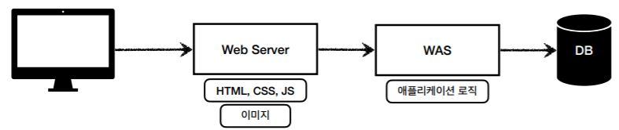
  - 업무 분담이 됨

- 효율적인 리소스 관리
  - 정적 리소스가 많이 사용되면 Web 서버 증설
  - 애플리케이션 리소스가 많이 사용되면 WAS 증설

- 정적 리소스만 제공하는 웹 서버는 잘 죽지 않음
- 애플리케이션 로직이 동작하는 WAS 서버는 잘 죽음
- WAS, DB 장애시 WEB 서버가 오류 화면 제공 가능
- 

---

### 서블릿

HTML Form 데이터 전송
- POST 전송 - 저장
- 
  - action="/save" -> URL에 추가
  - method="post" -> post방식으로 데이터 전송
  - 그 후 값을 넣고 전송을 누르면 웹 브라우저가 생성한 요청 HTTP 메시지가 만들어짐

서버에서 처리해야 하는 업무
- 웹 애플리케이션 서버 직접 구현해야 한다면?
  - 서버 TCP/IP 연결 대기, 소켓 연결
  - HTTP 요청 메시지를 파싱해서 읽기
  - POST 방식, /save URL 인지
  - Content-Type 확인
  - HTTP 메시지 바디 내용 ㅍ싱
  - 저장 프로세스 실행
  - **비즈니스 로직 실행(여기가 의미있는 비즈니스 로직)**
    - **데이텉베이스에 저장 요청**
  - HTTP 응답 메시지 생성 시작
    - HTTP 시작 라인 생성
    - Header 생성
    - 메시지 바디에 HHTML 생성해서 입력
  - TCP/IP에 응답 전달, 소켓 종료

- 서블릿을 지원하는 WAS 사용
  - 위의 과정에서 비즈니스 로직 실행 부분만 제외한 모든 일을 다 지원해줌.

특징
```java
@WebServlet(name = "helloServlet", urlPatterns = "/hello")
public class HelloServlet extends HttpServlet{
    @Override
    protected void service(HttpServletRequest request, HttpServletResponse response){
        //애플리케이션 로직
    }
}
```
  - urlPatterns(/hello)의 URL이 호출되면 서블릿 코드가 실행
  - HTTP 요청 정보를 편리하게 사용할 수 있는 HttpServletRequest
  - HTTP 응답 정보를 편리하게 제공할 수 있는 HttpServletResponse
  - 개발자는 HTTP 스펙을 매우 편리하게 사용

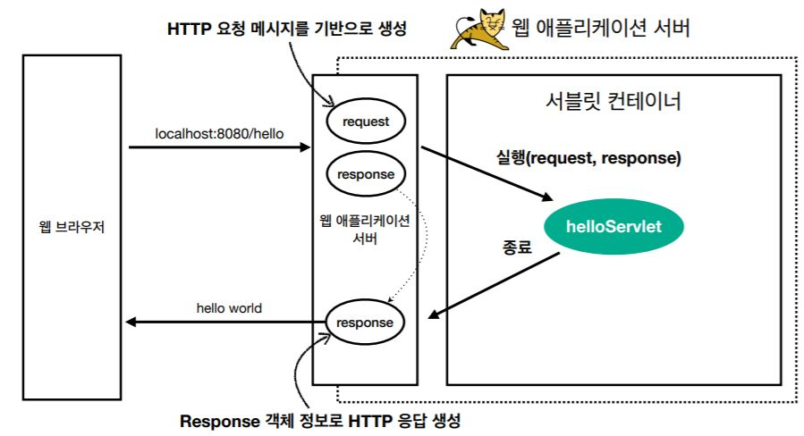
- 웹 브라우저에서 `localhost:8080/hello` 요청
- 그러면, WAS에서 HTTP 요청 메시지 기반으로 request, response 객체를 새로 만듦
- 그 다음, helloServlet 실행
- helloServlet이 종료가 되면 response 객체 정보로 HTTP 응답 생성
- 그리고 웹 브라우저에 응답 메시지 전달

HTTP 요청, 응답 흐름
- HTTP 요청시
  - WAS는 Request, Response 객체를 새로 만들어서 서블릿 객체 호출
  - 개발자는 Request 객체에서 HTTP 요청 정보를 편리하게 꺼내서 사용
  - 개발자는 Response 객체에 HTTP 응답 정보를 편리하게 입력
  - WAS는 Response 객체에 담겨있는 내용으로 HTTP 응답 정보를 생성

서블릿 컨테이너

- 서블릿을 지원하는 WAS안에는 서블릿 컨테이너가 있다.
- 서블릿 컨테이너 안에서 서블릿 객체를 서블릿 컨테이너가 자동으로 생성, 호출해줌.
- 생명주기 관리 : WAS가 종료될때 이 서블릿을 같이 종료해줌

- 톰캣처럼 서블릿을 지원하는 WAS를 `서블릿 컨테이너`라고 함.
- 서블릿 컨테이너는 서블릿 객체를 생성, 초기화, 호출, 종료하는 생명주기 관리
- 서블릿 객체는 **싱글톤으로 관리**
  - 고객의 요청이 올 때 마다 계속 객체를 생성하는 것은 비효율
  - 최초 로딩 시점에 서블릿 객체를 미리 만들어두고 재활용
  - 모든 고객 요청은 동일한 서블릿 객체 인스턴스에 접근
  - **공유 변수 사용 주의**
  - 서블릿 컨테이너 종료시 함께 종료
- JSP도 서블릿으로 변환 되어서 사용
- **동시 요청을 위한 멀티 쓰레드 처리 지원**

---

### 동시 요청 - 멀티 쓰레드


- 쓰레드가 호출해줌

쓰레드
- 애플리케이션 코드를 하나하나 순차적으로 실행하는 것은 쓰레드
- 자바 메인 메서드를 처음 실행하면 main이라는 이름의 쓰레드가 실행
- 쓰레드가 없다면 자바 애플리케이션 실행이 불가능
- 쓰레드는 한번에 하나의 코드 라인만 수행
- 동시 처리가 필요하면 쓰레드를 추가로 생성

단일 요청 - 쓰레드 하나 사용
- 요청이 하나가 온다.
- 그러면 쓰레드 할당해줌
- 이 쓰레드를 가지고 servlet 코드를 실행해줌
- 그리고 쓰레드를 가지고 응답을 해줌
- 응답이 되고나면 쓰레드가 휴식을 함.

다중 요청 - 쓰레드 하나 사용
- 요청1이 들어옴.
  - 쓰레드를 사용해서 servlet을 요청했으나 처리가 지연되고 있다.
- 이때, 요청2가 들어옴.
  - 쓰레드난 하나밖에 없는데 요청1때문에 사용하고 있어서 쓰레드를 기다려야함.
- 이러면, 1번 2번 둘 다 죽어버림.

요청 마다 쓰레드 생성
- 요청1이 들어옴
  - 쓰레드 생성했지만, 처리 지연
- 요청2가 들어옴
  - 쓰레드 새로 생성해서 처리하고 요청이 끝나면 쓰레드 휴식.
- 장점
  - 동시 요청을 처리할 수 있다.
  - 리소스(CP, 메모리)가 허용할 때 까지 처리가능
  - 하나의 쓰레드가 지연 되어도, 나머지 쓰레드는 정상 동작.
- 단점
  - 쓰레드는 생성 비용이 모두 비싸다.
    - 고객의 요청이 올 때마다 쓰레드를 생성하면, 응답 속도가 늦어진다.
  - 쓰레드는 context switching 비용이 발생한다.
  - 쓰레드 생성에 제한이 없다.
    - 고객 요청이 너무 많이 오면, CPU, 메모리 임계점을 넘어서 서버가 죽을 수 있다.

쓰레드 풀
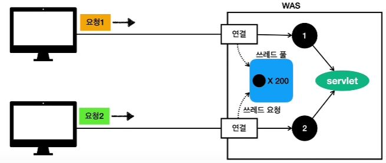
- 쓰레드 풀안에 미리 만들어놓은 쓰레드들이 들어있다.(200개라고 가정)
- 요청이 올 때마다 쓰레드 풀에서 가져다가 쓰고, 쓰레드를 다 사용하면 쓰레드를 죽이는것이 아닌 쓰레드 풀에 반납을 한다.

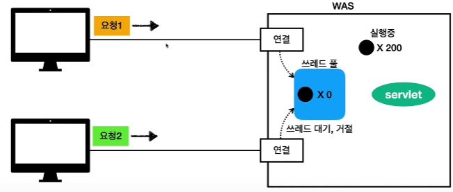
- 쓰레드 풀에 더이상 쓰레드가 없을 때 요청이 들어오면 대기하거나 거절할 수 있다.

- 요청 마다 쓰레드 생성의 단점 보완
  - 특징
    - 필요한 쓰레드를 쓰레드 풀에 보관하고 관리.
    - 쓰레드 풀에 생성 가능한 쓰레드의 최대치를 관리. 톰켓은 최대 200개 기본 설정(변경 가능)
  - 사용
    - 쓰레드가 필요하면, 이미 생성되어 있는 쓰레드를 쓰레드 풀에서 꺼내서 사용한다.
    - 사용을 종료하면 쓰레드 풀에 해당 쓰레드를 반납한다.
    - 최대 쓰레드가 모두 사용중이어서 쓰레드 풀에 쓰레드가 없다면?
      - 기다리는 요청은 거절하거나 특정 숫자만큼만 대기하도록 설정할 수 있다.
  - 장점
    - 쓰레드가 미리 생성되어 있으므로, 쓰레드를 생성하고 종료하는 비용(CPU)이 절약되고, 응답 시간이 빠르다.
    - 생성 가능한 쓰레드의 최대치가 있으므로 너무 많은 요청이 들어와도 기존 요청은 안전하게 처리할 수 있다.

- 실무 팁
  - WAS의 주요 튜닝 포인트는 최대 쓰레드(max thread) 수이다.
  - 이 값을 너무 낮게 설정하면?
    - 동시 요청이 많으면, 서버 리소스는 여유롭지만, 클라이언트는 금방 응답 지연.
  - 이 값을 너무 높게 설정하면?
    - 동시 요청이 많으면, CPU, 메모리 리소스 임계점 초과로 서버 다운
  - 장애 발생시?
    - 클라우드면 일단 서버부터 늘리고, 이후에 튜닝
    - 클라우드가 아니면 열심히 튜닝

- 쓰레드 풀의 적정 숫자
  - 적정 숫자는 어떻게 찾는가...?
  - 애플리케이션 로직의 복잡도, CPU, 메모리, IO 리소스 상황에 따라 모두 다름
  - 성능 테스트
    - 최대한 실제 서비스와 유사하게 성능 테스트 시도
    - 툴: 아파치 ab, 제이미터, nGrinder

WAS의 멀티 쓰레드 지원
- 핵심
  - 멀티 쓰레드에 대한 부분은 WAS가 처리
  - **개발자가 멀티 쓰레드 관련 코드를 신경쓰지 않아도 됨**
  - 개발자는 마치 **싱글 쓰레드 프로그래밍을 하듯이 편리하게 소스 코드를 개발**
  - 멀티 쓰레드 환경이므로 싱글톤 객체(서블릿, 스프링 빈)는 주의해서 사용.

---

### HTML, HTTP API, CSR, SSR

정적 리소스
- 고정된 HTML 파일, CSS, JS, 이미지, 영상 등을 제공
- 주로 웹 브라우저
- 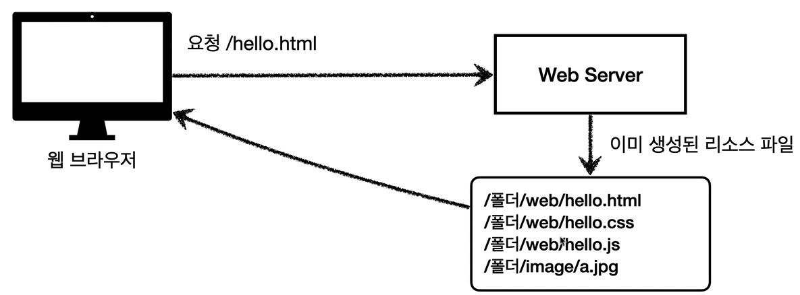

HTML 페이지
- 동적으로 필요한 html 파일을 생성해서 전달
- 웹 브라우저: HTML 해석
- 
  - 주문 내역을 보여줘!
  - WAS(애플리케이션 로직을 수행할 수 있음)가 DB를 통해서 주문 정보 조회.
  - 이것을 동적으로 HTML 생성(JSP,타임리프...)
  - 동적으로 생성된 HTML을 웹브라우저를 내려줌.

HTTP API
- HTML이 아니라 데이터를 전달
- 주로 JSON 형식 사용
- 다양한 시스템에서 호출
- 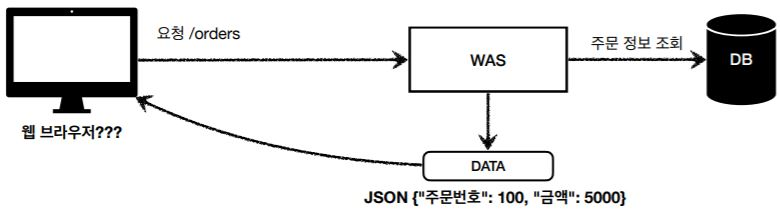
- 데이터만 주고 받음, UI 화면이 필요하면, 클라이언트가 별도 처리
- 앱, 웹 클라이언트, 서버 to 서버
1. 웹 클라이언트 to 서버
2. 앱 클라이언트 to 서버
3. 서버 to 서버 

- 다양한 시스템 연동
  - 주로 JSON 형태로 데이터 통신
  - UI 클라이언트 접점
    - 앱 클라이언트(아이폰, 안드로이드, PC 앱)
    - 웹 브라우저에서 자바스크립트를 통한 HTTP API 호출
    - React, Vue.js 같은 웹 클라이언트
  - 서버 to 서버
    - 주문 서버 -> 결제 서버
    - 기업간 데이터 통신

서버사이드 렌더링, 클라이언트 사이드 렌더링
- SSR - 서버 사이드 렌더링
  - HTML 최종 결과를 서버에서 만들어서 웹 브라우저에 전달
  - 주로 정적인 화면에 사용
  - 관련기술 : JSP, 타임리프 -> **백엔드 게발자**
  - 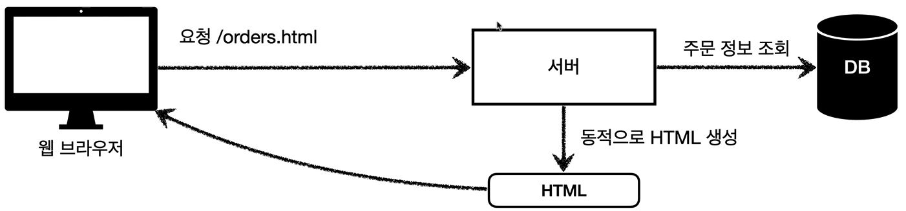
    - 최종적으로 html을 서버에서 다 만듦.
- CSR - 클라이언트 사이드 렌더링
  - HTML 결과를 자바 스크립트를 사용해 웹 브라우저에서 동적으로 생성해서 적용
  - 주로 동적인 화면에 사용, 웹 환경을 마치 앱 처럼 필요한 부분부분 변경할 수 있음.
  - ex> 구글 지도, Gmail, 구글 캘린더
  - 관련기술: React, Vue.js -> **웹 프론트앤드 개발자**
  - 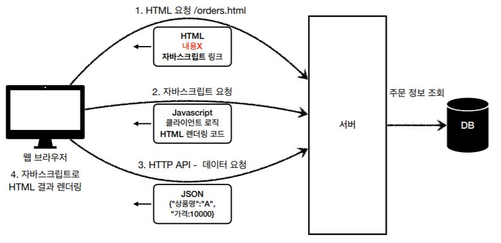
- 참고
  - React, Vue.js를 CSR + SSR 동시에 지원하는 웹 프레임워크도 있음.
  - SSR을 사용하더라도, 자바스크립트를 사용해서 화면 일부를 동적으로 변경 가능

어디까지 알아야 할까? 백엔드 개발자 입장에서 UI 기술
- 백엔드 - 서버 사이드 렌더링 기술
  - JSP, 타임리프
  - 화면이 정적이고, 복잡하지 않을 때 사용
  - 백엔드 개발자는 서버 사이드 렌더링 기술 학습 **필수**
- 웹 프론트엔드 - 클라이언트 사이드 렌더링 기술
  - React, Vue.js
  - 복잡하고 동적인 UI 사용
  - 웹 프론트엔드 개발자의 전문 분야
- 선택과 집중
  - 백엔드 개발자의 웹 프론트엔드 기술 학습은 **옵션**
  - 백엔드 개발자는 서버, DB, 인프라 등등 수 많은 백엔드 기술을 공부해야한다.
  - 웹 프론트엔드도 깊이있게 잘 하려면 숙련에 오랜 시간이 필요하다.

---

### 자바 백엔드 웹 기술 역사

과거 기술
- 서블릿 - 1997
  - html 생성이 어려움
- JSP - 1999
  - HTML 생성은 편리하지만, 비즈니스 로직까지 너무 많은 역할 담당
- 서블릿, JSP 조합 MVC 패턴 사용
  - 모델, 뷰, 컨트롤러로 역할을 나누어 개발
- MVC 프레임워크 춘추 전국 시대 - 2000년 초 ~ 2010년 초
  - MVC 패턴 자동화, 복잡한 웹 기술을 편리하게 사용할 수 있는 다양한 기능 지원
  - 스트럿츠, 웹워크, 스프링 MVC(과거 버전)

현재 사용 기술
- **애노테이션 기반의 스프링 MVC 등장**
  - @Controller
  - MVC 프레임워크의 춘추 전국 시대 마무리
- 스프링 부트의 등장
  - 스프링 부트는 서버를 내장
  - 과거에는 서버에 WAS를 직접 설치하고, 소스는 War 파일을 만들어서 설치한 WAS에 배포
  - 스프링 부트는 빌드 결과(Jar)에 WAS 서버 포함 -> 빌드 배포 단순화

최신 기술 - 스프링 웹 기술의 분화
- Web Servlet - Spring MVC
- Web Reactive - Spring WebFlux
  - 특징
    - 비동기 넌 블러킹 처리
    - 최소 쓰레드로 최대 성능 - 쓰레드 컨텍스트 스위칭 비용 효율화
    - 함수형 스타일로 개발 - 동시처리 코드 효율화
    - 서블릿 기술 사용 X
  - 그런데
    - Web Flux는 기술적 난이도 매우 높음
    - 아직은 RDB 지원 부족
    - 일반 MVC의 쓰레드 모델도 충분히 빠르다.
    - 실무에서 아직 많이 사용하지는 않음(전체 1% 이하)

자바 뷰 템플릿 역사
- HTML을 편리하게 생성하는 뷰 기능
  - JSP
    - 속도 느림, 기능 부족
  - 프리마커(Freemarker), Velocity(벨로시티)
    - 속도 문제 해결, 다양한 기능
  - 타임리프(Thymeleaf)
    - 내추럴 템플릿: HTML의 모양을 유지하면서 뷰 템플릿 적용 가능
    - 스프링 MVC와 강력한 기능 통합
    - **최선의 선택**, 단 성능은 프리마커, 벨로시티가 더 빠름

---
---

## 서블릿

---
---

### 프로젝트 생성

- Gradle 
- Java
- 2.4.3
- Group : hello
- Artifact : servlet
- Packaging : War
  - 보통 Jar인데, War로 해야 jsp를 사용할 수 있음.
  - War은 톰켓서버를 별도로 설치하고 그 다음 별도로 War로 빌드해서 넣을때 혹은 안에 톰켓을 내장하는것도 됨.
- Java : 11
- Dependencies
  - Spring Web


---

### Hello 서블릿

```java
@ServletComponentScan
@SpringBootApplication
public class ServletApplication {

	public static void main(String[] args) {
		SpringApplication.run(ServletApplication.class, args);
	}

}
```
- 스프링부트는 서블릿을 직접 등록해서 사용할 수 있도록 `@ServletComponentScan`을 지원한다.

```java
package hello.servlet.basic;

import javax.servlet.ServletException;
import javax.servlet.annotation.WebServlet;
import javax.servlet.http.HttpServlet;
import javax.servlet.http.HttpServletRequest;
import javax.servlet.http.HttpServletResponse;
import java.io.IOException;

@WebServlet(name = "heeloServlet",urlPatterns = "/hello")
public class HelloServlet extends HttpServlet {

    @Override
    protected void service(HttpServletRequest request, HttpServletResponse response) throws ServletException, IOException {

        System.out.println("HelloServlet.service");
        System.out.println("request = " + request);
        System.out.println("response = " + response);

        String username = request.getParameter("username");
        System.out.println("username = " + username);

        //header에 들어가는거
        response.setContentType("text/plain");
        response.setCharacterEncoding("utf-8");
        //data
        response.getWriter().write("hello "+username);
    }
}
```
- `@WebServlet` 서블릿 애노테이션
  - name : 서블릿 이름
  - urlPatterns : URL 매핑
  - 위의 두개는 중복이 있으면 안됨.

HTTP 요청을 통해 매핑된 URL이 호출되면 서블릿 컨테이너는 다음 메서드 실행.
```java
protected void service(HttpServletRequest request, HttpServletResponse response)
```

```java
//header에 들어가는거
response.setContentType("text/plain");
response.setCharacterEncoding("utf-8");
//data
response.getWriter().write("hello "+username);
```
- 컴망 내용

HTTP 요청 메시지 로그로 확인하기


resources/application.properites 에 아래와 같이 입력
```
logging.level.org.apache.coyote.http11=debug
```

출력
```
Host: localhost:8080
Connection: keep-alive
sec-ch-ua: "Chromium";v="88", "Google Chrome";v="88", ";Not A Brand";v="99"
sec-ch-ua-mobile: ?0
Upgrade-Insecure-Requests: 1
User-Agent: Mozilla/5.0 (Windows NT 10.0; Win64; x64) AppleWebKit/537.36 (KHTML, like Gecko) Chrome/88.0.4324.190 Safari/537.36
Accept: text/html,application/xhtml+xml,application/xml;q=0.9,image/avif,image/webp,image/apng,*/*;q=0.8,application/signed-exchange;v=b3;q=0.9
Sec-Fetch-Site: none
Sec-Fetch-Mode: navigate
Sec-Fetch-User: ?1
Sec-Fetch-Dest: document
Accept-Encoding: gzip, deflate, br
Accept-Language: ko-KR,ko;q=0.9,en-US;q=0.8,en;q=0.7
Cookie: Idea-ac70df0f=3700b133-6e19-47ac-8150-fcb2b1f4a668
```
- 그러나 운영서버에 이렇게 모든 요청 정보를 다 남기면 성능저하가 발생할 수 있으니, 개발 단계에서만 적용

서블릿 컨테이너 동작 방식 설명
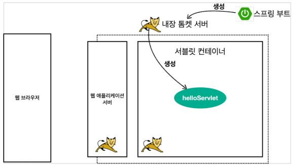
- 스프링 부트를 가지고 스프링 부트 실행
- 스프링 부트를 실행하면서 스프링 부트가 내장 톰켓 서버를 띄어준다.
- 그러면서 톰켓 서버는 내부에 서블릿 컨테이너 기능을 가지고 있고, 서블릿 컨테이너를 통해서 서블릿을 생성해줌.
- 그리하여 서블릿 컨테이너안에 `helloServlet`이 생성.


- 웹 브라우저가 위와같이 http 메세지를 만들어서 서버에 던져줌


- 서버는 WAS에서 request, response 객체를 만들어서 싱글톤으로 떠있는 `helloServlet`을 호출해줌.
- 거기에 서비스 method를 호출하면서 request, response를 넘겨줌
- 그리고 필요한 작업(ex> resopnse data에다가 Content-Type, hello world라는 메시지)을 하고, 종료되고 나가면서 WAS서버가 response 정보를 가지고 HTTP 응답 메시지를 위와같이 만들고 반환을 해줌.
- 그러면 웹 브라우저에서 hello world라고 볼 수 있는거다.

> 참고
>
> HTTp 응답에서 Content-Length는 웹 애플리케이션 서버가 자동으로 생성해준다.

---

### HttpServletRequest - 개요

**HttpServletRequest 역할**
- HTTP 요청 메시지를 개발자가 직접 파싱해서 사용해도 되지만, 매우 불편.
- 서블릿은 개발자가 HTTP 요청 메시지를 편리하게 사용할 수 있도록 개발자 대신에 HTTP 요청 메시지를 파싱한다.
- 그리고 그 결과를 `HttpServletRequest` 객체에 담아서 제공.

HttpServletRequest를 사용하면 다음과 같은 HTTP 요청 메시지를 편리하게 조회할 수 있다.

**HTTP 요성 메시지**
```
POST /save HTTP/1.1
Host: localhost:8080
Content-Type: applicatoin/x-www-form-urlencoded

username=kim&age=20
```

- START LINE(첫번째 줄, 즉 위에서는 `POST /save HTTP/1.1` 이거)
  - HTTP 메소드
  - URL
  - 쿼리 스트링
  - 스키마, 프로토콜
- 헤더(위에서는 `Host: localhost:8080 Content-Type: applicatoin/x-www-form-urlencoded` 이거)
  - 헤더 조회
- 바디(위에서는 `username=kim&age=20` 이거)
  - form 파라미터 형식 조회
  - message body 데이터 직접 조회

**임시 저장소 기능**
- 해당 HTTP 요청이 시작부터 끝날 때 까지 유지되는 임시 저장소 기능
  - 저장: `request.setAttribute(name, value)`
  - 조회: `request.getAttribute(name)`

**세선 관리 기능**
- `request.getSession(create: true)`

> 중요
>
> HttpServletRequest, HttpServletResponse를 사용할 때 가장 중요한 점은 이 객체들이 HTTP 요청 메시지, HTTP 응답 메시지를 편리하게 사용하도록 도와주는 객체라는 점이다.
>
> 따라서 이 기능에 대해서 깊이있는 이해를 하려면 **HTTP 스펙이 제공하는 욫ㅇ, 응답 메시지 자체를 이해**해야 한다.

---

### HTttpServletRequest - 기본 사용법

코딩으로 함.

<details>
<summary>java/hello.servlet/basic/request/RequestHeaderServlet.java</summary>

```java
package hello.servlet.basic.request;

import javax.servlet.ServletException;
import javax.servlet.annotation.WebServlet;
import javax.servlet.http.Cookie;
import javax.servlet.http.HttpServlet;
import javax.servlet.http.HttpServletRequest;
import javax.servlet.http.HttpServletResponse;
import java.io.IOException;
import java.util.Enumeration;

@WebServlet(name = "requestHeaderServlet", urlPatterns = "/request-header")
public class RequestHeaderServlet extends HttpServlet {

    @Override
    protected void service(HttpServletRequest request, HttpServletResponse response) throws ServletException, IOException {
        printStartLine(request);
        printHeaders(request);
        printHeaderUtils(request);
        printEtc(request);

    }

    private void printStartLine(HttpServletRequest request) {
        System.out.println("--- REQUEST-LINE - start ---");
        System.out.println("request.getMethod() = " + request.getMethod()); //GET
        System.out.println("request.getProtocal() = " + request.getProtocol()); //HTTP/1.1
        System.out.println("request.getScheme() = " + request.getScheme()); //http
        // http://localhost:8080/request-header
        System.out.println("request.getRequestURL() = " + request.getRequestURL());
        // /request-test
        System.out.println("request.getRequestURI() = " + request.getRequestURI());
        //username=hi
        System.out.println("request.getQueryString() = " +
                request.getQueryString());
        System.out.println("request.isSecure() = " + request.isSecure()); //https 사용 유무
        System.out.println("--- REQUEST-LINE - end ---");
        System.out.println();
    }
    //Header 모든 정보
    private void printHeaders(HttpServletRequest request) {
        System.out.println("--- Headers - start ---");

//      옛날
//        Enumeration<String> headerNames = request.getHeaderNames();
//        while(headerNames.hasMoreElements()){
//            String headerName = headerNames.nextElement();
//            System.out.println(headerName + ": " + headerName);
//        }

        //요즘
        request.getHeaderNames().asIterator()
                .forEachRemaining(headerName -> System.out.println(headerName + ": " + headerName));

        System.out.println("--- Headers - end ---");
        System.out.println();
    }

    //Header 편리한 조회
    private void printHeaderUtils(HttpServletRequest request) {
        System.out.println("--- Header 편의 조회 start ---");
        System.out.println("[Host 편의 조회]");
        System.out.println("request.getServerName() = " +
                request.getServerName()); //Host 헤더
        System.out.println("request.getServerPort() = " +
                request.getServerPort()); //Host 헤더
        System.out.println();
        System.out.println("[Accept-Language 편의 조회]");
        request.getLocales().asIterator()
                .forEachRemaining(locale -> System.out.println("locale = " +
                        locale));
        System.out.println("request.getLocale() = " + request.getLocale());
        System.out.println();
        System.out.println("[cookie 편의 조회]");
        if (request.getCookies() != null) {
            for (Cookie cookie : request.getCookies()) {
                System.out.println(cookie.getName() + ": " + cookie.getValue());
            }
        }
        System.out.println();
        System.out.println("[Content 편의 조회]");
        System.out.println("request.getContentType() = " +
                request.getContentType());
        System.out.println("request.getContentLength() = " +
                request.getContentLength());
        System.out.println("request.getCharacterEncoding() = " +
                request.getCharacterEncoding());
        System.out.println("--- Header 편의 조회 end ---");
        System.out.println();
    }

    //기타 정보
    private void printEtc(HttpServletRequest request) {
        System.out.println("--- 기타 조회 start ---");
        // remote 정보 : 요청이 온거에 대한 정보
        System.out.println("[Remote 정보]");
        System.out.println("request.getRemoteHost() = " +
                request.getRemoteHost()); //
        System.out.println("request.getRemoteAddr() = " +
                request.getRemoteAddr()); //
        System.out.println("request.getRemotePort() = " +
                request.getRemotePort()); //
        System.out.println();
        // local 정보 : 현재 나의 서버에 대한 정보
        System.out.println("[Local 정보]");
        System.out.println("request.getLocalName() = " +
                request.getLocalName()); //
        System.out.println("request.getLocalAddr() = " +
                request.getLocalAddr()); //
        System.out.println("request.getLocalPort() = " +
                request.getLocalPort()); //
        System.out.println("--- 기타 조회 end ---");
        System.out.println();
    }
}

```
</details>

---

### HTTP 요청 데이터 - 개요

HTTP 요청 메시지를 통해 클라이언트에서 서버로 데이터를 전달하는 방법들.

**주로 다음 3가지 방법을 사용**
- **GET - 쿼리 파라미터**
  - /url<strong>?username=hello?age=20</strong>
  - 메시지 바디 없이, URL의 쿼리 파라미터에 데이터를 포함해서 전달
  - ex> 검색, 필터, 페이징등에서 많이 사용하는 방식
- **POST - HTML Form**
  - 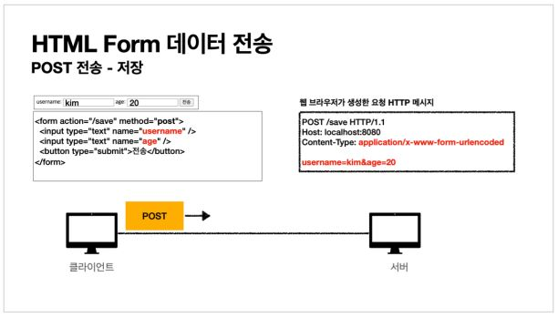
  - content-type : applicatoin/x-www-form-urlencoded
  - 메시지 바디에 쿼리 파라미터 형식으로 전달 username=hello&age=20
  - ex> 회원 가입, 상품 주문, HTML Form 사용
- **HTTP message body**에 데이터를 직접 담아서 요청
  - HTTP API에서 주로 사용, JSON, XML, TEXT
  - 데이터 형식은 주로 JSON 사용
  - POST, PUT, PATCH

---

### HTTP 요청 데이터 - GET 쿼리 파라미터

다음 데이터를 client에서 server로 전송해보자.

전달 데이터
- username=hello
- age=20

메시지 바디 없이, URL의 쿼리 파라미터를 사용해서 데이터를 전달해보자.<br>
ex> 검색, 필터, 페이징등에서 많이 사용하는 방식

쿼리 파라미터는 URL에 다음과 같이 `?`를 시작으로 보낼 수 있다. 추가 파라미터는 `&`로 구분하면 된다.
- `http://localhost:8080/request-param?username=hello&age=20`

서버에서는 `HttpServletRequest`가 제공하는 다음 메서드를 통해 쿼리 파라미터를 편리하게 조회할 수 있다.

```
[전체 파라미터 조회] - start
username=hello
age=20
[전체 파라미터 조회] - end

[단일 파라미터 조회]
username = hello
age = 20

[이름이 같은 복수 파라미터 조회]
name = hello
name = hello2
```

**복수 파라미터에서 단일 파라미터 조회**
- `username=hello&username=kim`과 같이 파라미터 이름은 하나인데, 값이 중복되면 어떻게 될까?
- `request.getParameter()`는 하나의 파라미터 이름에 대해서 단 하나의 값만 있을 때 사용해야한다. 지금처럼 중복일때는 `request.getParameterValues()`를 사용해야 한다.
- 참고로 이렇게 중복일 때 `request.getParameter()`를 사용하면 `request.getParameterValues`의 첫 번째 값이 반환.

---

### HTTP 요청 데이터 - POST HTML Form

이번에는 HTML의 Form을 사용해서 client 에서 server로 데이터를 전송해보자.<br>
주로 회원 가입, 상품 주문 등에서 사용하는 방식이다.

**특징**
- content-type: `application/x-www-form-urlencoded`
- 메시지 바디에 쿼리 파라미터 형식으로 데이터를 전달한다. `username=hello&age=20`

`src/main/webapp/basic/hello-form.html`생성

```html
<!DOCTYPE html>
<html>
<head>
 <meta charset="UTF-8">
 <title>Title</title>
</head>
<body>
<form action="/request-param" method="post">
 username: <input type="text" name="username" />
 age: <input type="text" name="age" />
 <button type="submit">전송</button>
</form>
</body>
</html>
```

POST의 HTML Form을 전송하면 웹 브라우저는 다음 형식으로 HTTP 메시지를 만든다. (웹 브라우저 개발자 모드 확인)
- **요청 URL** : `http://localhost:8080/request-param`
- **content-type**: `applicatoin/x-www-form-urlencoded`
- **message body** : `username=hello&age=20`

`application/x-www-form-urlencoded` 형식은 앞서 GET에서 살펴본 쿼리파라미터 형식과 같다. 따라서 **쿼리 파라미터 조회 메서드를 그대로 사용**하면 된다. <br>
client(웹 브라우저) 입장에서는 두 방식에 차이가 있지만, server 입장에서는 둘의 형식이 동일하므로, `request.getParameter()`로 편리하게 구분없이 조회할 수 있다.

정리하면 `request.getParameter()`는 GET URL 쿼리 파라미터 형식도 지원하고, POST HTML Form 형식도 둘 다 지원한다.

> **참고**
>
> contnet-type은 HTTP 메시지 바디의 데이터 형식을 지정한다. <br>
> **GET URL 쿼리 파라미터 형식**으로 client에서 server로 데이터를 전달 할 때는 HTTP 메시지 바디를 사용하지 않기 때문에 content-type이 없다. <br>
> **POST HTML Form** 형식으로 데이터를 전달하면 HTTP 메시지 바디에 해당 데이터를 포함해서 보내기 때문에 바디에 포함된 데이터가 어떤 형식인지 content-type을 꼭 지정해야 한다. 이렇게 폼으로 데이터를 전송하는 형식을 `applicaton/x-www-form-urlencoded`'라 한다.

Postman을 사용한 테스트
- 이런 간단한 테스트에서 HTML form을 만들기는 귀찮다. 이때 Postman을 사용하면 된다.

**Postman** 테스트 주의사항
- POST 전송시
  - Body -> `x-www-form-urlencoded` 선택
  - Headers에서 content-type: `application/x-www-form-urlencoded`로 지정된 부분 꼭 확인

---

### HTTP 요청 데이터 - API 메시지 바디 - 단순 텍스트

- **HTTP message body**에 데이터를 직접 담아서 요청
  - HTTP API에서 주로 사용, JSON, XML, TEXT
  - 데이터 형식은 주로 JSON 사용
  - POST, PUT, PATCH

- 먼저 가장 단순한 텍스트 메시지를 HTTP 메시지 바디에 담아서 전송하고 읽어본다.
- HTTP 메시지 바디의 데이터를 InputStream을 사용해서 직접 읽을 수 있다.

> 참고<br>
> inputStream은 byte 코드를 반환한다. byte 코드를 우리가 읽을 수 있는 문자(String)로 보려면 문자표(Charset)를 지정해주어야 한다. 여기서는 UTF_8 Charset을 지정해주었다.


### HTTP 요청 데이터 - API 메시지 바디 - JSON

이번에는 HTTP API에서 주로 사용하는 JSON 형식으로 데이터를 전달해본다.

**JSON 형식 전송**
- POST http://localhost:8080/request-body-json
- content-type: **application/json**
- message body: `{"username": "hello", "age": 20}
- 결과: `messageBody = {"username": "hello", "age": 20}

**JSON 형식 파싱 추가**<br>
JSON 형식으로 파싱할 수 있게 객체를 하나 생성.<BR>
`heelo.servlet.basic.HelloData`
- lombok 사용

> 참고<br>
> JSON 결과를 파싱해서 사용할 수 있는 자바 객체로 변환하려면 Jackson, Gson 같은 JSON 변환 라이브러리르 추가해서 사용해야 한다. 스프링 부트로 Spring MVC를 선택하면 기본으로 Jackson 라이브러리(`ObjectMapper`)를 함께 제공한다.

> 참고<br>
> HTML form 데이터도 메시지 바디를 통해 전송되므로 직접 읽을 수 있다. 하지만 편리한 파라미터 조회 기능 (`request.getParameter(...)`)을 이미 제공하기 때문에 파라미터 조회 기능을 사용하면 된다.

---

### HttpServletResponse - 기본 사용법

HttpServletResponse 역할

**HTTP 응답 메시지 작성**
- HTTP 응답코드 지정(ex>200,400,500,403...)
- 헤더 생성
- 바디 생성

**편의 기능 제공**
- Content-Type, 쿠키, Redirect(코드로 확인 main/java/hello.servlet/basic/response)

---

### HTTP 응답 데이터 - 단순 텍스트, HTML

HTTP 응답 메시지는 주로 다음 내용을 담아서 전달한다.

- 단순 텍스트 응답
  - `writer.println("ok");`
- HTML 응답
- HTTP API - MessageBody JSON 응답

<details>
<summary>코드</summary>

```java

@WebServlet(name = "responseHtmlServlet", urlPatterns = "/response-html")
public class ResponseHtmlServlet extends HttpServlet {

    @Override
    protected void service(HttpServletRequest request, HttpServletResponse response) throws ServletException, IOException {
        //Content-Type: text/html;charset=utf-8
        response.setContentType("text/html");
        response.setCharacterEncoding("utf-8");

        PrintWriter writer = response.getWriter();
        writer.println("<html>");
        writer.println("<body>");
        writer.println("  <div>안녕?</div>");
        writer.println("</body>");
        writer.println("</html>");

    }
```

</details>

- HTTP 응답으로 HTML을 반환할 때 content-type을 `text/html`로 지정해야 한다.

---

### HTTP 응답 데이터 - API JSON

<details>
<summary>코드</summary>

```java
@WebServlet(name = "responseJsonServlet", urlPatterns = "/response-json")
public class ResponseJsonServlet extends HttpServlet {
    
  private ObjectMapper objectMapper = new ObjectMapper();

  @Override
  protected void service(HttpServletRequest request, HttpServletResponse response) throws ServletException, IOException {
      //Content-Type: application/json
      response.setContentType("application/json");
      response.setCharacterEncoding("utf-8");

      HelloData helloData = new HelloData();
      helloData.setUsername("kim");
      helloData.setAge(20);
      
      //위 문자를 으로 변환해야함 {"username":"kim", "age":20} -> objectMapper 사용
      String result = objectMapper.writeValueAsString(helloData);
      response.getWriter().write(result);
  }
}
```
- Jackson 라이브러리가 제공하는 objectMapper.writeValueAsString() 를 사용하면 객체를 JSON 문자로 변경할 수 있다

</details>

---
---

## 서블릿, JSP, MVC 패턴

---
---

### 회원 관리 웹 애플리케이션 요구사항

**회원 정보**
- 이름 : `username`
- 나이 : `age`

**기능 요구사항**
- 회원 저장
- 회원 목록 조회

---

### 서블릿으로 회원 관리 웹 애플리케이션 만들기

서블릿으로 회원 등록 HTML 폼을 제공해보자.
(html 작성이 ㄹㅇ 헬임)(자바코드에다가 html을 만들어 넣는거)

**템플릿 엔진으로**
- 지금까지 서블릿과 자바 코드만으로 HTML을 만들었다. 서블릿 덕분에 동적으로 원하는 HTML을 마음껏 만들 수 있다.
- 정적인 HTML 문서라면 화면이 계속 달라지는 회원의 저장 결과라던가, 회원 목록 같은 동적인 HTML을 만드는 일은 불가능 할 것이다.
- 그런데, 코드에서 보듯이 매우 복잡하고 비효율적.
- 자바 코드로 HTML을 만들어 내는 것 보다 차라리 HTML 문서에 동적으로 변경해야 하는 부분만 자바 코드를 넣을 수 있다면 편리할 것이다.
- 이것이 바로 템플릿 엔진이 나온 이유이다. 템플릿 엔진을 사용하면 HTML 문서에서 필요한 곳만 코드를 적용해서 동적으로 변경 가능.
- 템플릿 엔진에는 JSP, Thymeleaf, Freemarker, Velocity등이 있다.

> **참고**
>
> JSP는 성능과 기능면에서 다른 템플릿 엔진과의 경쟁에서 밀리면서, 점점 사장되어 가는 추세이다.<BR>
> 템플릿 엔진들은 각각 장단점이 있는데, 강의에서는 JSP는 앞부분에서 잠깐 다루고, 스프링과 잘 통합되는 Thymeleaf를 사용한다.

---

### JSP로 회원 관리 웹 애플리케이션 만들기

- `<% page contentType="text/html;charset=UTF-8" language="java" %>`
  - 첫 줄은 JSP문서라는 뜻이다. JSP는 이렇게 시작해야함.

회원 등록 폼 JSP를 보면 첫 줄을 제외하고는 완전히 HTML과 똑같다. JSP는 서버 내부에서 서블릿으로 변환되는데, 우리가 만들었던 MemberFormServlet과 거의 비슷한 모습이다.

JSP는 자바 코드를 그대로 다 사용할 수 있다.
- `<%@ page import"hello.servlet.domain.member.MemberRepository" %>`
  - 자바의 import 문과 같다.
- `<% ~~~ %>`
  - 이 부분에는 자바 코드를 입력할 수 있다.
- `<%= ~~ %>`
  - 이 부분에는 자바 코드를 출력할 수 있다.

회원 저장 JSP를 보면, 회원 저장 서블릿 코드와 같다. 다른 점이 있다면 HTML을 중심으로 하고, 자바 코드를 부분부분 입력해주었다. `<% ~ %>`를 사용해서 HTML 중간에 자바 코드를 출력하고 있다.

회원 리포지토리를 먼저 조회하고, 결과 List를 사용해서 중간에 `<tr><td>` HTML 태그를 반복해서 출력하고 있다.

서블릿과 JSP의 한계

- 서블릿으로 개발할 때는 뷰(View)화면을 위한 HTML을 만드는 작업이 자바 코드에 섞여서 지저분하고 복잡했다.
- JSP를 사용한 덕분에 뷰를 생성하는 HTML 작업을 깔끔하게 가져가고, 중간중간 동적으로 변경이 필요한 부분에만 자바 코드를 적용했다. 그런데 이렇게 해도 해결되지 않는 몇가지 고민이 남는다.
<BR>

- 회원 저장 JSP를 보자.
- 코드의 상위 절반은 회원을 저장하기 위한 비즈니스 로직이고, 나머지 하위 절반만 결과를 HTML로 보여주기 위한 뷰 영역이다. 회원 목록의 경우에도 마찬가지다.
- 코드를 잘 보면, JAVA 코드, 데이터를 조회하는 리포지토리 등등 다양한 코드가 모두 JSPDP 노출되어 있다. JSP가 너무 많은 역할을 한다. 이렇게 작은 프로젝트도 벌써 머리가 아파오는데, 수백 수천줄이 넘어가는 JSP를 떠올려보면 정말 지옥과 같을 것이다.(유지보수 지옥 썰)

**MVC 패턴의 등장**

비즈니스 로직은 서블릿 처럼 다른곳에서 처리하고, JSP는 목적에 맞게 HTML로 화면(View)을 그리는 일에 집중.

과거 개발자들도 모두 비슷한 고민이 있었고, 그래서 MVC패턴이 등장했다.

---

### MVC 패턴 - 개요

**너무 많은 역할**<BR>
- 하나의 서블릿이나 JSP만으로 비즈니스 로직과 뷰 렌더링까지 모두 처리하게 되면, 너무 많은 역할을 하게되고, 결과적으로 유지보수가 어려워진다. 
- 비즈니스 로직을 호출하는 부분에 변경이 발생해도 해당 코드를 손대야 하고, UI를 변경할 일이 있어도 비즈니스 로직이 함께 있는 해당 파일을 수정해야 한다. 
  - HTML 코드 하나 수정해야 하는데, 수백줄의 자바 코드가 함깨 있다고 상상하면 끔찍하다. 
  - 또는 비즈니스 로직을 하나 수정해야 하는데 수백 수천줄의 HTML 코드가 함께 있다면 끔찍하다.

**변경의 라이프 사이클**<BR>
- 사실 이게 중요한데, 진짜 문제는 둘 사이에 변경의 라이프 사이클이 다르다는 점이다.
- 예를 들어서 UI를 일부 수정하는 일과 비즈니스 로직을 수저하는 일은 각각 다르게 발생할 가능성이 매우 높고 대부분 서로 영향을 주지 않는다.
- 이렇게 변경의 라이프 사이클이 다른 부분을 하나의 코드로 관리하는 것은 유지보수하기 좋지 않다. (물론 UI가 많이 변하면 함께 변경될 가능성도 있다.)

**기능 특화**
- 특히 JSP 같은 뷰 템플릿은 화면을 렌더링 하는데 최적화 되어 있기 때문에 이 부분의 업무만 담당하는 것이 가장 효과적이다.

**Model View Control**
- MVC 패턴은 지금까지 학습한 것 처럼 하나의 서블릿이나, JSP로 처리하던 것을 컨트롤러(Controller)와 뷰(View)라는 영역으로 서로 역할을 나눈 것을 말한다. 웹 애플리케이션은 보통 이 MVC 패턴을 사용한다.

**컨트롤러** : HTTP 요청을 받아서 파라미터를 검증하고, 비즈니스 로직을 실행한다. 그리고 뷰에 전달할 결과 데이터를 조회해서 모델에 담는다.

**모델**: 뷰에 출력할 데이터를 담아둔다. 뷰가 필요한 데이터를 모두 모델에 담아서 전달해주는 덕분에 뷰는 비즈니스 로직이나 데이터 접근을 몰라도 되고, 화면을 렌더링 하는 일에 집중할 수 있다.

**뷰** : 모델에 담겨있는 데이터를 사용해서 화면을 그리는 일에 집중한다. 여기서는 HTML을 생성하는 부분을 말한다.

> **참고**<BR>
> 컨트롤러에 비즈니스 로직을 둘 수도 있지만, 이렇게 되면 컨트롤러가 너무 많은 역할을 담당한다.<BR>
> 그래서 일반적으로 비즈니스 로직은 서비스(Service)라는 게층을 별도로 만들어서 처리한다.(막 로직이 별로 없는경우(단순히 저장...)는 repository를 바로 사용하기도 함)<br>
> 그리고 컨트롤러는 비즈니스 로직이 있는 서비스를 호출하는 담당한다.<br>
> 참고로 비즈니스 로직을 변경하면 비즈니스 로직을 호출하는 컨트롤러의 코드도 변경될 수 있다. 앞에서는 이해흘ㄹ 돕기 위해 비즈니스 로직을 호출한다는 표현 보다는, 비즈니스 로직이라 설명했다.


- 고객이 요청을 함.
- Controller에서 비즈니스 로직 수행(servlet)
- Model에다가 데이터를 담는다
- 그리고 뷰 로직을 실행(뷰 로직으로 제어권을 넘긴다.)(jsp)
- jsp가 이때부터 실행 되면서 Model에 있는 데이터를 참고해서 view를 그려서 전달해줌.

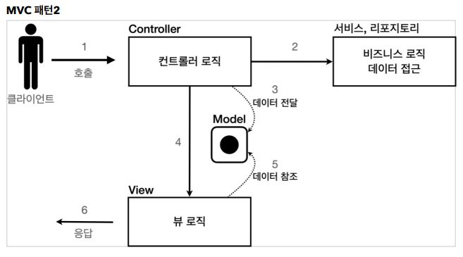
- 보통 이 그림이 맞음
- client가 controller 호출한다.
- controller는 파라미터 꺼내는 등 고객이 제대로 요청한건지, http 요청이 제대로 맞는지 스펙을 확인(잘못되면 400 오류...), 로직이 잘 맞으면 service나 repository를 호출해서 비즈니스 로직이나 데이터 접근을 함.
- 그리고 controller는 이에 대한 결과를 받음.
- 그리고 Model에다가 데이터를 전달함
- 뷰 로직으로 제어권을 넘긴다
- 뷰 로직은 Model에서 값을 꺼내서 처리함.

---

### MVC 패턴 - 적용

서블릿을 controller로 사용하고, JSP를 view로 사용해서 MVC 패턴을 적용해보자.<br>
Model은 HttpServletRequest 객체를 사용한다. request는 내부에 데이터 저장소를 가지고 있는데, `request.setAttribute()`,`request.getAttribute()`를 사용하면 데이터를 보관하고, 조회할 수 있다.

`dispatcher.forward()`: 다른 서블릿이나 JSP로 이동할 수 있는 기능이다. 서버 내부에서 다시 호출이 발생한다.(client에서 server로 호출을 한거임, server안에서 자기들 끼리 서블릿이 호출되었다가 jsp를 호출하고 jsp에서 응답을 만들어서 고객한테 보낸거임)

`/WEB-INF`<br>
이 경로안에 JSP가 있으면 외부에서 직접 JSP를 호출할 수 없다. 우리가 기대하는 것은 항상 컨트롤러를 통해서 JSP를 호출하는 것이다.

**redirect vs forward**<br>
redirect는 실제 client(웹 브라우저)에 응답이 나갔다가, client가 redirect 경로로 다시 요청한다. 따라서 client가 인지할 수 있고, URL 경로도 실제로 변경된다.(호출이 2번)<BR>
반면에 forward는 서버 내부에서 일어나는 호출이기 때문에 client가 전혀 인지하지 못한다.

```html
<!-- 상대경로 사용, [현재 URL이 속한 계층 경로 + /save] -->
<form action="save" method="post">
    username: <input type="text" name="username" />
    age: <input type="text" name="age" />
    <button type="submit">전송</button>
</form>
```
- 여기서 form의 action을 보면 절대 경로(/로 시작)이 아니라 상대경로(/로 시작 x)하는 것을 확인할 수 있다. 이렇게 상대경로를 사용하면 폼 전송시 현재 URL이 속한 계층 경로 + save가 호출된다.<br>
- 현재 계층 경로 : `/servlet-mvc/members/`
- 결과 : `servlet-mvc/members/save`


**회원 저장 - 컨트롤러**<br>
HttpServletRequest를 Model로 사용한다.<br>
request가 제공하는 `setAttribute()`를 사용하면 request 객체에 데이터를 보관해서 뷰에 전달할 수 있다.<br>
뷰는 `request.getAttribute()`를 사용해서 데이터를 꺼내면 된다.

**회원 저장 - 뷰**<br>
`<%= request.getAttribute("member")%>`로 모델에 저장한 member 객체를 꺼낼 수 있지만, 너무 복잡해진다.<br>
JSP는 `${}` 문법을 제공하는데, 이 문법을 사용하면 request의 attribute에 담긴 데이터를 편리하게 조회할 수 있다.

**회원 목록 조회 - 컨트롤러**<br>
request 객체를 사용해서 `List<Member> members`를 모델에 보관했다.

**회원 목록 조회 - 뷰**<br>
모델에 담아둔 members를 JSP가 제공하는 taglib기능을 사용해서 반복하면서 출력했다.<br>
`members` 리스트에서 `member`를 순서대로 꺼내서 `item` 변수에 담고, 출력하는 과정을 반복한다.

`<c:forEach>` 이 기능을 사용하려면 다음과 같이 선언해야 한다.<br>
`<%@ taglib prefix="c" uri="http://java.sun.com/jsp/jstl/core"%>`

MVC 덕분에 컨트롤러 로직과 뷰 로직을 확실하게 분리한 것을 확인할 수 있다. 향후 화면에 수정이 발생하면 뷰 로직만 변경하면 된다.
