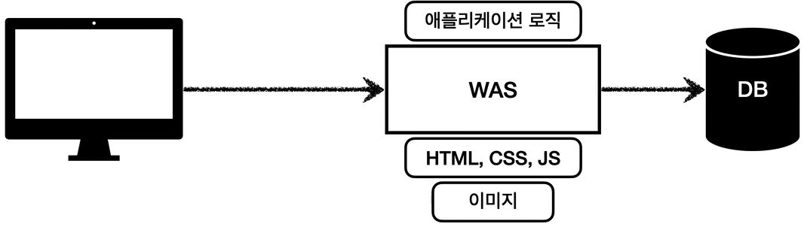
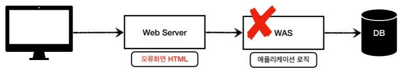
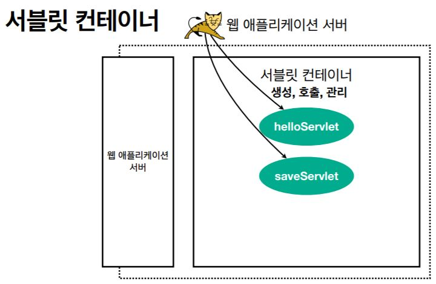
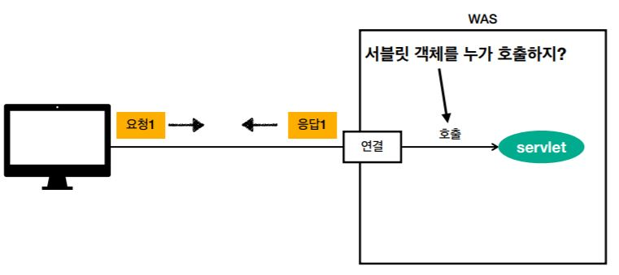
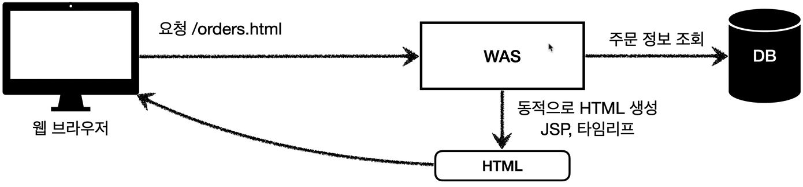
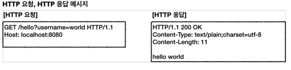
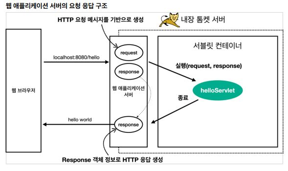
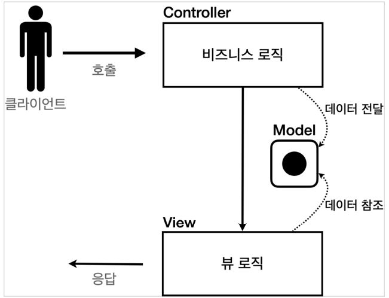

# 스프링 MVC 1편 - 백엔드 웹 개발 핵심 기술

---
---

## 목차

- [스프링 MVC 1편 - 백엔드 웹 개발 핵심 기술](#스프링-mvc-1편---백엔드-웹-개발-핵심-기술)
  - [목차](#목차)
  - [웹 애플리케이션 이해](#웹-애플리케이션-이해)
    - [웹 서버, 웹 어플리케이션 서버](#웹-서버-웹-어플리케이션-서버)
    - [서블릿](#서블릿)
    - [동시 요청 - 멀티 쓰레드](#동시-요청---멀티-쓰레드)
    - [HTML, HTTP API, CSR, SSR](#html-http-api-csr-ssr)
    - [자바 백엔드 웹 기술 역사](#자바-백엔드-웹-기술-역사)
  - [서블릿](#서블릿-1)
    - [프로젝트 생성](#프로젝트-생성)
    - [Hello 서블릿](#hello-서블릿)
    - [HttpServletRequest - 개요](#httpservletrequest---개요)
    - [HTttpServletRequest - 기본 사용법](#htttpservletrequest---기본-사용법)
    - [HTTP 요청 데이터 - 개요](#http-요청-데이터---개요)
    - [HTTP 요청 데이터 - GET 쿼리 파라미터](#http-요청-데이터---get-쿼리-파라미터)
    - [HTTP 요청 데이터 - POST HTML Form](#http-요청-데이터---post-html-form)
    - [HTTP 요청 데이터 - API 메시지 바디 - 단순 텍스트](#http-요청-데이터---api-메시지-바디---단순-텍스트)
    - [HTTP 요청 데이터 - API 메시지 바디 - JSON](#http-요청-데이터---api-메시지-바디---json)
    - [HttpServletResponse - 기본 사용법](#httpservletresponse---기본-사용법)
    - [HTTP 응답 데이터 - 단순 텍스트, HTML](#http-응답-데이터---단순-텍스트-html)
    - [HTTP 응답 데이터 - API JSON](#http-응답-데이터---api-json)
  - [서블릿, JSP, MVC 패턴](#서블릿-jsp-mvc-패턴)
    - [회원 관리 웹 애플리케이션 요구사항](#회원-관리-웹-애플리케이션-요구사항)
    - [서블릿으로 회원 관리 웹 애플리케이션 만들기](#서블릿으로-회원-관리-웹-애플리케이션-만들기)
    - [JSP로 회원 관리 웹 애플리케이션 만들기](#jsp로-회원-관리-웹-애플리케이션-만들기)
    - [MVC 패턴 - 개요](#mvc-패턴---개요)
    - [MVC 패턴 - 적용](#mvc-패턴---적용)
    - [MVC 패턴 - 한계](#mvc-패턴---한계)
  - [MVC 프레임워크 만들기](#mvc-프레임워크-만들기)
    - [프론트 컨트롤러 패턴 소개](#프론트-컨트롤러-패턴-소개)
    - [프론트 컨트롤러 도입 - v1](#프론트-컨트롤러-도입---v1)
    - [View 분리 - v2](#view-분리---v2)
    - [Model 추가 - v3](#model-추가---v3)
    - [단순하고 실용적인 컨트롤러 - V4](#단순하고-실용적인-컨트롤러---v4)
    - [유연한 컨트롤러1 - v5](#유연한-컨트롤러1---v5)
    - [유연한 컨트롤러2 - V5](#유연한-컨트롤러2---v5)
    - [정리](#정리)
  - [스프링 MVC - 구조 이해](#스프링-mvc---구조-이해)
    - [스프링 MVC 전체 구조](#스프링-mvc-전체-구조)
    - [핸들러 매핑과 핸들러 어댑터](#핸들러-매핑과-핸들러-어댑터)
      - [Controller 인터페이스](#controller-인터페이스)
    - [스프링 MVC - 시작하기](#스프링-mvc---시작하기)
    - [스프링 MVC - 컨트롤러 통합](#스프링-mvc---컨트롤러-통합)
  - [스프링 MVC - 실용적인 방식](#스프링-mvc---실용적인-방식)
  - [스프링 MVC - 기본 기능](#스프링-mvc---기본-기능)
    - [프로젝트 생성](#프로젝트-생성-1)
    - [로깅 간단히 알아보기](#로깅-간단히-알아보기)
    - [요청 매핑](#요청-매핑)
    - [요청 매핑 - API 예시](#요청-매핑---api-예시)
    - [HTTP 요청 - 기본, 헤더 조회](#http-요청---기본-헤더-조회)
    - [Http 요청 파라미터 - 쿼리 파라미터, HTML Form](#http-요청-파라미터---쿼리-파라미터-html-form)
      - [HTTP 요청 데이터 조회 - 개요](#http-요청-데이터-조회---개요)
      - [요청 파라미터 - 쿼리 파라미터, HTML Form](#요청-파라미터---쿼리-파라미터-html-form)
    - [HTTP 요청 파라미터 - @RequestParam](#http-요청-파라미터---requestparam)
    - [HTTp 요청 파라미터 - @ModelAttribute](#http-요청-파라미터---modelattribute)
    - [HTTP 요청 메시지 - 단순 텍스트](#http-요청-메시지---단순-텍스트)
    - [HTTP 요청 메시지 - JSON](#http-요청-메시지---json)
    - [응답 - 정적 리소스, 뷰 템플릿](#응답---정적-리소스-뷰-템플릿)
      - [정적 리소스](#정적-리소스)
      - [뷰 템플릿](#뷰-템플릿)
    - [HTTP 응답 - HTTP API, 메시지 바디에 직접 입력](#http-응답---http-api-메시지-바디에-직접-입력)


---
---

## 웹 애플리케이션 이해

---
---

### 웹 서버, 웹 어플리케이션 서버

웹 - HTTP 기반 통신이다.

- 웹 브라우저에서 URL을 치면 인터넷을 통해서 server에 접근하고 server에서는 HTML을 만들어서 client에 내려주고 웹 브라우저가 받은 HTML을 가지고 우리에게 보여준다.

- client에서 server로 데이터를 전송할때, server에서 client로 데이터를 응답할 때, 이때 HTTP protocol 기반으로 동작함.

모든 것이 웹에서는 HTTP기반으로 데이터를 주고 받음
- HTML,TXT
- IMAGE,음성,영상,파일
- JSON,XML(API)
- 거의 모든 형태의 데이터 전송 가능
- server간 데이터를 주고 받을 때도 대부분 HTTP 사용

웹 서버(Web Server)

- HTTP 기반 동작 서버
- 정적 리소스 제공, 기타 부가기능 제공
- 정적(파일) HTML, CSS, JS, 이미지, 영상
- ex> NGINX, APACHE


웹 애플리케이션 서버(WAS - Web Application Server)

- HTTP 기반 동작
- 웹 서버 기능 + (정적 리소스 제공 가능)
- **프로그램 코드를 실행해서 애플리케이션 로직 수행**
  - 동적 HTML, HTTP API(JSON)
  - 서블릿, JSP, 스프링 MVC
- ex> 톰캣(Tomcat) Jetty, Undertow


웹 서버, 웹 애플리케이션 서버(WAS) 차이

- 웹 서버는 정적 리소스(파일), WAS는 애플리케이션 로직
- 사실 둘의 용어도 경계도 모호
  - 웹 서버도 프로그램을 실행하는 기능을 포함하기도 함
  - 웹 애플리케이션 서버도 웹 서버의 기능을 제공함
- 자바는 서블릿 컨테이너 기능을 제공하면 was
  - 서블릿 없이 자바코드를 실행하는 서버 프레임워크도 있음
- **WAS는 애플리케이션 코드를 실행하는데 더 특화**

웹 시스템 구성 - WAS, DB
- WAS, DB 만으로 시스템 구성 가능
- WAS는 정적 리소스, 애플리케이션 로직 모두 제공 가능

- 

- WAS가 너무 많은 역할을 담당, 서버 과부하 우려
- 가장 비싼 애플리케이션 로직이 정적 리소스 때문에 수행이 어려울 수 있음
- WAS 장애시 오류 화면도 노출 불가능

웹 시스템 구성 - WEB, WAS, DB
- 정적 리소스는 웹 서버가 처리
- 웹 서버는 애플리케이션 로직같은 동적인 처리가 필요하면 WAS에 요청을 위임
- WAS는 중요한 애플리케이션 로직 처리 전담
- 
  - 업무 분담이 됨

- 효율적인 리소스 관리
  - 정적 리소스가 많이 사용되면 Web 서버 증설
  - 애플리케이션 리소스가 많이 사용되면 WAS 증설

- 정적 리소스만 제공하는 웹 서버는 잘 죽지 않음
- 애플리케이션 로직이 동작하는 WAS 서버는 잘 죽음
- WAS, DB 장애시 WEB 서버가 오류 화면 제공 가능
- 

---

### 서블릿

HTML Form 데이터 전송
- POST 전송 - 저장
- 
  - action="/save" -> URL에 추가
  - method="post" -> post방식으로 데이터 전송
  - 그 후 값을 넣고 전송을 누르면 웹 브라우저가 생성한 요청 HTTP 메시지가 만들어짐

서버에서 처리해야 하는 업무
- 웹 애플리케이션 서버 직접 구현해야 한다면?
  - 서버 TCP/IP 연결 대기, 소켓 연결
  - HTTP 요청 메시지를 파싱해서 읽기
  - POST 방식, /save URL 인지
  - Content-Type 확인
  - HTTP 메시지 바디 내용 ㅍ싱
  - 저장 프로세스 실행
  - **비즈니스 로직 실행(여기가 의미있는 비즈니스 로직)**
    - **데이텉베이스에 저장 요청**
  - HTTP 응답 메시지 생성 시작
    - HTTP 시작 라인 생성
    - Header 생성
    - 메시지 바디에 HHTML 생성해서 입력
  - TCP/IP에 응답 전달, 소켓 종료

- 서블릿을 지원하는 WAS 사용
  - 위의 과정에서 비즈니스 로직 실행 부분만 제외한 모든 일을 다 지원해줌.

특징
```java
@WebServlet(name = "helloServlet", urlPatterns = "/hello")
public class HelloServlet extends HttpServlet{
    @Override
    protected void service(HttpServletRequest request, HttpServletResponse response){
        //애플리케이션 로직
    }
}
```
  - urlPatterns(/hello)의 URL이 호출되면 서블릿 코드가 실행
  - HTTP 요청 정보를 편리하게 사용할 수 있는 HttpServletRequest
  - HTTP 응답 정보를 편리하게 제공할 수 있는 HttpServletResponse
  - 개발자는 HTTP 스펙을 매우 편리하게 사용


- 웹 브라우저에서 `localhost:8080/hello` 요청
- 그러면, WAS에서 HTTP 요청 메시지 기반으로 request, response 객체를 새로 만듦
- 그 다음, helloServlet 실행
- helloServlet이 종료가 되면 response 객체 정보로 HTTP 응답 생성
- 그리고 웹 브라우저에 응답 메시지 전달

HTTP 요청, 응답 흐름
- HTTP 요청시
  - WAS는 Request, Response 객체를 새로 만들어서 서블릿 객체 호출
  - 개발자는 Request 객체에서 HTTP 요청 정보를 편리하게 꺼내서 사용
  - 개발자는 Response 객체에 HTTP 응답 정보를 편리하게 입력
  - WAS는 Response 객체에 담겨있는 내용으로 HTTP 응답 정보를 생성

서블릿 컨테이너

- 서블릿을 지원하는 WAS안에는 서블릿 컨테이너가 있다.
- 서블릿 컨테이너 안에서 서블릿 객체를 서블릿 컨테이너가 자동으로 생성, 호출해줌.
- 생명주기 관리 : WAS가 종료될때 이 서블릿을 같이 종료해줌

- 톰캣처럼 서블릿을 지원하는 WAS를 `서블릿 컨테이너`라고 함.
- 서블릿 컨테이너는 서블릿 객체를 생성, 초기화, 호출, 종료하는 생명주기 관리
- 서블릿 객체는 **싱글톤으로 관리**
  - 고객의 요청이 올 때 마다 계속 객체를 생성하는 것은 비효율
  - 최초 로딩 시점에 서블릿 객체를 미리 만들어두고 재활용
  - 모든 고객 요청은 동일한 서블릿 객체 인스턴스에 접근
  - **공유 변수 사용 주의**
  - 서블릿 컨테이너 종료시 함께 종료
- JSP도 서블릿으로 변환 되어서 사용
- **동시 요청을 위한 멀티 쓰레드 처리 지원**

---

### 동시 요청 - 멀티 쓰레드


- 쓰레드가 호출해줌

쓰레드
- 애플리케이션 코드를 하나하나 순차적으로 실행하는 것은 쓰레드
- 자바 메인 메서드를 처음 실행하면 main이라는 이름의 쓰레드가 실행
- 쓰레드가 없다면 자바 애플리케이션 실행이 불가능
- 쓰레드는 한번에 하나의 코드 라인만 수행
- 동시 처리가 필요하면 쓰레드를 추가로 생성

단일 요청 - 쓰레드 하나 사용
- 요청이 하나가 온다.
- 그러면 쓰레드 할당해줌
- 이 쓰레드를 가지고 servlet 코드를 실행해줌
- 그리고 쓰레드를 가지고 응답을 해줌
- 응답이 되고나면 쓰레드가 휴식을 함.

다중 요청 - 쓰레드 하나 사용
- 요청1이 들어옴.
  - 쓰레드를 사용해서 servlet을 요청했으나 처리가 지연되고 있다.
- 이때, 요청2가 들어옴.
  - 쓰레드난 하나밖에 없는데 요청1때문에 사용하고 있어서 쓰레드를 기다려야함.
- 이러면, 1번 2번 둘 다 죽어버림.

요청 마다 쓰레드 생성
- 요청1이 들어옴
  - 쓰레드 생성했지만, 처리 지연
- 요청2가 들어옴
  - 쓰레드 새로 생성해서 처리하고 요청이 끝나면 쓰레드 휴식.
- 장점
  - 동시 요청을 처리할 수 있다.
  - 리소스(CP, 메모리)가 허용할 때 까지 처리가능
  - 하나의 쓰레드가 지연 되어도, 나머지 쓰레드는 정상 동작.
- 단점
  - 쓰레드는 생성 비용이 모두 비싸다.
    - 고객의 요청이 올 때마다 쓰레드를 생성하면, 응답 속도가 늦어진다.
  - 쓰레드는 context switching 비용이 발생한다.
  - 쓰레드 생성에 제한이 없다.
    - 고객 요청이 너무 많이 오면, CPU, 메모리 임계점을 넘어서 서버가 죽을 수 있다.

쓰레드 풀

- 쓰레드 풀안에 미리 만들어놓은 쓰레드들이 들어있다.(200개라고 가정)
- 요청이 올 때마다 쓰레드 풀에서 가져다가 쓰고, 쓰레드를 다 사용하면 쓰레드를 죽이는것이 아닌 쓰레드 풀에 반납을 한다.


- 쓰레드 풀에 더이상 쓰레드가 없을 때 요청이 들어오면 대기하거나 거절할 수 있다.

- 요청 마다 쓰레드 생성의 단점 보완
  - 특징
    - 필요한 쓰레드를 쓰레드 풀에 보관하고 관리.
    - 쓰레드 풀에 생성 가능한 쓰레드의 최대치를 관리. 톰켓은 최대 200개 기본 설정(변경 가능)
  - 사용
    - 쓰레드가 필요하면, 이미 생성되어 있는 쓰레드를 쓰레드 풀에서 꺼내서 사용한다.
    - 사용을 종료하면 쓰레드 풀에 해당 쓰레드를 반납한다.
    - 최대 쓰레드가 모두 사용중이어서 쓰레드 풀에 쓰레드가 없다면?
      - 기다리는 요청은 거절하거나 특정 숫자만큼만 대기하도록 설정할 수 있다.
  - 장점
    - 쓰레드가 미리 생성되어 있으므로, 쓰레드를 생성하고 종료하는 비용(CPU)이 절약되고, 응답 시간이 빠르다.
    - 생성 가능한 쓰레드의 최대치가 있으므로 너무 많은 요청이 들어와도 기존 요청은 안전하게 처리할 수 있다.

- 실무 팁
  - WAS의 주요 튜닝 포인트는 최대 쓰레드(max thread) 수이다.
  - 이 값을 너무 낮게 설정하면?
    - 동시 요청이 많으면, 서버 리소스는 여유롭지만, 클라이언트는 금방 응답 지연.
  - 이 값을 너무 높게 설정하면?
    - 동시 요청이 많으면, CPU, 메모리 리소스 임계점 초과로 서버 다운
  - 장애 발생시?
    - 클라우드면 일단 서버부터 늘리고, 이후에 튜닝
    - 클라우드가 아니면 열심히 튜닝

- 쓰레드 풀의 적정 숫자
  - 적정 숫자는 어떻게 찾는가...?
  - 애플리케이션 로직의 복잡도, CPU, 메모리, IO 리소스 상황에 따라 모두 다름
  - 성능 테스트
    - 최대한 실제 서비스와 유사하게 성능 테스트 시도
    - 툴: 아파치 ab, 제이미터, nGrinder

WAS의 멀티 쓰레드 지원
- 핵심
  - 멀티 쓰레드에 대한 부분은 WAS가 처리
  - **개발자가 멀티 쓰레드 관련 코드를 신경쓰지 않아도 됨**
  - 개발자는 마치 **싱글 쓰레드 프로그래밍을 하듯이 편리하게 소스 코드를 개발**
  - 멀티 쓰레드 환경이므로 싱글톤 객체(서블릿, 스프링 빈)는 주의해서 사용.

---

### HTML, HTTP API, CSR, SSR

정적 리소스
- 고정된 HTML 파일, CSS, JS, 이미지, 영상 등을 제공
- 주로 웹 브라우저
- 

HTML 페이지
- 동적으로 필요한 html 파일을 생성해서 전달
- 웹 브라우저: HTML 해석
- 
  - 주문 내역을 보여줘!
  - WAS(애플리케이션 로직을 수행할 수 있음)가 DB를 통해서 주문 정보 조회.
  - 이것을 동적으로 HTML 생성(JSP,타임리프...)
  - 동적으로 생성된 HTML을 웹브라우저를 내려줌.

HTTP API
- HTML이 아니라 데이터를 전달
- 주로 JSON 형식 사용
- 다양한 시스템에서 호출
- 
- 데이터만 주고 받음, UI 화면이 필요하면, 클라이언트가 별도 처리
- 앱, 웹 클라이언트, 서버 to 서버
1. 웹 클라이언트 to 서버
2. 앱 클라이언트 to 서버
3. 서버 to 서버 

- 다양한 시스템 연동
  - 주로 JSON 형태로 데이터 통신
  - UI 클라이언트 접점
    - 앱 클라이언트(아이폰, 안드로이드, PC 앱)
    - 웹 브라우저에서 자바스크립트를 통한 HTTP API 호출
    - React, Vue.js 같은 웹 클라이언트
  - 서버 to 서버
    - 주문 서버 -> 결제 서버
    - 기업간 데이터 통신

서버사이드 렌더링, 클라이언트 사이드 렌더링
- SSR - 서버 사이드 렌더링
  - HTML 최종 결과를 서버에서 만들어서 웹 브라우저에 전달
  - 주로 정적인 화면에 사용
  - 관련기술 : JSP, 타임리프 -> **백엔드 게발자**
  - 
    - 최종적으로 html을 서버에서 다 만듦.
- CSR - 클라이언트 사이드 렌더링
  - HTML 결과를 자바 스크립트를 사용해 웹 브라우저에서 동적으로 생성해서 적용
  - 주로 동적인 화면에 사용, 웹 환경을 마치 앱 처럼 필요한 부분부분 변경할 수 있음.
  - ex> 구글 지도, Gmail, 구글 캘린더
  - 관련기술: React, Vue.js -> **웹 프론트앤드 개발자**
  - 
- 참고
  - React, Vue.js를 CSR + SSR 동시에 지원하는 웹 프레임워크도 있음.
  - SSR을 사용하더라도, 자바스크립트를 사용해서 화면 일부를 동적으로 변경 가능

어디까지 알아야 할까? 백엔드 개발자 입장에서 UI 기술
- 백엔드 - 서버 사이드 렌더링 기술
  - JSP, 타임리프
  - 화면이 정적이고, 복잡하지 않을 때 사용
  - 백엔드 개발자는 서버 사이드 렌더링 기술 학습 **필수**
- 웹 프론트엔드 - 클라이언트 사이드 렌더링 기술
  - React, Vue.js
  - 복잡하고 동적인 UI 사용
  - 웹 프론트엔드 개발자의 전문 분야
- 선택과 집중
  - 백엔드 개발자의 웹 프론트엔드 기술 학습은 **옵션**
  - 백엔드 개발자는 서버, DB, 인프라 등등 수 많은 백엔드 기술을 공부해야한다.
  - 웹 프론트엔드도 깊이있게 잘 하려면 숙련에 오랜 시간이 필요하다.

---

### 자바 백엔드 웹 기술 역사

과거 기술
- 서블릿 - 1997
  - html 생성이 어려움
- JSP - 1999
  - HTML 생성은 편리하지만, 비즈니스 로직까지 너무 많은 역할 담당
- 서블릿, JSP 조합 MVC 패턴 사용
  - 모델, 뷰, 컨트롤러로 역할을 나누어 개발
- MVC 프레임워크 춘추 전국 시대 - 2000년 초 ~ 2010년 초
  - MVC 패턴 자동화, 복잡한 웹 기술을 편리하게 사용할 수 있는 다양한 기능 지원
  - 스트럿츠, 웹워크, 스프링 MVC(과거 버전)

현재 사용 기술
- **애노테이션 기반의 스프링 MVC 등장**
  - @Controller
  - MVC 프레임워크의 춘추 전국 시대 마무리
- 스프링 부트의 등장
  - 스프링 부트는 서버를 내장
  - 과거에는 서버에 WAS를 직접 설치하고, 소스는 War 파일을 만들어서 설치한 WAS에 배포
  - 스프링 부트는 빌드 결과(Jar)에 WAS 서버 포함 -> 빌드 배포 단순화

최신 기술 - 스프링 웹 기술의 분화
- Web Servlet - Spring MVC
- Web Reactive - Spring WebFlux
  - 특징
    - 비동기 넌 블러킹 처리
    - 최소 쓰레드로 최대 성능 - 쓰레드 컨텍스트 스위칭 비용 효율화
    - 함수형 스타일로 개발 - 동시처리 코드 효율화
    - 서블릿 기술 사용 X
  - 그런데
    - Web Flux는 기술적 난이도 매우 높음
    - 아직은 RDB 지원 부족
    - 일반 MVC의 쓰레드 모델도 충분히 빠르다.
    - 실무에서 아직 많이 사용하지는 않음(전체 1% 이하)

자바 뷰 템플릿 역사
- HTML을 편리하게 생성하는 뷰 기능
  - JSP
    - 속도 느림, 기능 부족
  - 프리마커(Freemarker), Velocity(벨로시티)
    - 속도 문제 해결, 다양한 기능
  - 타임리프(Thymeleaf)
    - 내추럴 템플릿: HTML의 모양을 유지하면서 뷰 템플릿 적용 가능
    - 스프링 MVC와 강력한 기능 통합
    - **최선의 선택**, 단 성능은 프리마커, 벨로시티가 더 빠름

---
---

## 서블릿

---
---

### 프로젝트 생성

- Gradle 
- Java
- 2.4.3
- Group : hello
- Artifact : servlet
- Packaging : War
  - 보통 Jar인데, War로 해야 jsp를 사용할 수 있음.
  - War은 톰켓서버를 별도로 설치하고 그 다음 별도로 War로 빌드해서 넣을때 혹은 안에 톰켓을 내장하는것도 됨.
- Java : 11
- Dependencies
  - Spring Web


---

### Hello 서블릿

```java
@ServletComponentScan
@SpringBootApplication
public class ServletApplication {

	public static void main(String[] args) {
		SpringApplication.run(ServletApplication.class, args);
	}

}
```
- 스프링부트는 서블릿을 직접 등록해서 사용할 수 있도록 `@ServletComponentScan`을 지원한다.

```java
package hello.servlet.basic;

import javax.servlet.ServletException;
import javax.servlet.annotation.WebServlet;
import javax.servlet.http.HttpServlet;
import javax.servlet.http.HttpServletRequest;
import javax.servlet.http.HttpServletResponse;
import java.io.IOException;

@WebServlet(name = "heeloServlet",urlPatterns = "/hello")
public class HelloServlet extends HttpServlet {

    @Override
    protected void service(HttpServletRequest request, HttpServletResponse response) throws ServletException, IOException {

        System.out.println("HelloServlet.service");
        System.out.println("request = " + request);
        System.out.println("response = " + response);

        String username = request.getParameter("username");
        System.out.println("username = " + username);

        //header에 들어가는거
        response.setContentType("text/plain");
        response.setCharacterEncoding("utf-8");
        //data
        response.getWriter().write("hello "+username);
    }
}
```
- `@WebServlet` 서블릿 애노테이션
  - name : 서블릿 이름
  - urlPatterns : URL 매핑
  - 위의 두개는 중복이 있으면 안됨.

HTTP 요청을 통해 매핑된 URL이 호출되면 서블릿 컨테이너는 다음 메서드 실행.
```java
protected void service(HttpServletRequest request, HttpServletResponse response)
```

```java
//header에 들어가는거
response.setContentType("text/plain");
response.setCharacterEncoding("utf-8");
//data
response.getWriter().write("hello "+username);
```
- 컴망 내용

HTTP 요청 메시지 로그로 확인하기


resources/application.properites 에 아래와 같이 입력
```
logging.level.org.apache.coyote.http11=debug
```

출력
```
Host: localhost:8080
Connection: keep-alive
sec-ch-ua: "Chromium";v="88", "Google Chrome";v="88", ";Not A Brand";v="99"
sec-ch-ua-mobile: ?0
Upgrade-Insecure-Requests: 1
User-Agent: Mozilla/5.0 (Windows NT 10.0; Win64; x64) AppleWebKit/537.36 (KHTML, like Gecko) Chrome/88.0.4324.190 Safari/537.36
Accept: text/html,application/xhtml+xml,application/xml;q=0.9,image/avif,image/webp,image/apng,*/*;q=0.8,application/signed-exchange;v=b3;q=0.9
Sec-Fetch-Site: none
Sec-Fetch-Mode: navigate
Sec-Fetch-User: ?1
Sec-Fetch-Dest: document
Accept-Encoding: gzip, deflate, br
Accept-Language: ko-KR,ko;q=0.9,en-US;q=0.8,en;q=0.7
Cookie: Idea-ac70df0f=3700b133-6e19-47ac-8150-fcb2b1f4a668
```
- 그러나 운영서버에 이렇게 모든 요청 정보를 다 남기면 성능저하가 발생할 수 있으니, 개발 단계에서만 적용

서블릿 컨테이너 동작 방식 설명

- 스프링 부트를 가지고 스프링 부트 실행
- 스프링 부트를 실행하면서 스프링 부트가 내장 톰켓 서버를 띄어준다.
- 그러면서 톰켓 서버는 내부에 서블릿 컨테이너 기능을 가지고 있고, 서블릿 컨테이너를 통해서 서블릿을 생성해줌.
- 그리하여 서블릿 컨테이너안에 `helloServlet`이 생성.


- 웹 브라우저가 위와같이 http 메세지를 만들어서 서버에 던져줌


- 서버는 WAS에서 request, response 객체를 만들어서 싱글톤으로 떠있는 `helloServlet`을 호출해줌.
- 거기에 서비스 method를 호출하면서 request, response를 넘겨줌
- 그리고 필요한 작업(ex> resopnse data에다가 Content-Type, hello world라는 메시지)을 하고, 종료되고 나가면서 WAS서버가 response 정보를 가지고 HTTP 응답 메시지를 위와같이 만들고 반환을 해줌.
- 그러면 웹 브라우저에서 hello world라고 볼 수 있는거다.

> 참고
>
> HTTp 응답에서 Content-Length는 웹 애플리케이션 서버가 자동으로 생성해준다.

---

### HttpServletRequest - 개요

**HttpServletRequest 역할**
- HTTP 요청 메시지를 개발자가 직접 파싱해서 사용해도 되지만, 매우 불편.
- 서블릿은 개발자가 HTTP 요청 메시지를 편리하게 사용할 수 있도록 개발자 대신에 HTTP 요청 메시지를 파싱한다.
- 그리고 그 결과를 `HttpServletRequest` 객체에 담아서 제공.

HttpServletRequest를 사용하면 다음과 같은 HTTP 요청 메시지를 편리하게 조회할 수 있다.

**HTTP 요성 메시지**
```
POST /save HTTP/1.1
Host: localhost:8080
Content-Type: applicatoin/x-www-form-urlencoded

username=kim&age=20
```

- START LINE(첫번째 줄, 즉 위에서는 `POST /save HTTP/1.1` 이거)
  - HTTP 메소드
  - URL
  - 쿼리 스트링
  - 스키마, 프로토콜
- 헤더(위에서는 `Host: localhost:8080 Content-Type: applicatoin/x-www-form-urlencoded` 이거)
  - 헤더 조회
- 바디(위에서는 `username=kim&age=20` 이거)
  - form 파라미터 형식 조회
  - message body 데이터 직접 조회

**임시 저장소 기능**
- 해당 HTTP 요청이 시작부터 끝날 때 까지 유지되는 임시 저장소 기능
  - 저장: `request.setAttribute(name, value)`
  - 조회: `request.getAttribute(name)`

**세선 관리 기능**
- `request.getSession(create: true)`

> 중요
>
> HttpServletRequest, HttpServletResponse를 사용할 때 가장 중요한 점은 이 객체들이 HTTP 요청 메시지, HTTP 응답 메시지를 편리하게 사용하도록 도와주는 객체라는 점이다.
>
> 따라서 이 기능에 대해서 깊이있는 이해를 하려면 **HTTP 스펙이 제공하는 욫ㅇ, 응답 메시지 자체를 이해**해야 한다.

---

### HTttpServletRequest - 기본 사용법

코딩으로 함.

<details>
<summary>java/hello.servlet/basic/request/RequestHeaderServlet.java</summary>

```java
package hello.servlet.basic.request;

import javax.servlet.ServletException;
import javax.servlet.annotation.WebServlet;
import javax.servlet.http.Cookie;
import javax.servlet.http.HttpServlet;
import javax.servlet.http.HttpServletRequest;
import javax.servlet.http.HttpServletResponse;
import java.io.IOException;
import java.util.Enumeration;

@WebServlet(name = "requestHeaderServlet", urlPatterns = "/request-header")
public class RequestHeaderServlet extends HttpServlet {

    @Override
    protected void service(HttpServletRequest request, HttpServletResponse response) throws ServletException, IOException {
        printStartLine(request);
        printHeaders(request);
        printHeaderUtils(request);
        printEtc(request);

    }

    private void printStartLine(HttpServletRequest request) {
        System.out.println("--- REQUEST-LINE - start ---");
        System.out.println("request.getMethod() = " + request.getMethod()); //GET
        System.out.println("request.getProtocal() = " + request.getProtocol()); //HTTP/1.1
        System.out.println("request.getScheme() = " + request.getScheme()); //http
        // http://localhost:8080/request-header
        System.out.println("request.getRequestURL() = " + request.getRequestURL());
        // /request-test
        System.out.println("request.getRequestURI() = " + request.getRequestURI());
        //username=hi
        System.out.println("request.getQueryString() = " +
                request.getQueryString());
        System.out.println("request.isSecure() = " + request.isSecure()); //https 사용 유무
        System.out.println("--- REQUEST-LINE - end ---");
        System.out.println();
    }
    //Header 모든 정보
    private void printHeaders(HttpServletRequest request) {
        System.out.println("--- Headers - start ---");

//      옛날
//        Enumeration<String> headerNames = request.getHeaderNames();
//        while(headerNames.hasMoreElements()){
//            String headerName = headerNames.nextElement();
//            System.out.println(headerName + ": " + headerName);
//        }

        //요즘
        request.getHeaderNames().asIterator()
                .forEachRemaining(headerName -> System.out.println(headerName + ": " + headerName));

        System.out.println("--- Headers - end ---");
        System.out.println();
    }

    //Header 편리한 조회
    private void printHeaderUtils(HttpServletRequest request) {
        System.out.println("--- Header 편의 조회 start ---");
        System.out.println("[Host 편의 조회]");
        System.out.println("request.getServerName() = " +
                request.getServerName()); //Host 헤더
        System.out.println("request.getServerPort() = " +
                request.getServerPort()); //Host 헤더
        System.out.println();
        System.out.println("[Accept-Language 편의 조회]");
        request.getLocales().asIterator()
                .forEachRemaining(locale -> System.out.println("locale = " +
                        locale));
        System.out.println("request.getLocale() = " + request.getLocale());
        System.out.println();
        System.out.println("[cookie 편의 조회]");
        if (request.getCookies() != null) {
            for (Cookie cookie : request.getCookies()) {
                System.out.println(cookie.getName() + ": " + cookie.getValue());
            }
        }
        System.out.println();
        System.out.println("[Content 편의 조회]");
        System.out.println("request.getContentType() = " +
                request.getContentType());
        System.out.println("request.getContentLength() = " +
                request.getContentLength());
        System.out.println("request.getCharacterEncoding() = " +
                request.getCharacterEncoding());
        System.out.println("--- Header 편의 조회 end ---");
        System.out.println();
    }

    //기타 정보
    private void printEtc(HttpServletRequest request) {
        System.out.println("--- 기타 조회 start ---");
        // remote 정보 : 요청이 온거에 대한 정보
        System.out.println("[Remote 정보]");
        System.out.println("request.getRemoteHost() = " +
                request.getRemoteHost()); //
        System.out.println("request.getRemoteAddr() = " +
                request.getRemoteAddr()); //
        System.out.println("request.getRemotePort() = " +
                request.getRemotePort()); //
        System.out.println();
        // local 정보 : 현재 나의 서버에 대한 정보
        System.out.println("[Local 정보]");
        System.out.println("request.getLocalName() = " +
                request.getLocalName()); //
        System.out.println("request.getLocalAddr() = " +
                request.getLocalAddr()); //
        System.out.println("request.getLocalPort() = " +
                request.getLocalPort()); //
        System.out.println("--- 기타 조회 end ---");
        System.out.println();
    }
}

```
</details>

---

### HTTP 요청 데이터 - 개요

HTTP 요청 메시지를 통해 클라이언트에서 서버로 데이터를 전달하는 방법들.

**주로 다음 3가지 방법을 사용**
- **GET - 쿼리 파라미터**
  - /url<strong>?username=hello?age=20</strong>
  - 메시지 바디 없이, URL의 쿼리 파라미터에 데이터를 포함해서 전달
  - ex> 검색, 필터, 페이징등에서 많이 사용하는 방식
- **POST - HTML Form**
  - 
  - content-type : applicatoin/x-www-form-urlencoded
  - 메시지 바디에 쿼리 파라미터 형식으로 전달 username=hello&age=20
  - ex> 회원 가입, 상품 주문, HTML Form 사용
- **HTTP message body**에 데이터를 직접 담아서 요청
  - HTTP API에서 주로 사용, JSON, XML, TEXT
  - 데이터 형식은 주로 JSON 사용
  - POST, PUT, PATCH

---

### HTTP 요청 데이터 - GET 쿼리 파라미터

다음 데이터를 client에서 server로 전송해보자.

전달 데이터
- username=hello
- age=20

메시지 바디 없이, URL의 쿼리 파라미터를 사용해서 데이터를 전달해보자.<br>
ex> 검색, 필터, 페이징등에서 많이 사용하는 방식

쿼리 파라미터는 URL에 다음과 같이 `?`를 시작으로 보낼 수 있다. 추가 파라미터는 `&`로 구분하면 된다.
- `http://localhost:8080/request-param?username=hello&age=20`

서버에서는 `HttpServletRequest`가 제공하는 다음 메서드를 통해 쿼리 파라미터를 편리하게 조회할 수 있다.

```
[전체 파라미터 조회] - start
username=hello
age=20
[전체 파라미터 조회] - end

[단일 파라미터 조회]
username = hello
age = 20

[이름이 같은 복수 파라미터 조회]
name = hello
name = hello2
```

**복수 파라미터에서 단일 파라미터 조회**
- `username=hello&username=kim`과 같이 파라미터 이름은 하나인데, 값이 중복되면 어떻게 될까?
- `request.getParameter()`는 하나의 파라미터 이름에 대해서 단 하나의 값만 있을 때 사용해야한다. 지금처럼 중복일때는 `request.getParameterValues()`를 사용해야 한다.
- 참고로 이렇게 중복일 때 `request.getParameter()`를 사용하면 `request.getParameterValues`의 첫 번째 값이 반환.

---

### HTTP 요청 데이터 - POST HTML Form

이번에는 HTML의 Form을 사용해서 client 에서 server로 데이터를 전송해보자.<br>
주로 회원 가입, 상품 주문 등에서 사용하는 방식이다.

**특징**
- content-type: `application/x-www-form-urlencoded`
- 메시지 바디에 쿼리 파라미터 형식으로 데이터를 전달한다. `username=hello&age=20`

`src/main/webapp/basic/hello-form.html`생성

```html
<!DOCTYPE html>
<html>
<head>
 <meta charset="UTF-8">
 <title>Title</title>
</head>
<body>
<form action="/request-param" method="post">
 username: <input type="text" name="username" />
 age: <input type="text" name="age" />
 <button type="submit">전송</button>
</form>
</body>
</html>
```

POST의 HTML Form을 전송하면 웹 브라우저는 다음 형식으로 HTTP 메시지를 만든다. (웹 브라우저 개발자 모드 확인)
- **요청 URL** : `http://localhost:8080/request-param`
- **content-type**: `applicatoin/x-www-form-urlencoded`
- **message body** : `username=hello&age=20`

`application/x-www-form-urlencoded` 형식은 앞서 GET에서 살펴본 쿼리파라미터 형식과 같다. 따라서 **쿼리 파라미터 조회 메서드를 그대로 사용**하면 된다. <br>
client(웹 브라우저) 입장에서는 두 방식에 차이가 있지만, server 입장에서는 둘의 형식이 동일하므로, `request.getParameter()`로 편리하게 구분없이 조회할 수 있다.

정리하면 `request.getParameter()`는 GET URL 쿼리 파라미터 형식도 지원하고, POST HTML Form 형식도 둘 다 지원한다.

> **참고**
>
> contnet-type은 HTTP 메시지 바디의 데이터 형식을 지정한다. <br>
> **GET URL 쿼리 파라미터 형식**으로 client에서 server로 데이터를 전달 할 때는 HTTP 메시지 바디를 사용하지 않기 때문에 content-type이 없다. <br>
> **POST HTML Form** 형식으로 데이터를 전달하면 HTTP 메시지 바디에 해당 데이터를 포함해서 보내기 때문에 바디에 포함된 데이터가 어떤 형식인지 content-type을 꼭 지정해야 한다. 이렇게 폼으로 데이터를 전송하는 형식을 `applicaton/x-www-form-urlencoded`'라 한다.

Postman을 사용한 테스트
- 이런 간단한 테스트에서 HTML form을 만들기는 귀찮다. 이때 Postman을 사용하면 된다.

**Postman** 테스트 주의사항
- POST 전송시
  - Body -> `x-www-form-urlencoded` 선택
  - Headers에서 content-type: `application/x-www-form-urlencoded`로 지정된 부분 꼭 확인

---

### HTTP 요청 데이터 - API 메시지 바디 - 단순 텍스트

- **HTTP message body**에 데이터를 직접 담아서 요청
  - HTTP API에서 주로 사용, JSON, XML, TEXT
  - 데이터 형식은 주로 JSON 사용
  - POST, PUT, PATCH

- 먼저 가장 단순한 텍스트 메시지를 HTTP 메시지 바디에 담아서 전송하고 읽어본다.
- HTTP 메시지 바디의 데이터를 InputStream을 사용해서 직접 읽을 수 있다.

> 참고<br>
> inputStream은 byte 코드를 반환한다. byte 코드를 우리가 읽을 수 있는 문자(String)로 보려면 문자표(Charset)를 지정해주어야 한다. 여기서는 UTF_8 Charset을 지정해주었다.


### HTTP 요청 데이터 - API 메시지 바디 - JSON

이번에는 HTTP API에서 주로 사용하는 JSON 형식으로 데이터를 전달해본다.

**JSON 형식 전송**
- POST http://localhost:8080/request-body-json
- content-type: **application/json**
- message body: `{"username": "hello", "age": 20}
- 결과: `messageBody = {"username": "hello", "age": 20}

**JSON 형식 파싱 추가**<br>
JSON 형식으로 파싱할 수 있게 객체를 하나 생성.<BR>
`heelo.servlet.basic.HelloData`
- lombok 사용

> 참고<br>
> JSON 결과를 파싱해서 사용할 수 있는 자바 객체로 변환하려면 Jackson, Gson 같은 JSON 변환 라이브러리르 추가해서 사용해야 한다. 스프링 부트로 Spring MVC를 선택하면 기본으로 Jackson 라이브러리(`ObjectMapper`)를 함께 제공한다.

> 참고<br>
> HTML form 데이터도 메시지 바디를 통해 전송되므로 직접 읽을 수 있다. 하지만 편리한 파라미터 조회 기능 (`request.getParameter(...)`)을 이미 제공하기 때문에 파라미터 조회 기능을 사용하면 된다.

---

### HttpServletResponse - 기본 사용법

HttpServletResponse 역할

**HTTP 응답 메시지 작성**
- HTTP 응답코드 지정(ex>200,400,500,403...)
- 헤더 생성
- 바디 생성

**편의 기능 제공**
- Content-Type, 쿠키, Redirect(코드로 확인 main/java/hello.servlet/basic/response)

---

### HTTP 응답 데이터 - 단순 텍스트, HTML

HTTP 응답 메시지는 주로 다음 내용을 담아서 전달한다.

- 단순 텍스트 응답
  - `writer.println("ok");`
- HTML 응답
- HTTP API - MessageBody JSON 응답

<details>
<summary>코드</summary>

```java

@WebServlet(name = "responseHtmlServlet", urlPatterns = "/response-html")
public class ResponseHtmlServlet extends HttpServlet {

    @Override
    protected void service(HttpServletRequest request, HttpServletResponse response) throws ServletException, IOException {
        //Content-Type: text/html;charset=utf-8
        response.setContentType("text/html");
        response.setCharacterEncoding("utf-8");

        PrintWriter writer = response.getWriter();
        writer.println("<html>");
        writer.println("<body>");
        writer.println("  <div>안녕?</div>");
        writer.println("</body>");
        writer.println("</html>");

    }
```

</details>

- HTTP 응답으로 HTML을 반환할 때 content-type을 `text/html`로 지정해야 한다.

---

### HTTP 응답 데이터 - API JSON

<details>
<summary>코드</summary>

```java
@WebServlet(name = "responseJsonServlet", urlPatterns = "/response-json")
public class ResponseJsonServlet extends HttpServlet {
    
  private ObjectMapper objectMapper = new ObjectMapper();

  @Override
  protected void service(HttpServletRequest request, HttpServletResponse response) throws ServletException, IOException {
      //Content-Type: application/json
      response.setContentType("application/json");
      response.setCharacterEncoding("utf-8");

      HelloData helloData = new HelloData();
      helloData.setUsername("kim");
      helloData.setAge(20);
      
      //위 문자를 으로 변환해야함 {"username":"kim", "age":20} -> objectMapper 사용
      String result = objectMapper.writeValueAsString(helloData);
      response.getWriter().write(result);
  }
}
```
- Jackson 라이브러리가 제공하는 objectMapper.writeValueAsString() 를 사용하면 객체를 JSON 문자로 변경할 수 있다

</details>

---
---

## 서블릿, JSP, MVC 패턴

---
---

### 회원 관리 웹 애플리케이션 요구사항

**회원 정보**
- 이름 : `username`
- 나이 : `age`

**기능 요구사항**
- 회원 저장
- 회원 목록 조회

---

### 서블릿으로 회원 관리 웹 애플리케이션 만들기

서블릿으로 회원 등록 HTML 폼을 제공해보자.
(html 작성이 ㄹㅇ 헬임)(자바코드에다가 html을 만들어 넣는거)

**템플릿 엔진으로**
- 지금까지 서블릿과 자바 코드만으로 HTML을 만들었다. 서블릿 덕분에 동적으로 원하는 HTML을 마음껏 만들 수 있다.
- 정적인 HTML 문서라면 화면이 계속 달라지는 회원의 저장 결과라던가, 회원 목록 같은 동적인 HTML을 만드는 일은 불가능 할 것이다.
- 그런데, 코드에서 보듯이 매우 복잡하고 비효율적.
- 자바 코드로 HTML을 만들어 내는 것 보다 차라리 HTML 문서에 동적으로 변경해야 하는 부분만 자바 코드를 넣을 수 있다면 편리할 것이다.
- 이것이 바로 템플릿 엔진이 나온 이유이다. 템플릿 엔진을 사용하면 HTML 문서에서 필요한 곳만 코드를 적용해서 동적으로 변경 가능.
- 템플릿 엔진에는 JSP, Thymeleaf, Freemarker, Velocity등이 있다.

> **참고**
>
> JSP는 성능과 기능면에서 다른 템플릿 엔진과의 경쟁에서 밀리면서, 점점 사장되어 가는 추세이다.<BR>
> 템플릿 엔진들은 각각 장단점이 있는데, 강의에서는 JSP는 앞부분에서 잠깐 다루고, 스프링과 잘 통합되는 Thymeleaf를 사용한다.

---

### JSP로 회원 관리 웹 애플리케이션 만들기

- `<% page contentType="text/html;charset=UTF-8" language="java" %>`
  - 첫 줄은 JSP문서라는 뜻이다. JSP는 이렇게 시작해야함.

회원 등록 폼 JSP를 보면 첫 줄을 제외하고는 완전히 HTML과 똑같다. JSP는 서버 내부에서 서블릿으로 변환되는데, 우리가 만들었던 MemberFormServlet과 거의 비슷한 모습이다.

JSP는 자바 코드를 그대로 다 사용할 수 있다.
- `<%@ page import"hello.servlet.domain.member.MemberRepository" %>`
  - 자바의 import 문과 같다.
- `<% ~~~ %>`
  - 이 부분에는 자바 코드를 입력할 수 있다.
- `<%= ~~ %>`
  - 이 부분에는 자바 코드를 출력할 수 있다.

회원 저장 JSP를 보면, 회원 저장 서블릿 코드와 같다. 다른 점이 있다면 HTML을 중심으로 하고, 자바 코드를 부분부분 입력해주었다. `<% ~ %>`를 사용해서 HTML 중간에 자바 코드를 출력하고 있다.

회원 리포지토리를 먼저 조회하고, 결과 List를 사용해서 중간에 `<tr><td>` HTML 태그를 반복해서 출력하고 있다.

서블릿과 JSP의 한계

- 서블릿으로 개발할 때는 뷰(View)화면을 위한 HTML을 만드는 작업이 자바 코드에 섞여서 지저분하고 복잡했다.
- JSP를 사용한 덕분에 뷰를 생성하는 HTML 작업을 깔끔하게 가져가고, 중간중간 동적으로 변경이 필요한 부분에만 자바 코드를 적용했다. 그런데 이렇게 해도 해결되지 않는 몇가지 고민이 남는다.
<BR>

- 회원 저장 JSP를 보자.
- 코드의 상위 절반은 회원을 저장하기 위한 비즈니스 로직이고, 나머지 하위 절반만 결과를 HTML로 보여주기 위한 뷰 영역이다. 회원 목록의 경우에도 마찬가지다.
- 코드를 잘 보면, JAVA 코드, 데이터를 조회하는 리포지토리 등등 다양한 코드가 모두 JSPDP 노출되어 있다. JSP가 너무 많은 역할을 한다. 이렇게 작은 프로젝트도 벌써 머리가 아파오는데, 수백 수천줄이 넘어가는 JSP를 떠올려보면 정말 지옥과 같을 것이다.(유지보수 지옥 썰)

**MVC 패턴의 등장**

비즈니스 로직은 서블릿 처럼 다른곳에서 처리하고, JSP는 목적에 맞게 HTML로 화면(View)을 그리는 일에 집중.

과거 개발자들도 모두 비슷한 고민이 있었고, 그래서 MVC패턴이 등장했다.

---

### MVC 패턴 - 개요

**너무 많은 역할**<BR>
- 하나의 서블릿이나 JSP만으로 비즈니스 로직과 뷰 렌더링까지 모두 처리하게 되면, 너무 많은 역할을 하게되고, 결과적으로 유지보수가 어려워진다. 
- 비즈니스 로직을 호출하는 부분에 변경이 발생해도 해당 코드를 손대야 하고, UI를 변경할 일이 있어도 비즈니스 로직이 함께 있는 해당 파일을 수정해야 한다. 
  - HTML 코드 하나 수정해야 하는데, 수백줄의 자바 코드가 함깨 있다고 상상하면 끔찍하다. 
  - 또는 비즈니스 로직을 하나 수정해야 하는데 수백 수천줄의 HTML 코드가 함께 있다면 끔찍하다.

**변경의 라이프 사이클**<BR>
- 사실 이게 중요한데, 진짜 문제는 둘 사이에 변경의 라이프 사이클이 다르다는 점이다.
- 예를 들어서 UI를 일부 수정하는 일과 비즈니스 로직을 수저하는 일은 각각 다르게 발생할 가능성이 매우 높고 대부분 서로 영향을 주지 않는다.
- 이렇게 변경의 라이프 사이클이 다른 부분을 하나의 코드로 관리하는 것은 유지보수하기 좋지 않다. (물론 UI가 많이 변하면 함께 변경될 가능성도 있다.)

**기능 특화**
- 특히 JSP 같은 뷰 템플릿은 화면을 렌더링 하는데 최적화 되어 있기 때문에 이 부분의 업무만 담당하는 것이 가장 효과적이다.

**Model View Control**
- MVC 패턴은 지금까지 학습한 것 처럼 하나의 서블릿이나, JSP로 처리하던 것을 컨트롤러(Controller)와 뷰(View)라는 영역으로 서로 역할을 나눈 것을 말한다. 웹 애플리케이션은 보통 이 MVC 패턴을 사용한다.

**컨트롤러** : HTTP 요청을 받아서 파라미터를 검증하고, 비즈니스 로직을 실행한다. 그리고 뷰에 전달할 결과 데이터를 조회해서 모델에 담는다.

**모델**: 뷰에 출력할 데이터를 담아둔다. 뷰가 필요한 데이터를 모두 모델에 담아서 전달해주는 덕분에 뷰는 비즈니스 로직이나 데이터 접근을 몰라도 되고, 화면을 렌더링 하는 일에 집중할 수 있다.

**뷰** : 모델에 담겨있는 데이터를 사용해서 화면을 그리는 일에 집중한다. 여기서는 HTML을 생성하는 부분을 말한다.

> **참고**<BR>
> 컨트롤러에 비즈니스 로직을 둘 수도 있지만, 이렇게 되면 컨트롤러가 너무 많은 역할을 담당한다.<BR>
> 그래서 일반적으로 비즈니스 로직은 서비스(Service)라는 게층을 별도로 만들어서 처리한다.(막 로직이 별로 없는경우(단순히 저장...)는 repository를 바로 사용하기도 함)<br>
> 그리고 컨트롤러는 비즈니스 로직이 있는 서비스를 호출하는 담당한다.<br>
> 참고로 비즈니스 로직을 변경하면 비즈니스 로직을 호출하는 컨트롤러의 코드도 변경될 수 있다. 앞에서는 이해흘ㄹ 돕기 위해 비즈니스 로직을 호출한다는 표현 보다는, 비즈니스 로직이라 설명했다.


- 고객이 요청을 함.
- Controller에서 비즈니스 로직 수행(servlet)
- Model에다가 데이터를 담는다
- 그리고 뷰 로직을 실행(뷰 로직으로 제어권을 넘긴다.)(jsp)
- jsp가 이때부터 실행 되면서 Model에 있는 데이터를 참고해서 view를 그려서 전달해줌.


- 보통 이 그림이 맞음
- client가 controller 호출한다.
- controller는 파라미터 꺼내는 등 고객이 제대로 요청한건지, http 요청이 제대로 맞는지 스펙을 확인(잘못되면 400 오류...), 로직이 잘 맞으면 service나 repository를 호출해서 비즈니스 로직이나 데이터 접근을 함.
- 그리고 controller는 이에 대한 결과를 받음.
- 그리고 Model에다가 데이터를 전달함
- 뷰 로직으로 제어권을 넘긴다
- 뷰 로직은 Model에서 값을 꺼내서 처리함.

---

### MVC 패턴 - 적용

서블릿을 controller로 사용하고, JSP를 view로 사용해서 MVC 패턴을 적용해보자.<br>
Model은 HttpServletRequest 객체를 사용한다. request는 내부에 데이터 저장소를 가지고 있는데, `request.setAttribute()`,`request.getAttribute()`를 사용하면 데이터를 보관하고, 조회할 수 있다.

`dispatcher.forward()`: 다른 서블릿이나 JSP로 이동할 수 있는 기능이다. 서버 내부에서 다시 호출이 발생한다.(client에서 server로 호출을 한거임, server안에서 자기들 끼리 서블릿이 호출되었다가 jsp를 호출하고 jsp에서 응답을 만들어서 고객한테 보낸거임)

`/WEB-INF`<br>
이 경로안에 JSP가 있으면 외부에서 직접 JSP를 호출할 수 없다. 우리가 기대하는 것은 항상 컨트롤러를 통해서 JSP를 호출하는 것이다.

**redirect vs forward**<br>
redirect는 실제 client(웹 브라우저)에 응답이 나갔다가, client가 redirect 경로로 다시 요청한다. 따라서 client가 인지할 수 있고, URL 경로도 실제로 변경된다.(호출이 2번)<BR>
반면에 forward는 서버 내부에서 일어나는 호출이기 때문에 client가 전혀 인지하지 못한다.

```html
<!-- 상대경로 사용, [현재 URL이 속한 계층 경로 + /save] -->
<form action="save" method="post">
    username: <input type="text" name="username" />
    age: <input type="text" name="age" />
    <button type="submit">전송</button>
</form>
```
- 여기서 form의 action을 보면 절대 경로(/로 시작)이 아니라 상대경로(/로 시작 x)하는 것을 확인할 수 있다. 이렇게 상대경로를 사용하면 폼 전송시 현재 URL이 속한 계층 경로 + save가 호출된다.<br>
- 현재 계층 경로 : `/servlet-mvc/members/`
- 결과 : `servlet-mvc/members/save`


**회원 저장 - 컨트롤러**<br>
HttpServletRequest를 Model로 사용한다.<br>
request가 제공하는 `setAttribute()`를 사용하면 request 객체에 데이터를 보관해서 뷰에 전달할 수 있다.<br>
뷰는 `request.getAttribute()`를 사용해서 데이터를 꺼내면 된다.

**회원 저장 - 뷰**<br>
`<%= request.getAttribute("member")%>`로 모델에 저장한 member 객체를 꺼낼 수 있지만, 너무 복잡해진다.<br>
JSP는 `${}` 문법을 제공하는데, 이 문법을 사용하면 request의 attribute에 담긴 데이터를 편리하게 조회할 수 있다.

**회원 목록 조회 - 컨트롤러**<br>
request 객체를 사용해서 `List<Member> members`를 모델에 보관했다.

**회원 목록 조회 - 뷰**<br>
모델에 담아둔 members를 JSP가 제공하는 taglib기능을 사용해서 반복하면서 출력했다.<br>
`members` 리스트에서 `member`를 순서대로 꺼내서 `item` 변수에 담고, 출력하는 과정을 반복한다.

`<c:forEach>` 이 기능을 사용하려면 다음과 같이 선언해야 한다.<br>
`<%@ taglib prefix="c" uri="http://java.sun.com/jsp/jstl/core"%>`

MVC 덕분에 컨트롤러 로직과 뷰 로직을 확실하게 분리한 것을 확인할 수 있다. 향후 화면에 수정이 발생하면 뷰 로직만 변경하면 된다.

---

### MVC 패턴 - 한계

MVC 패턴을 적용한 덕분에 controller의 역할과 view를 렌더링 하는 역할을 명확하게 구분할 수 있다.<br>
특히 view는 화면을 그리는 역할에 충실한 덕분에, 코드가 깔끔하고 직관적이다. 단순하게 모델에서 필요한 데이터를 꺼내고, 화면을 만들면 된다.<br>
그런데 controller는 딱 봐도 중복이 많고, 필요하지 않는 코드들도 많이 보인다.

**MVC controller의 단점**

- **포워드 중복**
  - View로 이동하는 코드가 항상 중복 호출되어야 한다. 물론 이 부분을 메서드로 공통화해도 되지만, 해당 메서드도 항상 직접 호출해야 한다.
  - 
  ```java
  RequestDispatch dispatcher = request.getRequestDispatcher(viewPath);
  dispatcher.forward(request, response);
  ```

- **ViewPath에 중복**
  - 
  ```java
  String viewPath = "/WEB-INF/views/new-form.jsp";
  ```
  - prefix: `/WEB-INF/views/`
  - suffix: `.jsp`
  - 그리고 만약 jsp가 아닌 thymeleaf 같은 다른 뷰로 변경한다면 전체 코드를 다 변경해야 한다.

- **사용하지 않는 코드**
  - 다음 코드를 사용할 때도 있고, 사용하지 않을 때도 있다. 특히 response는 현재 코드에서 사용되지 않는다.
  - 
  ```java
  HttpServletRequest request, HttpServletResponse response
  ```
  - 그리고 이런 `HttpServletRequest`,`HttpServletResponse`를 사용하는 코드는 테스트 케이스를 작성하기도 어렵다.

- **공통 처리가 어렵다**
  - 기능이 복잡해질 수록 controller에서 공통으로 처리해야 하는 부분이 점점 더 많이 증가할 것이다. 단순히 공통 기능을 메서드로 뽑으면 될 것 같지만, 결과적으로 해당 메서드를 항상 호출해야 하고, 실수로 호출하지 않으면 문제가 될 것이다. 그리고 호출하는 것 자체도 중복이다.

- **정리하면 공통 처리가 어렵다는 문제가 있다**
  - 이 문제를 해결하려면 controller 호출 전에 먼저 공통 기능을 처리해야 한다. 소위 **수문장 역할**을 하는 기능이 필요하다. **프론트 컨트롤러(Front Controller) 패턴**을 도입하면 이런 문제를 깔끔하게 해결할 수 있다.(입구를 하나로)<br>
  - 스프링 MVC의 핵심도 바로 이 front controller에 있다.

---
---

## MVC 프레임워크 만들기

---
---

### 프론트 컨트롤러 패턴 소개

프론트 컨트롤러 도입전(공통 로직이 중복)


프론트 컨트롤러 도입 후(서블릿 하나 도입하고 그곳에다가 공통 로직을 몰고, controller A,B,C 각각 필요한 로직은 각각 처리하세요)


**FrontController 패턴 특징**
- Front Controller Servlet 하나로 client의 요청을 받음
- Front Controller가 요청에 맞는 controller를 찾아서 호출.
- 입구를 하나로!
- 공통 처리 가능
- Front Controller를 제외한 나머지 Controller는 Servlet을 사용하지 않아도 됨.

**스프링 웹 MVC와 front controller**<br>
스프링 웹 MVC의 핵심도 바로 **FrontController**<br>
스프링 웹 MVC의 **DispatcherServlet**이 FrontController 패턴으로 구현되어 있음

---

### 프론트 컨트롤러 도입 - v1

프론트 컨트롤러를 단계적으로 도입<br>
이번 목표는 기존 코드를 최대한 유지하면서, 프론트 컨트롤러를 도입.<br>
먼저 구조를 맞추어두고 점진적으로 리펙터링함.

**V1 구조**


- client가 http요청을 함
- front controller라는 서블릿이 요청을 받음
- http 요청의 URL 매핑 정보를 가지고 컨트롤러에 매핑정보를 넣어둠.
- 어떤 컨트롤러가 호출되어야하는지 찾은 후 해당 컨트롤러 호출
- 컨트롤러는 자기 로직 수행하고 컨트롤러에서 JSP forward
- http 응답

ControllerV1
- 인터페이스로 만든다
- 서블릿과 비슷한 모양의 컨트롤러 인터페이스다. 각 컨트롤러들은 이 인터페이스를 구현하면 된다. 프론트 컨트롤러는 이 인터페이스를 호출해서 구현과 관계업싱 로직의 일관성을 가져갈 수 있다.

이제 이 인터페이스를 구현한 컨트롤러를 만들어본다. 지금 단계에서는 기존 로직을 최대한 유지하는게 핵심.
- MemberFormControllerV1

**프론트 컨트롤러 분석**

**urlPatterns**
- `urlPatterns = "/front-controller/v1/*"`: `front-controller/v1` 를 포함한 하위 모든 요청은 이 서블릿에서 받아들인다
- ex> `/front-controller/v1`,`/front-controller/v1/a`,`/front-controller/v1/a/b`

**controllerMap**
- key: 매핑 URL
- value: 호출된 컨트롤러

**service()**

먼저 `requestURI`를 조회해서 실제 호출할 컨트롤러를 `controllerMap`에서 찾는다. 만약 없다면 404(SC_NOT_FOUND) 상태 코드를 반환한다.<BR>
컨트롤러를 찾고 `controller.procesS(request,response);`을 호출해서 해당 컨트롤러를 실행한다.

**JSP**<br>
JSP는 이전 MVC에서 사용했던 것을 그대로 사용한다.

---

### View 분리 - v2

모든 컨트롤러에서 뷰로 이동하는 부분에 중복이 있고, 깔끔하지 않다.
```java
String viewPath = "/WEB-INF/views/new-form.jsp";
RequestDispatcher dispatcher = request.getRequestDispatcher(viewPath);
dispatcher.forward(request,response);
```

이 부분을 깔끔하게 분리하기 위해 별도로 뷰를 처리하는 객체를 만들어본다.

**V2 구조**

- client가 http 요청을 함.
- front controller가 매핑 정보에서 controller 조회
- 그 후, controller 호출
- controller에서 MyView 반환
- frontcontroller가 대신 myview의 render()를 호출해서
- MyView가 JSP로 forward하도록 함.

즉 위를 통해서 controller가 더이상 JSP forward 이런거에 대해서 고민하지 않아도 됨. 단순하게 myview만 생성해서 호출하면 된다.

**MyView**<br>
뷰 객체는 이후 다른 버전에서도 함께 사용하므로 패키지 위치를 `frontcontroller`에 두었다.

프론트 컨트롤러의 도입으로 `MyView` 객체의 `render()`를 호출하는 부분을 모두 일관되게 처리할 수 있다. 각각의 컨트롤러는 `MyView` 객체를 생성만 해서 반환하면 된다.

---

### Model 추가 - v3

**서블릿 종속성 제거**<br>
controller 입장에서 HttpServletRequest, HttpServletResponse가 꼭 필요할까?<br>
요청 파라미터 정보는 자바의 Map으로 대신 넘기도록 하면 지금 구조에서는 **controller가 servlet 기술을 몰라도 동작**할 수 있다.<br>
그리고 request 객체를 Model로 사용하는 대신에 별도의 Model 객체를 만들어서 반환하면 된다.<Br>
우리가 구현하는 controller가 servlet 기술을 전혀 사용하지 않도록 변경해보자.<br>
이렇게 하면 구현 코드도 매우 단순해지고, 테스트 코드 작성이 쉽다.

**뷰 이름 중복 제거**<br>
controller에서 지정하는 view 이름에 중복이 있는 것을 확인할 수 있다.<br>
controller는 **view의 논리 이름**을 반환하고, 실제 물리 위치의 이름은 front controller에서 처리하도록 단순화 하자.<br>
이렇게 해두면 향휴 view의 폴더 위치가 함께 이동해도 front controller만 고치면 된다

- `/WEB-INF/views/new-form.jsp` -> **new-form**
- `/WEB-INF/views/save-result.jsp` -> **save-result**
- `/WEB-INF/views/members.jsp` -> **members**

**V3 구조**

- client가 http 요청을 함
- front controller에서 매핑 정보를 가져와서
- controller를 호출함
- controller에서 ModelView 반환
- viewResolver 호출
- MyView 반환
- render(model) 호출

**ModelView**<br>
지금까지 controller에서 servlet에 종속적인 HtppServletRequest를 사용했다. 그리고 Model도 `request.setAttribute()`를 통해 데이터를 저장하고 view에 전달했다.<br>
servlet의 종속성을 제거하기 위해 Model을 직접 만들고, 추가로 View 이름까지 전달하는 객체를 만들어보자.<br>
(이번 버전에서는 controller에서 HttpServletRequest를 사용할 수 없다. 따라서 직접 `request.setAttribute()`를 호출할 수 도 없다. 따라서 Model이 별도로 필요하다.)

참고로 `ModelView`객체는 다른 버전에서도 사용하므로 패키지를 `frontcontroller`에 둔다.

`createParamMap()`<br>
HttpServletRequest에서 파라미터 정보를 꺼내서 Map으로 변환한다. 그리고 해당 Map(`paramMap`)을 컨트롤러에 전달하면서 호출한다.

**viewResolver**<br>
`MyView view = viewResolver(viewName)`<br>
컨트롤러가 반환한 논리 뷰 이름을 실제 물리 뷰 경로로 변경한다. 그리고 실제 물리 경로가 있는 MyView 객체를 반환한다.
- 논리 뷰 이름 : `members`
- 물리 뷰 경로 : `/WEB-INF/views/members.jsp`

`view.render(mv.getModel(), request, response)`
- 뷰 객체를 통해서 HTML 화면을 랜더링 한다.
- 뷰 객체의 `render()`는 모델 정보도 함께 받는다.
- JSP는 `request.getAttribute()`로 데이터를 조회하기 때문에, 모델의 데이터를 꺼내서 `request.setAttribute()`로 담아둔다.
- JSP로 포워드 해서 JSP를 렌더링 한다.

---

### 단순하고 실용적인 컨트롤러 - V4

앞서 만든 V3 컨트롤러는 servlet 종속성을 제거하고 view 경로의 중복을 제거하는 등, 잘 설계된 controller이다, 그런데 실제 controller interface를 구현하는 갭라자 입장에서 보면, 항상 ModelView 객체를 새엇ㅇ하고 반환해야 하는 부분은 조금 번거롭다.<br>
좋은 프레임워크는 아키텍쳐도 중요하지만, 그와 더불어 실제 개발하는 개발자가 단순하고 편리하게 사용할 수 있어야 한다. 소위 실용성이 있어야 한다.

이번에는 v3를 조금 변경해서 실제 구현하는 개발자들이 매우 편리하게 개발할 수 있는 v4 버전을 개발해보자.

**V4 구조**

- 기본적인 구조는 v3와 같다. 대신에 controller가 `ModelView`를 반환하지 안혹, `ViewName`만 반환한다.

**ControllerV4**

이번 버전은 인터페이스에 ModelView가 없다. model 객체는 파라미터로 전달되기 때문에 그냥 사용하면 되고, 결과로 view의 이름만 반환해주면 된다. 

**모델 객체 전달**<br>
`Map<String, Object> model = new HashMap<>(); //추가`<br>
모델 객체를 프론트 컨트롤러에서 생성해서 넘겨준다. 컨트롤러에서 모델 객체에 값을 담으면 여기에 그대로 담겨있게 된다.

**뷰의 논리 이름을 직접 반환**
```java
String viewName = controller.process(paramMap,model);
MyView view = viewResolver(viewName);
```
컨트롤러가 직접 뷰의 논리 이름을 반환하므로 이 값을 사용해서 실제 물리 뷰를 찾을 수 있다.

**정리**<br>
이번 버전의 컨트롤러는 매우 단순하고 실용적이다. 기존 구조에서 모델을 파라미터로 넘기고, 뷰의 논리 이름을 반환한다는 작은 아이디어를 적용했을 뿐인데, controller를 구현하는 개발자 입장에서 보면 이제 군더더기 없는 코드를 작성 할 수 있다.<br>
또한 중요한 사실은 여기까지 한번에 온 것이 아니라는 점이다. 프레임워크가 점진적으로 발전하는 과정 속에서 이런 방법도 찾을 수 있었다.

**프레임워크나 공통 기능이 수고로워야 사용하는 개발자가 편리해진다.**

---

### 유연한 컨트롤러1 - v5

만약 `ControllerV3` 방식으로 개발하고 싶고, 또 `ControllerV4` 방식으로 개발하고 싶다면??

```java
public interface ControllerV3{
  ModelView process(Map<String,String> paramMap);
}
```

```java
public interface ControllerV4{
  String process(Map<String,String> paramMap, Map<String, Object> model);
}
```

**어댑터 패턴**

`ControllerV3`,`ControllerV4`는 완전히 다른 인터페이스 이므로 호환이 불가능하다. 이럴때 사용하는 것이 `어댑터`이다.

어댑터 패턴을 사용해서 프론트 컨트롤러가 다양한 방식의 컨트롤러를 처리할 수 있도록 변경한다.

**V5 구조**

- client가 http 요청
- 핸들러 매핑에서 핸들러 조회
- 핸들러 어댑터 목록에서 핸들러를 처리할 수 있는 핸들러 어댑터 조회
- 핸들러 어댑터를 통해서 호출해야함(handle(handler))
  - 즉, 어댑터에게 controller를 넘겨줌.
- 그러면 핸들러 어댑터가 handler를 호출해줌.
- 그 후, 핸들러 어댑터가 ModelView를 반환해준다.
- 나머지 logic은 똑같음.

**핸들러 어댑터** : 중간에 어댑터 역할을 하는 어댑터가 추가되었는데, 이름이 핸들러 어댑터이다. 여???서 어댑터 역할을 해주는 덕분에 다양한 종류의 controller를 호출 할 수 있다

**핸들러** : controller의 이름을 더 넓은 범위인 handler로 변경했다. 그 이유는 이제 어댑터가 있기 때문에 꼭 controller의 개념 뿐 아니라 어떠한 것이든 해당하는 종류의 어댑터만 있으면 다 처리할 수 있기 때문이다.

**MyHandlerAdpater**

어댑터는 이렇게 구현해야 한다는 어댑터용 인터페이스이다.

- `boolean supports(Object handler)`
  - handler는 controller를 말한다.
  - 어댑터가 해당 controller를 처리할 수 있는지 판단하는 메서드.
- `ModelView handle(HttpServletRequest request), HttpServletResponse response, Object handler) throws ServletException, IOException;`
  - 어댑터는 실제 controller를 호출하고, 그 결과로 ModelView를 반환.
  - 실제 controller가 ModelView를 반환하지 못하면, 어댑터가 ModelView를 직접 생성해서라도 반환해야 한다.
  - 이전에는 front controller가 실제 controller를 호출했지만 이제는 이 어댑터를 통해서 실제 controller가 호출된다. 

**controller -> handler**<br>
이전에는 controller를 직접 매핑해서 사용했다. 그런데 이제는 어댑터를 사용하기 때문에, controller 뿐만 아니라 어댑터가 지원하기만 하면, 어떤 것이라도 URL에 매핑해서 사용할 수 있다. 그래서 이름을 controller에서 더 넓은 범위의 handler로 변경.

**생성자**

```java
public FrontControllerServletV5() {
 initHandlerMappingMap(); //핸들러 매핑 초기화
 initHandlerAdapters(); //어댑터 초기화
}
```
생성자는 핸들러 매핑과 어댑터를 초기화(등록)한다.

**매핑 정보**
```java
private final Map<String, Object> handlerMappingMap = new HashMap<>();
```
매핑 정보의 값이 ControllerV3 , ControllerV4 같은 인터페이스에서 아무 값이나 받을 수 있는
Object 로 변경되었다.

**핸들러 매핑**
```java
Object handler = getHandler(request)
private Object getHandler(HttpServletRequest request) {
 String requestURI = request.getRequestURI();
 return handlerMappingMap.get(requestURI);
}
```
핸들러 매핑 정보인 handlerMappingMap 에서 URL에 매핑된 핸들러(컨트롤러) 객체를 찾아서 반환한다.

**핸들러를 처리할 수 있는 어댑터 조회**
```java
MyHandlerAdapter adapter = getHandlerAdapter(handler)
for (MyHandlerAdapter adapter : handlerAdapters) {
 if (adapter.supports(handler)) {
 return adapter;
 }
}
```
handler 를 처리할 수 있는 어댑터를 adapter.supports(handler) 를 통해서 찾는다.<br>
handler가 ControllerV3 인터페이스를 구현했다면, ControllerV3HandlerAdapter 객체가
반환된다.


**어댑터 호출**
```java
ModelView mv = adapter.handle(request, response, handler);
```
어댑터의 handle(request, response, handler) 메서드를 통해 실제 어댑터가 호출된다.<br>
어댑터는 handler(컨트롤러)를 호출하고 그 결과를 어댑터에 맞추어 반환한다.<br>
ControllerV3HandlerAdapter 의 경우 어댑터의 모양과 컨트롤러의 모양이 유사해서 변환 로직이
단순하다.

---

### 유연한 컨트롤러2 - V5

`FrontControllerServletV5`에 `ControllerV4` 기능도 추가해보자.

---

### 정리

v1 : front controller 도입
- 기존 구조를 최대한 유지하면서 front controller를 도입.

v2 : View 분류
- 단순 반복 되는 view 로직 분리

v3 : Model 추가
- servlet 종속성 제거
- view 이름 중복 제거

v4 : 단순하고 실요적인 controller
- v3와 거의 비슷
- 구현 입장에서 ModelView를 직접 생성해서 반환하지 않도록 편리한 인터페이스 제공

v5 : 유연한 controller
- 어댑터 도입
- 어댑터를 추가해서 프레임웤르르 유연하고 확장성 있게 설계

애노테이션을 사용해서 controller를 더 편리하게 발전시킬 수 있다. 만약 애노테이션을 사용해서 controller를 편리하게 사용할 수 있게 할려면 어떻게 해야 할까?<br>
-> 바로 애노테이션을 지원하는 어댑터를 추가하면 된다.<br>
다형성과 어댑터 덕분에 기존 구조를 유지하면서, 프레임워크의 기능을 확장할 수 있다.

**스프링 MVC**<br>
지금까지 작성한 코드는 스프링 MVC 프레임워크의 핵심 코드의 축약 버전이고, 구조도 거의 같다.


---
---

## 스프링 MVC - 구조 이해

---
---

### 스프링 MVC 전체 구조

**직접 만든 MVC 프레임워크 구조**


**SpringMVC 구조**


**비교**
- FrontController -> DispatcherServlet(중요)
- handlerMappingMap -> HandlerMapping
- MyHandlerAdatper -> HandlerAdapter
- ModelView -> ModelAndView
- viewResolver -> ViewResolver
- MyView -> View

DispatcherServlet 구조 살펴보기

```
org.springframework.web.servlet.DispatcherServlet
```

스프링 MVC도 front controller 패턴으로 구현되어 있다.<br>
스프링 MVC의 front controller가 바로 DispatcherServlet이다.<br>
그리고 이 DispatcherServlet이 바로 Spring MVC의 핵심이다.

**DispatcherServlet 서블릿 등록**
- `DispatcherServlet`도 부모 클래스에서 `HttpServlet`을 상속 받아서 사용하고, 서블릿으로 동작한다.
  - DispatcherServlet -> FrameworkServlet -> HttpServletBean -> HttpServlet
- 스프링 부트는 `DispatcherServlet`을 서블릿으로 자동으로 등록하면서 `모든 경로(urlPatterns="/")`에 대해서 매핑한다.
  - 더 자세한 경로가 우선순위가 높다.

**요청 흐름**
- 서블릿이 호출되면 `HttpServlet`이 제공하는 `service()`가 호출된다.
- 스프링 MVC는 `DispatcherServlet`의 부모인 `FrameworkServlet`에서 `service()`를 오버라이드 해두었다.
- `FrameworkServlet.service()`를 시작으로 여러 메서드가 호출되면서 `DispatcherServlet.doDispatch()`가 호출된다.

**동작순서**
1. **핸들러 조회** : 핸들러 매핑을 통해 요청 URL에 매핑된 핸들러(Controller)를 조회.
2. **핸들러 어댑터 조회** : 핸들러를 실행할 수 있는 핸들러 어댑터 조회.
3. **핸들러 어댑터 실행** : 핸들러 어댑터를 실행.
4. **핸들러 실행** : 핸들러 어댑터가 실제 핸들러를 실행.
5. **ModelAndView 반환** : 핸들러 어댑터는 핸들러가 반환하는 정보를 ModelAndView로 **변환**해서 반환.
6. **viewResolver 호출** : 뷰 리졸버를 찾고 실행.
   - JSP의 경우 : `InternalResourceViewResolver`가 자동 등록되고, 사용된다.
7. **View 반환** : 뷰 리졸버는 뷰의 논리 이름을 물리 이름으로 바꾸고, 렌더링 역할을 담당하는 뷰 객체를 반환.
   - JSP의 경우 : `InternalResourceView(JstlView)`를 반환하는데, 내부에 `forward()`로직이 있다.
8. **뷰 렌더링** : 뷰를 통해서 뷰를 렌더링 한다.

**인터페이스 살펴보기**
- 스프링 MVC의 큰 강점
  - `DispatcherServlet` 코드의 변경 없이, 원하는 기능을 변경하거나 확장할 수 있다.(인터페이스로 제공해서)
- 이 인터페이스들만 구현해서 `DispatcherServlet`에 등록하면 우리들만의 controller를 만들 수 있다.

주요 인터페이스 목록
- **핸들러 매핑** : `org.springframework.web.servlet.HandlerMappgin`
- **핸들러 어댑터** : `org.springframework.web.servlet.HandlerAdapter`
- **뷰 리졸버** : `org.springframework.web.servlet.ViewResolver
- **뷰** : `org.springframework.web.servlet.View`

---

### 핸들러 매핑과 핸들러 어댑터

지금은 전혀 사용하지 않지만, 과거에 주로 사용했던 스프링이 제공하는 간단한 controller로 핸들러 매핑과 어댑터를 이해해보자.

#### Controller 인터페이스
**과거 버전 스프링 컨트롤러**
```java
public interface Controller{
  ModelAndView handleRequest(HttpServletRequest request, HttpServletResponse response) throws Exception;
}
```

>**참고**
>
> `Controller` 인터페이스는 `@Controller`과 다르다.

이 컨트롤러가 호출되려면 다음 2가지가 필요하다.

- **HandlerMapping(핸들러 매핑)**
  - 핸들러 매핑에서 이 controller를 찾을 수 있어야 한다.
  - ex> **스프링 빈의 이름으로 핸들러를 찾을 수 있는 핸들러 매핑**이 필요하다.
- **HandlerAdapter(핸들러 어댑터)**
  - 핸들러 매핑을 통해서 찾은 핸들러를 실행할 수 있는 핸들러 어댑터가 필요하다.
  - ex> `Controller` 인터페이스를 실행할 수 있는 핸들러 어댑터를 찾고 실행해야 한다.

스프링은 이미 필요한 핸들러 매핑과 핸들러 어댑터를 대부분 구현해놓음. 갭라자가 직접 핸들러 매핑과 핸들러 어댑터를 만드는 일은 거의 없다.

**스프링 부트가 자동 등록하는 핸들러 맾이과 핸들러 어댑터**

**HandlerMapping**
- 0 순위 : RequestMappingHandlerMapping
  - 애노테이션 기반의 컨트롤러인 `@RequestMapping`에서 사용
- 1 순위 : BeanNameUrlHandlerMapping
  - 스프링 빈의 이름으로 핸들러를 찾는다.

**HandlerAdapter**
- 0 순위 : RequestMappingHandlerAdapter
  - 애노테이션 기반의 컨트롤러인 `@RequestMapping`에서 사용
- 1 순위 : HttpRequestHandlerAdapter
  - HttpRequestHandler 처리
- 2 순위 : SimpleControllerHandlerAdapter
  - Controller 인터페이스(애노테이션x, 과거에 사용) 처리

핸들러 매핑도, 핸들러 어댑터도 모두 순서대로 찾고 만약 없으면 다음 순서로 넘어간다.

1. 핸들러 매핑으로 핸들러 조회
- `HandlerMapping`을 순서대로 실행해서, 핸들러를 찾는다.
- 이 경우 빈 이름으로 핸들러를 찾아야 하기 때문에 이름 그대로 빈 이름으로 핸들러를 찾아주는 `BeanNameUrlHandlerMapping`가 실행에 성공하고 핸들러인 `OldController`를 반환한다.
2. 핸들러 어댑터 조회
- `HandlerAdapter`의 `supports()`를 순서대로 호출.
- `SimpleControllerHandlerAdapter`가 `Controller` 인터페이슬르 지원하므로 대상이 된다.
3. 핸들러 어댑터 실행
- Dispatcher Servlet이 조회한 `SimpleControllerHandlerAdapter`를 실행하면서 핸들러 정보도 함께 넘겨준다.
- `SimpleControllerHandlerAdapter`는 핸들러인 `OldController`를 내부에서 실행하고, 그 결과를 반환한다.

**정리 - OldController 핸들러매핑, 어댑터**
- `OldController`를 실행하면서 사용된 객체는 다음과 같다.
  - `HandlerMapping = BeanNameUrlHandlerMapping`
  - `HandlerAdapter = SimpleControllerHandlerAdapter`

---

### 스프링 MVC - 시작하기

스프링이 제공하는 controller는 애노테이션 기반으로 동작해서, 매우 유연하고 실용적이다. 과거에는 자바 언어에 애노테이션이 없기도 했고, 스프링도 처음부터 이런 유연한 controller를 제공한 것은 아니다.

**@RequestMapping**<br>
스프링은 애노테이션을 활용한 매우 유연하고, 실용적인 controller를 만들었는데, 이것이 바로 `@RequestMapping` 애노테이션을 사용하는 controller이다.

`@RequestMapping`
- `RequestMappingHandlerMapping`
- `RequestMappingHandlerAdapter`

앞서 보았듯이 가장 우선순위가 핸들러 매핑과 핸들러 어댑터는 `RequestMappingHandlerMapping`과 `RequestMappingHandlerAdapter`이다.<br>
`@RequestMapping`의 앞글자를 따서 만든 이름인데, 이것이 바로 지금 스프링에서 주로 사용하는 애노테이션 기반의 controller를 지원하는 핸들러 매핑과 어댑터이다.


**SpringMemberFormControllerV1 - 회원 등록 폼**
```java
@Controller
public class SpringMemberFormControllerV1 {

  @RequestMapping("/springmvc/v1/members/new-form")
  public ModelAndView process(){
      return new ModelAndView("new-form");
  }
}
```
- `@Controller`
  - 스프링이 자동으로 스프링 빈으로 등록한다. (내부에 `@Component` 애노테이션이 있어서 컴포넌트 스캔의 대상이 됨.)
  - 스프링 MVC에서 애노테이션 기반 controller로 인식.
- `@RequestMapping` : 요청 정보를 매핑한다. 해당 URL이 호출되면 이 메서드가 호출된다. 애노테이션을 기반으로 동작하기 때문에, 메서드의 이름은 임의로 지으면 된다.
- `ModelAndView` : 모델과 뷰 정보를 담아서 반환하면 된다.

`RequestMappingHandlerMapping`은 스프링 빈 중에서 `@RequestMapping` 또는 `@Controller`가 클래스 레벨에 붙어 있는 경우에 매핑 정보로 인식한다.<br>
따라서 다음 코드도 동일하게 동작.
```java
@Component
@RequestMapping
public class SpringMemberFormControllerV1{
  @RequestMapping("/spring/v1/members/new-form")
  public ModelAndView process(){
    return new ModelandView("new-form");
  }
}
}
```

---

### 스프링 MVC - 컨트롤러 통합

`@RequestMapping`을 잘 보면 클래스 단위가 아니라 메서드 단위에 적용된 것을 확인할 수 있다. 따라서 컨트롤러 클래스를 유연하게 하나로 통합할 수 있다.

---

## 스프링 MVC - 실용적인 방식

MVC 프레임워크 만들기에서 v3은 ModelView를 개발자가 직접 생성해서 반환했기 때문에, 불편했다. 물론 v4를 만들면서 실용적으로 개선함.

스프링 MVC는 개발자가 편리하게 개발할 수 있도록 수 많은 편의 기능을 제공.

**실무에서는 지금부터 설명하는 방식을 주로 사용**

**Model 파라미터**
- `save()`, `members()`를 보면 Model을 파라미터로 받는 것을 확인할 수 있다. 스프링 MVC도 이런 편의 기능을 제공.

**ViewName 직접 반환**
- 뷰의 논리 이름을 반환할 수 있다.

**@RequestParam 사용**
- 스프링은 HTTP 요청 파라미터를 `@RequestParam`으로 받을 수 있다.
- `@RequestParam("username")`은 `request.getParameter("username")`와 거의 같은 코드.
- 물론 GET 쿼리 파라미터, POST Form 방식 모두 지원

**@RequestMapping -> @GetMapping, @PostMapping**
- `@RequestMapping`은 URL만 매칭하는 것이 아니라, HTTP Method도 함께 구분할 수 있다.
- 예를 들어서 URL이 `/new-form`이고, HTTP Method가 GET인 경우를 모두 만족하는 매핑을 하려면 다음과 같이 처리.
```java
@RequestMapping(value = "/new-form",method=RequestMethod.GET)
```

이것을 `@GetMapping`, `@PostMapping`으로 더 편리하게 사용가능.

참고로 Get,Post,Delte,Patch 모두 애노테이션이 준비됨.

---
---

## 스프링 MVC - 기본 기능

---
---

### 프로젝트 생성

start.spring.io

- Project : Gradle
- Language : Java
- Spring Boot : 2.4.4
- Project Metadata
  - Group : hello
  - Artifact : springmvc
- Packaing : Jar
- Java : 11
- Dependencies
  - Spring Web
  - Thymeleaf
  - Lombok

왜 Jar인가?
- JSP를 사용하지 않기 때문에 Jar를 사용하는 것이 좋다.
- Jar를 사용하면 항상 내장 서버(톰캣등)을 사용하고, `webapp` 경로도 사용하지 않는다. 내장 서버 사용에 최적화 되어 있는 기능이다. 최근에 주로 이방식을 사용.
- War를 사용하면 내장 서버도 사용가능 하지만, 주로 외부 서버에 배포하는 목적으로 사용.
  - War는 보통 톰캣같은 WAS서버를 별도로 설치하고 거기에 빌드된 파일을 넣을때
  - 혹은 jsp를 사용할때

만약 localhost:8080했는데 저번에 하던게 나온다??<br>
-> 웹 브라우저 캐시때문임. 그냥 refresh하면 오류화면이 제대로 나온다.(우리가 캐쉬를 쓰지않는다고 하지 않아서 그럼.)

스프링 부트에 `Jar`를 사용하면 `/resource/static/index.html` 파일을 두면 Welcome페이지로 처리해준다.(스프링 부트가 지원하는 정적 컨텐츠 위치에 `/index.html`이 있으면 된다.)

> 참고
>
> 스프링 부트 Welcome 페이지 지원 자세한 점
> > https://docs.spring.io/spring-boot/docs/current/reference/html/spring-bootfeatures.html#boot-features-spring-mvc-welcome-page

---

### 로깅 간단히 알아보기

운영 시스템에서는 `SYstem.out.println()`같은 시스템 콘솔을 사용해서 필요한 정보를 출력하지 않고, 별도의 로깅 라이브러리를 사용해서 로그를 출력한다.

**로깅 라이브러리**<br>
스프링 부트 라이브러리를 사용하면 스프링 부트 로깅 라이브러리(`spinrg-boot-starter-logging`)가 함께 포함된다.<Br>
스프링 부트 로깅 라이브러리는 기본으로 다음 로깅 라이브러리를 사용한다.

- SLF4J(인터페이스)
- Logback(구현체)

스프링 부트가 기본으로 제공하는 Logback을 대부분 사용함.

**로그 선언**<br>
- `private Logger log = LoggerFactory.getLogger(getClass());`
- `private static final Logger log = LoggerFactory.getLogger(Xxx.class)`
- `@Slf4j` : 롬복 사용가능

**로그 호출**<br>
- `log.info("hello")`
- `System.out,println("hello")`
  - 시스템 콘솔로 직접 출력하는 것 보다 로그를 사용하면 다음과 같은 장점이 있다. 항상 로그 사용!

```
2021-03-23 01:46:46.056  INFO 2328 --- [nio-8080-exec-9] hello.springmvc.basic.LogTestController  :  info log =Spring
```
- 위와 같이 로그가 남음
- 시간, INFO, process ID, 현재 실행한 쓰레드, 현재의 나의 Controller이름, 메시지 출력

```java
log.trace("trace log={}",name);
log.debug("debug log={}",name);
log.info(" info log ={}",name);
log.warn(" warn log ={}",name);
log.error("error log={}",name);
```
- log를 찍을때 level을 정할 수 있다.(이 log는 어떤 상태의 레벨이다.)
- ex> debug -> 현재 로그는 디버그할때 보는거다.(개발 서버)
- ex> info -> 현재 로그는 중요한 정보야(비즈니스 정보, 운영시스템에서 봐야할 정보..)
- ex> warn -> 경고
- ex> error -> 확인해야해 error!
- trace와 debug는 안보임

만약 서버를 로컬에서 개발한다고 가정하고, 모든 로그를 보고 싶으면 application.properites에서 수정
```
#hello.springmvc 패키지와 그 하위 로그 레벨 설정 가능
logging.level.hello.springmvc=trace
```
- 이렇게하면, trace와 debug로그도 추가로 보임

```
#hello.springmvc 패키지와 그 하위 로그 레벨 설정 가능
logging.level.hello.springmvc=debug
```
- 이러면, debug,info,warn,error가 보임

즉, 개발서버는 debug정도로 해두고 나의 로컬pc에서는 trace로 바꾸고 debug로 바꾸고 이렇게 보는거임<br>
그러다가 운영서버에는 info level로 세팅함.
```
logging.level.hello.springmvc=info
```

**매핑 정보**
- `@RestController`
  - `@Controller`는 반환 값이 `String`이면 뷰 이름으로 인식된다. 그래서 **뷰를 찾고 뷰가 렌더링**된다.
  - `@RestController`는 반환 값으로 뷰를 찾는 것이 아니라, **HTTP 메시지 바디에 바로 입력**한다. 따라서 실행 결과로 ok 메세지를 받을 수 있다. `@ResponseBody`와 관련이 있는데, 뒤에서 더 자세히 설명한다.

**테스트**
- 로그가 출력되는 포멧 확인
  - 시간, 로그 레벨, 프로세스 ID, 쓰레드 명, 클래스 명, 로그 메시지
- 로그 레벨 설정을 변경해서 출력 결과를 보자.
  - LEVEL : `TRACE > DEBUG > INFO > WARN > ERROR`
  - 개발 서버는 debug 출력
  - 운영 서버는 info 출력
- `@Slf4j`로 변경

**로그 레벨 설정**
```
#전체 로그 레벨 설정(기본 info)
logging.level.root=info
#hello.springmvc 패키지와 그 하위 로그 레벨 설정
logging.level.hello.springmvc=debug
```

`@Slf4j`를 넣으면 아래와 같이 가능.
```java
@Slf4j
@RestController
public class LogTestController {

//    private final Logger log = LoggerFactory.getLogger(getClass());

    @RequestMapping("/log-test")
    public String logTest(){
        String name = "Spring";
        System.out.println("name = " + name);

        log.trace("trace log={}",name);
        log.debug("debug log={}",name);
        log.info(" info log ={}",name);
        log.warn(" warn log ={}",name);
        log.error("error log={}",name);


        return "ok";
    }
}
```

**올바른 로그 사용법**<br>
- `log.debug("data="+data)`
  - 로그 출력 레벨을 info로 설정해도 해당 코드에 있는 "data="+data가 실제 실행이 되어 버린다. 결과적으로 **문자 더하기 연산이 발생한다.**
- `log.debug("data={}",data)`
  - 로그 출력 레벨을 info로 설정하면 아무일도 발생하지 않는다. 따라서 앞과 같은 **의미없는 연산이 발생하지 않는다.**


**로그 사용시 장점**
- 쓰레드 정보, 클래스 이름 같은 부가 정보를 함께 볼 수 있꼬, 출력 모양을 조정할 수 있다.
- 로그 레벨에 따라 개발 서버에서는 모든 로그를 출력하고, 운영서버에서는 출력하지 않는 등 로그를 상황에 맞게 조절할 수 있다.
- 시스템 아웃 콘솔에만 출력하는 것이 아니라, 파일이나 네트워크 등, 로그를 별도의 위치에 남길 수 있다. 특히 파일로 남길 때는 일별, 특정 용량에 따라 로그를 분할하는 것도 가능하다.
- 성능도 일반 System.out보다 좋다.(내부 버퍼링, 멀티 쓰레드 등등) 그래서 실무에서는 꼭 로그를 사용함.

**더 공부하자면?**<br>
- 로그에 대해서 더 자세하 내용은 slf4j, logback 검색
  - SLF4J = http://www.slf4j.org
  - Logback = http://logback.qos.ch

---

### 요청 매핑

- 요청 매핑이란
  - 요청이 왔을때 어떤 controller가 호출이 되어야 돼! 이것을 매핑하는 것

**매핑 정보**
- `@RestController`
  - `@Controller`는 반환 값이 `String`이면 뷰 이름으로 인식. 그래서 **뷰를 찾고 뷰가 랜더링** 된다.
  - `@RestController`는 반환 값으로 뷰를 찾는 것이 아니라, **HTTP 메시지 바디에 바로 입력**한다. 따라서 실행 결고로 ok 메세지를 받을 수 있다. `ResponseBody`와 관련이 있다.
- `@RequestMapping("/hello-basic")`
  - `/hello-basic` URL 호출이 오면 이 메서드가 실행되도록 매핑.
  - 대부분의 속성을 `배열[]`로 제공하므로 다중 설정이 가능. `{"/hello-basic","/hello-go"}`

**둘다 허용** 
- 다른 URL이지만, 스프링은 다음 URL 요청들을 같은 요청으로 매핑.
  - 매핑 : `/hello-basic`
  - URL 요청 : `/hello-basic`, `/hello-basic/`

**HTTP 메서드**
- `@RequestMapping`에 `method` 속성으로 HTTP 메서드를 지정하지 않으면 HTTP 메서드와 무관하게 호출된다. 
- 모두 허용 GET, HEAD, POST, PUT, PATCH, DELETE

**HTTP 메서드 매핑 축약**
- `@GetMapping`
- `@PostMapping`
- `@PutMapping`
- `@DeleteMapping`
- `@PatchMapping`

**PathVariable(경로 변수) 사용(요즘 이렇게 많이 사용)**

```java
/**
  * PathVariable 사용
  * 변수명이 같으면 생략 가능
  * @PathVariable("userId") String userId -> @PathVariable userId
  * 요청 URL이 /mapping/userA 이런식으로 옴
  */
@GetMapping("/mapping/{userId}")
public String mappingPath(@PathVariable("userId") String data){
    log.info("mappingPath userId=[}", data);
    return "ok";
}
```

최근 HTTP API는 다음과 같이 리소스 경로에 식별자를 넣는 스타일을 선호한다.
- `/mapping/userA`
- `/users/1`
- 비슷한게 쿼리 파라미터 방식
  - ex> `?userId=userA`
<br>

- `@RequestMapping`은 URL 경로를 템플릿화 할 수 있는데, `@PathVariable`을 사용하면 매칭 되는 부분을 편리하게 조회할 수 있다.
- `@PathVariable`의 이름과 파라미터 이름이 같으면 생략할 수 있다.
  - 
  ```java
  @GetMapping("/mapping/{userId}")
  public String mappingPath(@PathVariable String userId){
      log.info("mappingPath userId=[}", userId);
      return "ok";
  }
  ```

**PathVariable 사용 - 다중**

```java
/**
  * PathVariable 사용 다중
  */
@GetMapping("/mapping/users/{userId}/orders/{orderId}")
public String mappingPath(@PathVariable String userId, @PathVariable Long orderId){
    log.info("mappingPath userId={}, orderId={}",userId,orderId);
    return "ok";
}
```

**특정 파라미터 조건 매핑 (잘 사용하지는 않음)**

```java
/**
 * 파라미터로 추가 매핑
 * params="mode",
 * params="!mode"
 * params="mode=debug"
 * params="mode!=debug" (! = )
 * params = {"mode=debug","data=good"}
 */
@GetMapping(value = "/mapping-param", params = "mode=debug")
public String mappingParam() {
 log.info("mappingParam");
 return "ok";
}
```
- 특정 파라미터가 있거나 없는 조건을 추가할 수 있다. 잘 사용하지는 않는다.

**특정 헤더 조건 매핑**

```java
/**
 * 특정 헤더로 추가 매핑
 * headers="mode",
 * headers="!mode"
 * headers="mode=debug"
 * headers="mode!=debug" (! = )
 */
@GetMapping(value = "/mapping-header", headers = "mode=debug")
public String mappingHeader() {
 log.info("mappingHeader");
 return "ok";
}
```
- 파라미터 매핑과 비슷하지만, HTTP 헤더를 사용한다.
- **Postman으로 테스트 해야 함.**

**미디어 타입 조건 매핑 - HTTP 요청 Content-Type, consume**

```java
/**
 * Content-Type 헤더 기반 추가 매핑 Media Type
 * consumes="application/json"
 * consumes="!application/json"
 * consumes="application/*"
 * consumes="*\/*"
 * MediaType.APPLICATION_JSON_VALUE
 */
@PostMapping(value = "/mapping-consume", consumes = "application/json")
public String mappingConsumes() {
 log.info("mappingConsumes");
 return "ok";
}
```
- **Postman으로 테스트 해야 한다.**
- 위 코드는 헤더의 Content-Type이 application/json이어야만 호출이 됨.
- HTTP 요청의 Content-Type 헤더를 기반으로 미디어 타입으로 매핑한다.
- 만약 맞지 않으면 HTTP 415 상태코드(Unsupported Media Type)을 반환.
- 서버 입장에서는 소비하니까 consume

**미디어 타입 조건 매핑 - HTTP 요청 Accept, produce**

```java
/**
 * Accept 헤더 기반 Media Type
 * produces = "text/html"
 * produces = "!text/html"
 * produces = "text/*"
 * produces = "*\/*"
 */
@PostMapping(value = "/mapping-produce", produces = "text/html")
public String mappingProduces() {
 log.info("mappingProduces");
 return "ok";
}
```
- HTTP 요청의 Accept 헤더를 기반으로 미디어 타입으로 매핑한다.
- 만약 맞지 않으면 HTTP 406 상태코드(Not Acceptable)반환.

---

### 요청 매핑 - API 예시

회원 관리를 HTTP API로 만든다 생각하고 매핑을 어떻게 하는지 알아본다.(실제 데이터가 넘어가는 부분은 생략하고 URL 매핑만)

**회원 관리 API**
- 회원 목록 조회: GET `/users`
- 회원 등록 : POST `/users`
- 회원 조회 : GET `/users/{userId}`
- 회원 수정 : PATCH `/users/{userId}`
- 회원 삭제 : DELETE `/users/{userId}`

MappingClassController 만들기

---

### HTTP 요청 - 기본, 헤더 조회

애노테이션 기반의 스프링 컨트롤러는 다양한 파라미터를 지원한다.<br>
이번 시간에는 HTTP 헤더 정보를 조호하는 방법을 알아보자.

RequestHeaderController 만들기

```java
@Slf4j
@RestController
public class RequestHeaderController {

    @RequestMapping("/headers")
    public String headers(HttpServletRequest request,
                          HttpServletResponse response,
                          HttpMethod httpMethod,
                          Locale locale,
                          @RequestHeader MultiValueMap<String, String> headerMap,
                          @RequestHeader("host") String host,
                          @CookieValue(value="myCookie", required = false) String cookie
                          ){
        log.info("request={}", request);
        log.info("response={}", response);
        log.info("httpMethod={}", httpMethod);
        log.info("locale={}", locale);
        log.info("headerMap={}", headerMap);
        log.info("header host={}", host);
        log.info("myCookie={}", cookie);

        return "ok";
    }

}

```
- `HttpServletRequest`
- `HttpServletResponse`
- `HttpMethod` : HTTP 메서드를 조회한다. `org.spring.framework.http.HttpMethod`
- `Locale` : Locale 정보를 조회한다.
- `@RequestHeader MultiValueMap<String, String> headerMap`
  - 모든 HTTP 헤더를 MultiValueMap 형식으로 조회.
- `@RequestHeader("host") String host`
  - 특정 HTTP 헤더를 조회한다.
  - 속성
    - 필수 값 여부 : `required`
    - 기본 값 속성 : `defaultValue`
  - `@CookieValue(value="myCookie",required=false) String cookie`
    - 특정 쿠키를 조회.
    - 속성
      - 필수 값 여부 : `required`
      - 기본 값 : `defaultValue`

`MultiValueMap`
- MAP과 유사한데, 하나의 key에 여러 value를 받을 수 있다.
- HTTP header, HTTP 쿼리 파라미터와 같이 하나의 key에 여러 value 값을 받을 때 사용.
  - **keyA=value1&keyA=value2**
- 배열이 return 됨
  - 
  
```java
MultiValueMap<String, String> map = new LinkedMultiValueMap();
map.add("keyA","value1");
map.add("keyA","value2");

//[value1,value2]
List<String> values = map.get("keyA");

```


> 참고<br>
> `@Conroller` 의 사용 가능한 파라미터 목록은 다음 공식 메뉴얼에서 확인할 수 있다.<br>
> https://docs.spring.io/spring-framework/docs/current/reference/html/web.html#mvc-annarguments
> 참고<br>
> `@Conroller` 의 사용 가능한 응답 값 목록은 다음 공식 메뉴얼에서 확인할 수 있다.<br>
> https://docs.spring.io/spring-framework/docs/current/reference/html/web.html#mvc-annreturn-types


---

### Http 요청 파라미터 - 쿼리 파라미터, HTML Form

#### HTTP 요청 데이터 조회 - 개요

**client에서 server로 요청 데이터를 전달할 때는 주로 다음 3가지 방법 사용.**
- **GET - 쿼리 파라미터**
  - /url?**username=hello&age=20**
  - 메시지 바디 없이, URL의 쿼리 파라미터에 데이터를 포함해서 전달
  - ex> 검색, 필터, 페이징등
- **POST - HTML Form**
  - content-type : application/x-www-form-urlencoded
  - 메시지 바디에 쿼리 파라미터 형식으로 전달 username=hello&age=20
  - ex> 회원 가입, 상품 주문, HTML Form 사용
- **HTTP message body**에 데이터를 직접 담아서 요청
  - HTTP API에서 주로 사용, JSON, XML, TEXT
  - 데이터 형식은 주로 JSON 사용
  - POST, PUT, PATCH

#### 요청 파라미터 - 쿼리 파라미터, HTML Form

`HttpServletRequest`의 `request.getParameter()`를 사용하면 다음 2가지 요청 파라미터 조회 가능.

**GET, 쿼리 파라미터 전송**<BR>
예시<BR>
`http://localhost:8080/request-param?username=hello&age=20`

**POST,HTML Form 전송**<br>

GET 쿼리 파라미터 전송 방식이든, POST HTML Form 전송 방식이든 둘 다 형식이 같으므로 구분없이 조회 가능.<br>
이것을 간단히 **요청 파라미터(request parameter)조회**라 한다.

> **참고**<br>
> `Jar`를 사용하면 `webapp`경로를 사용할 수 없다. 이제부터 정적 리소스도 클래스 경로에 함께 포함해야 한다.

---

### HTTP 요청 파라미터 - @RequestParam

스프링이 제공하는 `@RequestParam`을 사용하면 요청 파라미터를 매우 편리하게 사용 가능.

**requestParamV2**

```java
@ResponseBody
@RequestMapping("/request-param-v2")
public String requestParamV2(
        @RequestParam("username") String memberName,
        @RequestParam("age") int memberAge){

    log.info("username={}, age={}",memberName,memberAge);
    return "ok";
}
```
- `@RequestParam` : 파라미터 이름으로 바인딩
- `ResponseBody` : View 조회를 무시하고, HTTP message body에 직접 해당 내용 입력

**@RequestParam**의 `name(value)` 속성이 파라미터 이름으로 사용
- @RequestParam("**username**") String **memberName**
- -> request.getParameter("**username**")

**requestParamV4**

```java
@ResponseBody
@RequestMapping("/request-param-v4")
public String requestParamV4(String username, int age){
    log.info("username={}, age={}",username,age);
    return "ok";
}
```
- `String`, `int`, `Integer` 등의 단순 타입이면 `@RequestParam` 도 생략 가능.

>**참고**<br>
>이렇게 애노테이션을 완전히 생략해도 되나 `@RequestParam`이 있으면 명확하게 요청 파라미터에서 데이터를 읽는 다는 것을 명시적으로 알 수 있음.

**파라미터 필수 여부 - requestParamRequired**

```java
@ResponseBody
@RequestMapping("/request-param-required")
public String requestParamRequired(
        @RequestParam(required = true) String username,
        @RequestParam(required = false) Integer age){
    //Integer는 객체이므로 null이 들어갈 수 있음
    log.info("username={}, age={}",username,age);
    return "ok";
}
```
- `@RequestParam.required`
  - 파라미터 필수 여부
  - 기본값이 파라미터 필수(`true`)이다.

- `/request-param` 요청
  - `username`이 없으므로 400 예외가 발생한다.

**주의! - 파라미터 이름만 사용**<br>
`/request-param?username=`<br>
파라미터 이름만 있고 값이 없는 경우 -> 빈문자로 통과

**주의! - 기본형(primitive)에 null 입력**<br>
- `/request-param` 요청
- `@RequestParam(required = false) int age`

`null`을 `int`에 입력하는 것은 불가능(500 예외)<br>
따라서 `null`을 받을 수 있는 `Integer`로 변경하거나, 또는 다음에 나오는 `defaultValue` 사용


**기본 값 적용 - requestParamDefault**<br>
```java
@ResponseBody
@RequestMapping("/request-param-default")
public String requestParamDefault(
        @RequestParam(required = true, defaultValue = "guset") String username,
        @RequestParam(required = false, defaultValue = "-1") int age){
    //Integer는 객체이므로 null이 들어갈 수 있음
    log.info("username={}, age={}",username,age);
    return "ok";
}
```

파라미터에 값이 없는 경우 `defaultValue`를 사용하면 기본 값 적용.<Br>
이미 기본 값이 있기 때문에 `required`는 의미가 없음.

`defaultValue`는 빈 문자의 경우에도 설정한 기본 값이 적용된다.<br>
`/request-param?username=`

**파라미터를 Map으로 조회하기 - requestParamMap**
```java
@ResponseBody
@RequestMapping("/request-param-map")
public String requestParamMap(@RequestParam Map<String,Object> paramMap){
    log.info("username={}, age={}",paramMap.get("username"),paramMap.get("age"));
    return "ok";
}
```

파라미터를 Map, MultiValueMap으로 조회할 수 있다<br>
- `@RequestParam Map`
  - `Map(key=value)`
- `@RequestParam MultiValueMap`
  - `MultiValueMap(key=[value1,value2,...] ex) (key=userId, value=[id1,id2])`

파라미터의 값이 1개가 확실하다면 `Map`을 사용해도 되지만, 그렇지 않다면 `MultiValueMap`을 사용하자.

---

### HTTp 요청 파라미터 - @ModelAttribute

실제 개발을 하면 요청 파라미터를 받아서 필요한 객체를 만들고 그 객체에 값을 넣어주어야 한다. 보통 다음과 같이 코드를 작성할 것이다.
```java
@RequestParam String username;
@RequestParam int age;

HelloData data = new HelloData();
data.setUsername(username);
data.setAge(age);
```

스프링은 이 과정을 완전히 자동화해주는 `@ModelAttribute` 기능을 제공.

먼저 요청 파라미터를 바인딩 받을 객체를 만들자.

**HelloData**
```java
package hello.springmvc.basic;

import lombok.Data;

@Data
public class HelloData {
    private String username;
    private int age;
}
```
- lombok의 `@Data`
  - `@Getter`, `@Setter`, `@ToString`, `@EqualsAndHashCode`, `@RequiredArgsConstructor` 를 자동으로 적용해준다.

**@ModelAttribute 적용 - modelAttributeV1**

```java
@ResponseBody
@RequestMapping("/model-attribute-v1")
public String modelAttributeV1(@ModelAttribute HelloData helloData){
    log.info("username={}, age={}",helloData.getUsername(),helloData.getAge());
    return "ok";
}
```
알아서 `HelloData` 객체가 생성되고, 요청 파라미터의 값도 들어간다.

스프링MVC는 `@ModelAttribute`가 있으면 다음을 실행.
- `HelloData` 객체 생성
- 요청 파라미터의 이름으로 `HelloData` 객체의 프로퍼티를 찾는다. 그리고 해당 프로퍼티의 setter를 호출해서 파라미터의 값을 입력(바인딩)한다.
- ex> 파라미터 이름이 `username`이면 `setUsername()` 메서드를 찾아서 호출하면서 값을 입력한다.

**프로퍼티**<br>
객체에 `getUsername()`, `setUsername()` 메서드가 있으면, 이 객체는 `username`이라는 프로퍼티를 가지고 있다.<br>
`username`프로퍼티의 값을 변경하면, `setUsername()`이 호출되고, 조회하면 `getUsername()`이 호출된다.
```java
class HelloData{
  getUsername();
  setUsername();
}
```

 **바인딩 오류**<br>
 `age=abc`처럼 숫자가 들어가야 할 곳에 문자를 넣으면 `BindException`이 발생. 이런 바인딩 오류를 처리하는 방법은 검증 부분에서 다룬다.

**@ModelAttribute 생략 - modelAttributeV2**<br>
```java
@ResponseBody
@RequestMapping("/model-attribute-v2")
public String modelAttributeV2(HelloData helloData){
  log.info("username={}, age={}",helloData.getUsername(),helloData.getAge());
  return "ok";
}
```
`@ModelAttribute`는 생략할 수 있다.<br>
그러나 `@RequestParam`도 생략할 수 있으니 혼란 발생할 수 있다.

스프링은 해당 생략시 다음과 같은 규칙 적용.
- `String`, `int`, `Integer` 같은 단순 타입 = `@RequestParam`
- 나머지 = `@ModelAttribute`(argument resolver 로 지정해둔 타입 외)

---

### HTTP 요청 메시지 - 단순 텍스트

- **HTTP message body**에 데이터를 직접 담아서 요청
  - HTTP API에서 주로 사용, JSON, XML, TEXT
  - 데이터 형식은 주로 JSON
  - POST,PUT,PATCH

요청 파라미터와 다르게, HTTP 메시지 바디를 통해 데이터가 직접 데이터가 넘어오는 경우는 `@RequestParam`, `@ModelAttribute`를 사용할 수 없다.(물론 HTML Form 형식으로 전달되는 경우는 요청 파라미터로 인정된다.)

- HTTP 메시지 바디의 데이터를 `InputStream`을 사용해서 직접 읽을 수 있다.

**RequestBodyStringController**<br>
```java
@Slf4j
@Controller
public class RequestBodyStringController {

    @PostMapping("/request-body-string-v1")
    public void requestBodyString(HttpServletRequest request, HttpServletResponse response) throws IOException {
        ServletInputStream inputStream = request.getInputStream();
        String messageBody = StreamUtils.copyToString(inputStream, StandardCharsets.UTF_8);

        log.info("messageBody={}",messageBody);

        response.getWriter().write("ok");
    }
```

**Input, Output 스트림, Reader - requestBodyStringV2**
```java
@PostMapping("/request-body-string-v2")
public void requestBodyStringV2(InputStream inputStream, Writer responseWriter) throws IOException {
    String messageBody = StreamUtils.copyToString(inputStream, StandardCharsets.UTF_8);
    log.info("messageBody={}",messageBody);
    responseWriter.write("ok");
}
```

**스프링 MVC는 다음 파라미터를 지원한다.**<br>
InputStream(Reader): HTTP 요청 메시지 바디의 내용을 직접 조회<br>
OutputStream(Writer): HTTP 응답 메시지의 바디에 직접 결과 출력<br>

**HttpEntity - requestBodyStringV3**<br>

```java
@PostMapping("/request-body-string-v3")
public HttpEntity<String> requestBodyStringV3(HttpEntity<String> httpEntity) throws IOException {

    String messageBody = httpEntity.getBody();
    log.info("messageBody={}",messageBody);
    
    return new HttpEntity<>("ok");
}
```

**스프링 MVC는 다음 파라미터를 지원한다.**<br>
- **HttpEntity**: HTTP header, body 정보를 편리하게 조회
  - 메시지 바디 정보를 직접 조회
  - 요청 파라미터를 조회하는 기능과 관계 없음 `@RequestParam` X, `@ModelAttribute` X
- **HttpEntity는 응답에도 사용 가능**
  - 메시지 바디 정보 직접 반환
  - 헤더 정보 포함 가능
  - view 조회X

`HttpEntity` 를 상속받은 다음 객체들도 같은 기능을 제공한다.
- **RequestEntity**
  - HttpMethod, url 정보가 추가, 요청에서 사용
- **ResponseEntity**
  - HTTP 상태 코드 설정 가능, 응답에서 사용
  - `return new ResponseEntity<String>("Hello World", responseHeaders,HttpStatus.CREATED)`

> **참고**<br>
> 스프링MVC 내부에서 HTTP 메시지 바디를 읽어서 문자나 객체로 변환해서 전달해주는데, 이때 HTTP 메시지 컨버터(`HttpMessageConverter`)라는 기능을 사용한다 이것은 조금 뒤 HTTP 메시지 컨버터에서 자세히 설명.

**@RequestBody - requestBodyStringV4**<br>
```java
@PostMapping("/request-body-string-v4")
public HttpEntity<String> requestBodyStringV4(@RequestBody String messageBody){
    log.info("messageBody={}",messageBody);
    return new HttpEntity<>("ok");
}
```

**@RequestBody**<br>
`@RequestBody`를 사용하면 HTTP 메시지 바디 정보를 편리하게 조회할 수 있다. 참고로 헤더 정보가 필요하다면 `HttpEntity`를 사용하거나 `@RequestHeader`를 사용하면 된다.<br>
이렇게 메시지 바디를 직접 조회하는 기능은 요청 파라미터를 조회하는 `@RequestParam`,`@ModelAttribute`와는 전혀 관계가 없다.

**요청 파라미터 vs HTTP 메시지 바디**<br>
- 요청 파라미터를 조회하는 기능 : `@RequestParam`, `@ModelAttribute`
- HTTP 메시지 바디를 직접 조회하는 기능 : `@RequestBody`

**@ResponseBody**<br>
`@ResponseBody`를 사용하면 응답 결과를 HTTP 메시지 바디에 직접 담아서 전달할 수 있다.<BR>
물론 이 경우에도 view를 사용하지 않는다.

---

### HTTP 요청 메시지 - JSON

HTTP API에서 주로 사용하는 JSON 데이터 형식 조회.

**RequestBodyJsonControllerV3 - @RequestBody 객체 변환**
```java
@ResponseBody
@PostMapping("/request-body-json-v3")
public String requestBodyJsonV3(@RequestBody HelloData helloData){
    log.info("username={}, age={}",helloData.getUsername(),helloData.getAge());
    return "ok";
}
```

**@RequestBody 객체 파라미터**
- `@RequestBody HelloData data`
- `@RequestBody`에 직접 만든 객체를 지정할 수 있다.

`HttpEntity`, `@RequestBody`를 사용하면 HTTP 메시지가 컨버터가 HTTP 메시지 바디의 내용을 우리가 원하는 문자나 객체 등으로 변환해준다.<BR>
HTTP 메시지 컨버터는 문자 뿐 아니라, JSON 객체도 변환해주는데, 우리가 방금 V2에서 했던 작업을 대신 처리해준다. 자세한 내용은 뒤에 HTTP 메시지 컨버터에서 다룬다.

**@RequestBody는 생략 불가능**<br>
`@ModelAttribute`에서 학습한 내용 떠올리기.

스프링은 `@ModelAttribute`, `@RequestParam` 해당 생력시 다음과 같은 규칙 적용
- `String`, `int`, `Integer` 같은 단순 타입 = `@RequestParam`
- 나머지 = `@ModelAttribute`(argument resolver로 지정해둔 타입 외)

따라서 이 경우 HelloData에 `@RequestBody`를 생략하면 `@ModelAttribute`가 적용되어버린다.<br>
`HelloData data` -> `@ModelAttribute HelloData data`<br>
따라서 생략하면 HTTP 메시지 바디가 아니라 요청 파라미터를 처리하게 된다.

**requestBodyJsonV5**<br>
```java
@ResponseBody
@PostMapping("/request-body-json-v5")
public HelloData requestBodyJsonV5(@RequestBody HelloData data){
    log.info("username={}, age={}",data.getUsername(),data.getAge());
    return data;
}
```

`@ResponseBody`<br>
응답의 경우에도 `@ResponseBody`를 사용하면 해당 객체를 HTTP 메시지 바디에 직접 넣어줄 수 있다.<BR>
물론 이 경우에도 `HttpEntity`를 사용해도 된다.

- `@RequestBody` 요청
  - JSON 요청 -> HTTP 메시지 컨버터 -> 객체
- `@ResponseBody` 응답
  - 객체 -> HTTP 메시지 컨버터 -> JSON 응답

---

### 응답 - 정적 리소스, 뷰 템플릿

스프링(서버)에서 응답 데이터를 만드는 방법은 크게 3가지.
- 정적 리소스
  - ex> 웹 브라우저에 정적인 HTML, css, js을 제공할 때는, **정적 리소스** 사용.
- 뷰 템플릿 사용
  - ex> 웹 브라우저에 동적인 HTML을 제공할 때는 뷰 템플릿을 사용.
- HTTP 메시지 사용
  - HTTP API를 제공하는 경우에는 HTML이 아니라 데이터를 전달해야 하므로, HTTP 메시지 바디에 JSON 같은 형식으로 데이터를 실어 보낸다.

#### 정적 리소스
스프링 부트는 클래스패스의 다음 디렉토리에 있는 정적 리소스를 제공.<br>
`/static`, `/public`,`resources`,`/META-INF/resources`

`src/main/resources`는 리소스를 보관하는 곳이고, 또 클래스패스의 시작 경로이다.<br>
따라서 다음 디렉토리에 리소스를 넣어두면 스프링 부트가 정적 리소스로 서비스를 제공한다.

**정적 리소스 경로**<br>
`src/main/resources/static`

다음 경로에 파일이 들어있으면<br>
`src/main/resources/static/basic/hello-form.html`

웹 브라우저에서 다음과 같이 실행하면됨.<br>
`http://localhost:8080/basic/hello-form.html`

정적 리소스는 해당 파일을 변경 없이 그대로 서비스하는 것.

#### 뷰 템플릿
뷰 템플릿을 거쳐서 HTML이 생성되고, 뷰가 응답을 만들어서 전달한다.<BR>
일반적으로 HTML을 동적으로 생성하는 용도로 사용하지만, 다른 것들도 가능하다. 뷰 템플릿이 만들 수 있는 것이라면 뭐든지 가능하다.

스프링 부트는 기본 뷰 템플릿 경로를 제공함.

**뷰 템플릿 경로**<BR>
`src/main/resources/templates`

**뷰 템플릿 생성**<br>
`src/main/resources/templates/response/hello.html`

```java
@Controller
public class ResponseViewController {

  @RequestMapping("/response-view-v1")
  public ModelAndView responseViewV1(){
      ModelAndView mav = new ModelAndView("response/hello")
              .addObject("data","hello!");
      return mav;
  }

  @RequestMapping("/response-view-v2")
  public String responseViewV2(Model model){
      model.addAttribute("data","hello!");
      return "response/hello";
  }

  //권장 x
  @RequestMapping("/response/hello")
  public void responseViewV3(Model model){
      model.addAttribute("data","hello!");
  }
}
```

**String을 반환하는 경우 - View or HTTP 메시지**<BR>
`@ResponseBody`가 없으면 `response/hello`로 뷰 리졸버가 실행되어서 뷰를 찾고, 렌더링 한다.<br>
`@ResponseBody`가 있으면 뷰 리졸버를 실행하지 않고, HTTP 메시지 바디에 직접 `response/hello`라는 문자가 입력된다.

여기서 뷰의 논리 이름인 `response/hello`를 반환하면 다음 경로의 뷰 템프릿이 렌더링 되는 것을 확인할 수 있다.
- 실행 : `templates/response/hello.html`

**Void**를 반환하는 경우(v3)<br>
- `@Controller`를 사용하고, `HttpServletResponse`, `OutputStream(Wrtier)` 같은 HTTP 메시지 바디를 처리하는 파라미터가 없으면 요청 URL을 참고해서 논리 뷰 이름으로 사용
  - 요청 URL : `/response/hello`
  - 실행 : `templates/response/hello`
- **참고로 이 방식은 명시성이 너무 떨어지고 이렇게 딱 맞는 경우도 많이 없어서, 권장하지 않는다.**

**HTTP 메시지**<BR>
`@ResponseBody`,`HttpEntity`를 사용하면, 뷰 템플릿을 사용하는 것이 아니라, HTTP 메시지 바디에 직접 응답 데이터를 출력할 수 있다.

---

### HTTP 응답 - HTTP API, 메시지 바디에 직접 입력

> **참고**<BR>
> HTML이나 뷰 템플릿을 사용해도 HTTP 응답 메시지 바디에 HTML 데이터가 담겨서 전달된다. 여기서 설명하는 내용은 정적 리소스나 뷰 템플릿을 거치지 않고, 직접 HTTP 응답 메시지를 전달하는 경우를 말한다.

**ResponseBodyController** 
```java
@Slf4j
//@Controller
//ResponseBody
@RestController
public class ResponseBodyController {

    @GetMapping("/response-body-string-v1")
    public void responseBodyV1(HttpServletResponse response) throws IOException {
        response.getWriter().write("ok");
    }

    @GetMapping("/response-body-string-v2")
    public ResponseEntity<String> responseBodyV2(){
        return new ResponseEntity<>("ok", HttpStatus.OK);
    }

    @ResponseBody
    @GetMapping("/response-body-string-v3")
    public String responseBodyV3(){
        return "ok";
    }

    @GetMapping("/response-body-json-v1")
    public ResponseEntity<HelloData> responseBodyJsonV1(){
        HelloData helloData = new HelloData();
        helloData.setUsername("userA");
        helloData.setAge(20);

        return new ResponseEntity<>(helloData, HttpStatus.OK);
    }

    @ResponseStatus(HttpStatus.OK)
    @ResponseBody
    @GetMapping("/response-body-json-v2")
    public HelloData responseBodyJsonV2(){
        HelloData helloData = new HelloData();
        helloData.setUsername("userA");
        helloData.setAge(20);
        return helloData;
    }
    
}
```

**@RestController**
- `@Controller` 대신에 `@RestController` 애노테이션을 사용하면, 해당 컨트롤러에 모두 `@ResponseBody`가 적용되는 효과가 있다. 따라서 뷰 템플릿을 사용하는 것이 아니라, HTTP 메시지 바디에 직접 데이터를 입력한다. 이름 그대로 Rest API(HTTP API)를 만들 때 사용하는 컨트롤러이다.

참고로 `@ResponseBody`는 클래스 레벨에 두면 전체 메서드에 적용되는데, `@RestController` 애노테이션 안에 `@ResponseBody`가 적용되어있다.<br>
즉, `@RestController` = `@Controller` + `ResponseBody`

